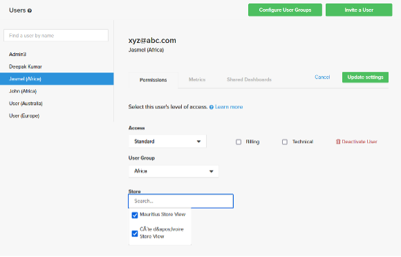

# 高级用户管理

[!DNL Advanced User Management]功能提供了增强的数据可见性控制，并启用基于用户组（组织区域）的逻辑数据过滤。 它允许您根据用户组定制数据可见性，并消除了在每次业务扩展到新区域时创建现有功能板副本以满足区域特定报告要求的需要。

[!DNL Advanced User Management]简化了仪表板共享和数据可见性，同时确保大型组织的安全性和可扩展性。 配置用户组、角色和权限的灵活性使Commerce Intelligence成为满足企业级要求的强大工具。

启用[!DNL Advanced User Management]后，只有管理员用户有权设置以下项：

- 量度
- 可视化Report Builder
- 基于SQL
- 电子邮件摘要
- 原始导出

## 特征矩阵

[!DNL Advanced User Management]影响Commerce Intelligence中的多项功能。 下表根据启用或禁用的功能，描述了各种角色的功能、权限及其可用性。

<table><thead>
  <tr>
    <th colspan="3" rowspan="2">Commerce Intelligence功能</th>
    <th colspan="6">高级用户管理(AUM)功能</th>
  </tr>
  <tr>
    <th colspan="3">已禁用</th>
    <th colspan="3">已启用</th>
  </tr></thead>
<tbody>
  <tr>
    <td>功能组</td>
    <td>功能</td>
    <td>权限</td>
    <td>管理员</td>
    <td>标准</td>
    <td>只读</td>
    <td>管理员</td>
    <td>标准</td>
    <td>只读</td>
  </tr>
  <tr>
    <td rowspan="7">管理用户（所有管理员都可访问并影响所有角色）</td>
    <td>配置用户组</td>
    <td></td>
    <td></td>
    <td></td>
    <td></td>
    <td>✓</td>
    <td></td>
    <td></td>
  </tr>
  <tr>
    <td>邀请用户</td>
    <td></td>
    <td>✓</td>
    <td></td>
    <td></td>
    <td>✓</td>
    <td></td>
    <td></td>
  </tr>
  <tr>
    <td>权限选项卡 — 角色映射</td>
    <td></td>
    <td>✓</td>
    <td></td>
    <td></td>
    <td>✓</td>
    <td></td>
    <td></td>
  </tr>
  <tr>
    <td>权限选项卡 — 用户组映射(AUM)</td>
    <td></td>
    <td></td>
    <td></td>
    <td></td>
    <td>✓</td>
    <td></td>
    <td></td>
  </tr>
  <tr>
    <td>“权限”选项卡 — 存储子集映射(AUM)</td>
    <td></td>
    <td></td>
    <td></td>
    <td></td>
    <td>✓</td>
    <td></td>
    <td></td>
  </tr>
  <tr>
    <td>“量度”选项卡</td>
    <td></td>
    <td>✓</td>
    <td></td>
    <td></td>
    <td>✓</td>
    <td></td>
    <td></td>
  </tr>
  <tr>
    <td>“共享报告面板”选项卡</td>
    <td></td>
    <td>✓</td>
    <td></td>
    <td></td>
    <td>✓</td>
    <td></td>
    <td></td>
  </tr>
  <tr>
    <td rowspan="2">Report Builder</td>
    <td>可视化Report Builder</td>
    <td></td>
    <td>✓</td>
    <td>✓</td>
    <td></td>
    <td>✓</td>
    <td></td>
    <td></td>
  </tr>
  <tr>
    <td>SQL REPORT BUILDER</td>
    <td></td>
    <td>✓</td>
    <td></td>
    <td></td>
    <td>✓</td>
    <td></td>
    <td></td>
  </tr>
  <tr>
    <td rowspan="2">电子邮件摘要</td>
    <td>在不进行数据分区的情况下创建电子邮件摘要</td>
    <td></td>
    <td>✓</td>
    <td>✓</td>
    <td></td>
    <td>✓</td>
    <td></td>
    <td></td>
  </tr>
  <tr>
    <td>使用数据分区(AUM)创建电子邮件摘要</td>
    <td></td>
    <td></td>
    <td></td>
    <td></td>
    <td>✓</td>
    <td></td>
    <td></td>
  </tr>
  <tr>
    <td rowspan="4">仪表板   — 共享</td>
    <td>跨角色与用户共享功能板</td>
    <td></td>
    <td>✓</td>
    <td>✓</td>
    <td></td>
    <td></td>
    <td></td>
    <td></td>
  </tr>
  <tr>
    <td>与用户组和管理员共享功能板(AUM)</td>
    <td></td>
    <td></td>
    <td></td>
    <td></td>
    <td>✓</td>
    <td></td>
    <td></td>
  </tr>
  <tr>
    <td rowspan="2">共享功能板 — 权限</td>
    <td>编辑</td>
    <td>✓</td>
    <td>✓</td>
    <td></td>
    <td></td>
    <td></td>
    <td></td>
  </tr>
  <tr>
    <td>视图</td>
    <td>✓</td>
    <td>✓</td>
    <td></td>
    <td>✓</td>
    <td></td>
    <td></td>
  </tr>
  <tr>
    <td rowspan="18">功能板 — 视图（打开具有给定权限的共享功能板）</td>
    <td rowspan="2">重新共享功能板</td>
    <td>编辑</td>
    <td>✓</td>
    <td>✓</td>
    <td></td>
    <td></td>
    <td></td>
    <td></td>
  </tr>
  <tr>
    <td>视图</td>
    <td></td>
    <td></td>
    <td></td>
    <td></td>
    <td></td>
    <td></td>
  </tr>
  <tr>
    <td rowspan="2">日期过滤器（不带“编辑时间选项”功能标记）</td>
    <td>编辑</td>
    <td>✓</td>
    <td>✓</td>
    <td>✓</td>
    <td></td>
    <td></td>
    <td></td>
  </tr>
  <tr>
    <td>视图</td>
    <td></td>
    <td></td>
    <td></td>
    <td>✓</td>
    <td></td>
    <td></td>
  </tr>
  <tr>
    <td rowspan="2">日期过滤器（带有编辑时间选项功能标记）</td>
    <td>编辑</td>
    <td>✓</td>
    <td>✓</td>
    <td>✓</td>
    <td></td>
    <td></td>
    <td></td>
  </tr>
  <tr>
    <td>视图</td>
    <td>✓</td>
    <td>✓</td>
    <td></td>
    <td>✓</td>
    <td>✓</td>
    <td>✓</td>
  </tr>
  <tr>
    <td rowspan="2">存储过滤器（不带“编辑时间选项”功能标记）</td>
    <td>编辑</td>
    <td>✓</td>
    <td>✓</td>
    <td>✓</td>
    <td></td>
    <td></td>
    <td></td>
  </tr>
  <tr>
    <td>视图</td>
    <td>✓</td>
    <td>✓</td>
    <td></td>
    <td>✓</td>
    <td>✓</td>
    <td></td>
  </tr>
  <tr>
    <td rowspan="2">存储过滤器（带有编辑时间选项功能标记）</td>
    <td>编辑</td>
    <td>✓</td>
    <td>✓</td>
    <td>✓</td>
    <td></td>
    <td></td>
    <td></td>
  </tr>
  <tr>
    <td>视图</td>
    <td>✓</td>
    <td>✓</td>
    <td></td>
    <td>✓</td>
    <td>✓</td>
    <td></td>
  </tr>
  <tr>
    <td rowspan="2">功能板数据 — 根据用户组映射(AUM)过滤报表数据</td>
    <td>编辑</td>
    <td></td>
    <td></td>
    <td></td>
    <td></td>
    <td></td>
    <td></td>
  </tr>
  <tr>
    <td>视图</td>
    <td></td>
    <td></td>
    <td></td>
    <td>✓</td>
    <td>✓</td>
    <td>✓</td>
  </tr>
  <tr>
    <td rowspan="2">报告 — 编辑</td>
    <td>编辑</td>
    <td>✓</td>
    <td>✓</td>
    <td></td>
    <td>✓</td>
    <td></td>
    <td></td>
  </tr>
  <tr>
    <td>视图</td>
    <td></td>
    <td></td>
    <td></td>
    <td>✓</td>
    <td></td>
    <td></td>
  </tr>
  <tr>
    <td rowspan="2">报表导出(CSV、XLSX)</td>
    <td>编辑</td>
    <td>✓</td>
    <td>✓</td>
    <td>✓</td>
    <td>✓</td>
    <td></td>
    <td></td>
  </tr>
  <tr>
    <td>视图</td>
    <td>✓</td>
    <td>✓</td>
    <td>✓</td>
    <td>✓</td>
    <td>✓</td>
    <td>✓</td>
  </tr>
  <tr>
    <td rowspan="2">报告 — 原始导出</td>
    <td>编辑</td>
    <td>✓</td>
    <td>✓</td>
    <td></td>
    <td>✓</td>
    <td></td>
    <td></td>
  </tr>
  <tr>
    <td>视图</td>
    <td>✓</td>
    <td>✓</td>
    <td></td>
    <td></td>
    <td></td>
    <td></td>
  </tr>
</tbody></table>

## 管理员控制

管理员用户可以管理以下任务：

- 用户组的配置
- 将角色和用户组分配给个人用户
- 与具有仪表板级别权限的用户组或其他管理员共享仪表板
- 使用用户组级别的数据过滤安排电子邮件摘要

### 配置用户组

用户组是映射到特定商店筛选器的区域的逻辑分组（例如，根据大陆、国家和区域的名称创建的用户组）。

要配置用户组，请执行以下操作：

1. 转到&#x200B;[!UICONTROL **管理用户**] > [!UICONTROL **User Groups]**&#x200B;以查看现有用户组。

   

1. [!UICONTROL **添加组**]&#x200B;允许管理员创建新的用户组：

   - 输入组的名称（例如，“美洲”）。

   - 选择与用户组相关的存储或筛选器。

   - 保存配置。

     

1. 管理员可以：

   - 编辑用户组以更新商店映射或重命名它们以便更清楚地了解。

   - 删除不再需要的用户组。 管理员必须手动重新分配映射到已删除用户组的现有用户。

1. 默认组：

   - [!UICONTROL **None]**：尚未映射到特定组的用户的备用组。 这些用户只有在分配到适当的组后才能看到任何数据。

   - [!UICONTROL **全部**]：提供对所有数据的无限制访问（通常为管理员用户保留）。

### 将用户分配给用户组

管理员可以使用&#x200B;[!UICONTROL **邀请用户**]&#x200B;将新用户映射到其新用户引导的相关组。 现有用户可以根据业务需求重新映射到用户组。

>[!TIP]
>
>- 在将&#x200B;[!UICONTROL **Standard**]&#x200B;或&#x200B;[!UICONTROL **只读**]&#x200B;用户分配给相关用户组之前，可以安全地将其分配给&#x200B;[!UICONTROL **None**]，以确保他们不会错误地访问任何仪表板数据。
>
>- 在根据业务要求向用户分配权限期间，有可能限制组内的特定存储用于增强控制。

默认情况下，管理员用户始终映射到&#x200B;[!UICONTROL **所有**]&#x200B;商店，这样他们就可以查看功能板以及完整的商店视图。

### 共享仪表板

[!DNL Advanced User Management]提供了功能强大的选项，可在保持数据安全的同时共享功能板。

- 管理员可以与用户组以及其他管理员用户共享功能板以进行协作。 这实现了仪表板的集中化管理，并简化了大型组织的管理。

  

- 功能板共享权限包括：

   - [!UICONTROL **编辑**]：仅供管理员用户修改仪表板、筛选数据、修改报告或导出数据。

   - [!UICONTROL **视图**]：适用于具有（特定限制）的所有角色中的用户。

   - [!UICONTROL **无**]：撤销某些用户组或管理员对仪表板的访问权限。

  >[!NOTE]
  >
  >请参阅[功能矩阵](#feature-matrix)，了解基于规则和仪表板权限的各种Commerce Intelligence功能的可用性，以了解各种组合。

#### 仪表板视图

管理员用户可以查看仪表板数据，并有权访问所有商店。

但是，用户可以查看根据用户配置期间映射到他们的存储过滤的仪表板数据。

>[!TIP]
>
>管理员可以为共享功能板启用日期过滤器，允许用户查看不同日期范围内的数据，而不是在创建报告期间设置的默认时间范围。 此功能可以根据业务需求切换为开启或关闭。

### 计划电子邮件摘要

[!DNL Advanced User Management]将数据筛选功能扩展到电子邮件摘要。 根据受众的不同，管理员用户可以指定必须筛选选定报表的用户组。

