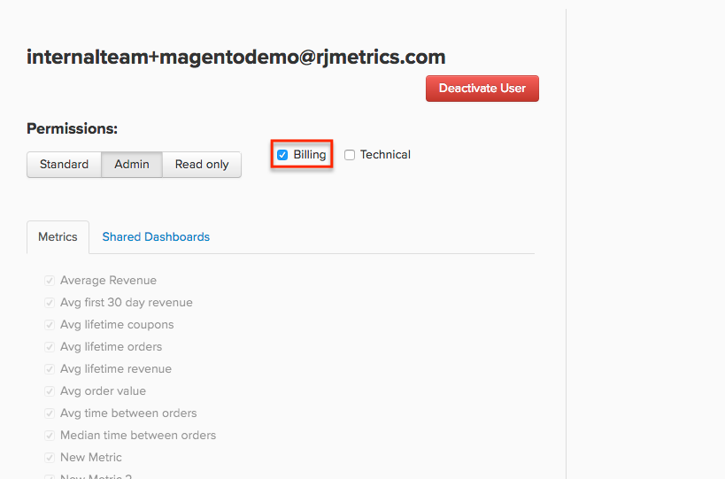

# 管理用户权限

[!DNL Adobe Commerce Intelligence]旨在作为整个组织的单一真实来源。 每个用户都有自己的仪表板集，他们可以[与其他用户共享](../../data-user/dashboards/share-dashboard-with-users.md)。

## 用户权限级别

在[!DNL Commerce Intelligence]中，有三个适用于用户的一般权限级别，在创建帐户时选择这些级别：

* `Admin`
* `Standard`
* `Read-Only`

这些权限使用户能够执行某些操作或访问[!DNL Commerce Intelligence]的特定部分。 以下是每个权限级别在[!DNL Commerce Intelligence]中可以执行的操作的表：

|   | `Admin` | `Standard` | `Read Only` |
| -----|-----|-----|----|
| **创建/管理用户** | ✔ |   |   |
| **创建电子邮件摘要** | ✔ | ✔ |   |
| **创建/编辑/共享功能板** | ✔ | ✔ |   |
| **查看仪表板** | ✔ | ✔ | ✔ |
| **创建/编辑/删除可视化报告** | ✔ | ✔* |   |
| **创建/编辑/删除SQL报告** | ✔ |  |   |
| **克隆功能板** | ✔ |   |   |
| **添加/管理集成** | ✔ |   |   |
| **访问Data Warehouse管理器** | ✔ |   |   |
| **同步/取消同步表和列** | ✔ |   |   |
| **创建/编辑指标** | ✔ |   |   |
| **创建/编辑筛选器集** | ✔ |   |   |
| **创建/编辑计算列** | ✔ |   |   |
| **创建依赖报告的列表** | ✔ |   |   |
| **访问系统摘要** | ✔ |   |   |
| **访问时区设置** | ✔ |   |   |
| **访问帐单** | ✔ | ✔** |   |
| **联系支持人员** | ✔ | ✔ | ✔ |

{style="table-layout:auto"}

>[!NOTE]
>
>_您可以限制&#x200B;**[!UICONTROL Standard]**&#x200B;用户访问特定量度[的](../../administrator/user-management/restrict-metric-access.md)权限。_
>
>**[!UICONTROL Standard] _用户可以使用额外的权限设置访问帐单。_
>
>**[!UICONTROL Read-Only]**&#x200B;用户只能&#x200B;_查看已与他们共享的_&#x200B;个仪表板；他们无法在[!DNL Commerce Intelligence]中创建或编辑任何内容，也不能搜索仪表板并将仪表板添加到其帐户。 Adobe建议您与您或团队其他成员维护的&#x200B;**[!UICONTROL Read-Only]**&#x200B;用户共享一组特定的功能板。 请勿为其克隆一组功能板。

## 其他权限：账单和技术 {#billingtech}

除了一般权限级别之外，还有另外两个用户指定 — `Billing`和`Technical`。 这些指定应与常规权限级别一起使用。

### 计费

`Billing`用户有权访问计费页面，并可以更改付款信息。 此外，Adobe可能会联系他们以询问帐单问题。

默认情况下，`Admin`用户有权访问`Billing`选项卡，但是`Standard`用户如果在配置文件中选中`Billing`复选框，则也可以获得访问权限。

<!--{: width="550" height="363"}-->

### 技术

`Technical`用户没有任何特定于他们的权限 — 此设置仅标记组织内的技术联系人。 Adobe可能会就技术问题联系这些用户。

`Admin`用户可以通过单击&#x200B;**[!UICONTROL Account Settings]** > **[!UICONTROL Create Users]**&#x200B;并按照提示添加新用户到他们的帐户。 在[!DNL Commerce Intelligence]中创建用户后，您邀请的幸运儿将收到有关如何完成帐户设置过程的电子邮件说明。

`Admins`可以随时通过单击&#x200B;**[!UICONTROL Account Settings]** > **[!UICONTROL Manage Users]**&#x200B;查看其帐户中的所有用户。 此页面显示用户的权限以及他们可以访问的量度和功能板。
