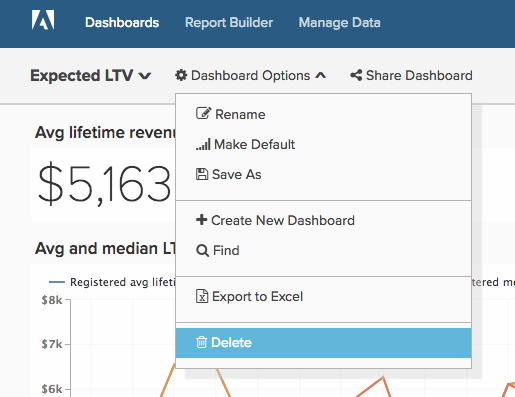
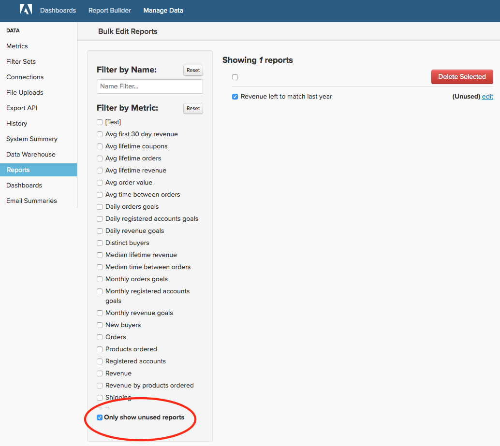
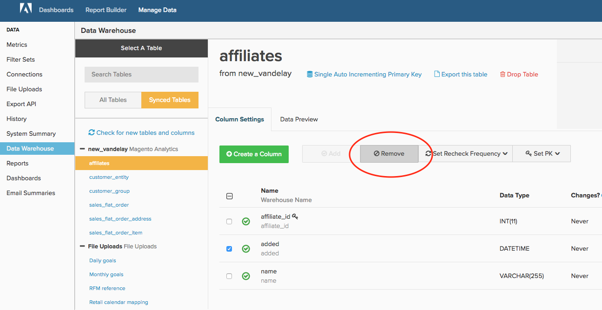

# 清理 [!DNL MBI] 帐户

无论你是否与 [!DNL MBI] 在6个月或6年的时间里，保持一个整洁的帐户对贵组织充分利用该平台至关重要。 随着时间的推移，不再需要的用户、功能板、报表、量度和列将很自然。 或许您创建了一个供一次性使用的报表，但忘记了该报表，或者离开您公司的用户从未停用其帐户。

与 [所有元素的标准化、清晰的命名](../best-practices/naming-elements.md)) [!DNL MBI] 帐户，下面的帐户审核步骤将帮助您减少用户的混乱和不必要分析。 另外一项好处包括 [可能更快的更新周期](../best-practices/reduce-update-cycle-time.md).

## 步骤1:识别非活动用户

清理帐户的第一步是停用非活动用户的帐户，例如离开公司或不再使用的用户 [!DNL MBI] 在他们当前的角色中。

为此，您可以单击顶部导航栏右上角的公司名称，然后选择 **[!UICONTROL Manage Users]**. 接下来，选择要停用的用户，然后单击 **[!UICONTROL Deactivate User]**.

>[!NOTE]
>
>您需要 [管理员权限](../administrator/user-management/user-management.md) 做这个。

>[!WARNING]
>
>取消激活用户还会删除该用户创建的图表、功能板和其他资产。 如果要保留这些资产，请联系 [!DNL MBI] [支持](../guide-overview.md) 团队。 支持可以帮助您将这些资产转移给其他用户。

### 重新激活用户

要重新激活用户，请使用已停用的相同电子邮件地址重新创建其帐户，以重新邀请用户，用户的访问权限及其拥有的数据将在登录时恢复。

## 步骤2:删除未使用的功能板和报表

审核帐户的下一步是删除任何未使用的功能板和报表。

>[!NOTE]
>
>您需要 `Admin` 或 `Standard` [用户权限](../administrator/user-management/user-management.md) 做这个。

每个用户 `Admin` 或 `Standard` 访问权限可以创建报表和功能板。 因此，具有这些权限的每个人都必须按照以下步骤来识别和删除未使用的报表。

### 查看功能板和报表

在删除任何内容之前，您应该查看报表和功能板，以评估当前使用的内容。 而您可以使用 **[!UICONTROL find unused reports]** 功能，则任何初始审核都会大大提高您的清理工作效率。

### 删除功能板和报表

访问功能板和报表后，您可以开始清理帐户。

**从功能板中删除报表**

1. 在功能板上找到要删除的报表。
1. 选择 **[!UICONTROL Options]** 中。
1. 单击 **[!UICONTROL Remove From Dashboard]**.

**删除整个功能板**

1. 选择 **[!UICONTROL Manage Data]**，然后是**[!UICONTROL Dashboards**].
1. 单击要删除的功能板。
1. 单击 **[!UICONTROL Delete Dashboard]**.

您还可以选择 **[!UICONTROL Dashboard Options]**，则 **[!UICONTROL Delete]** 功能板本身。

>[!NOTE]
>
>删除功能板不会删除其中的报表，因此您必须再执行一个步骤来删除报表。

**删除未使用的报表**

1. 选择 **[!UICONTROL Manage Data]**，则 **[!UICONTROL Reports]**.
1. 检查 **仅显示未使用的报表** 框。 这将创建一个功能板或电子邮件摘要中未使用的报表列表。
1. 选择要删除的报表。 您可以通过单击报表列表上方的复选框来选择全部。
1. 单击 **[!UICONTROL Delete Selected]**.

以下是未使用的报表删除流程：

## 步骤3:删除未使用的量度

清理用户列表、功能板和报表后，您可以转到审核量度列表。 这将帮助您识别可能已过时的任何内容（例如，已使用不同定义创建了新量度，或未在使用中）。

1. 要为量度生成从属报表列表，请转到 **[!DNL Manage Data]**，然后选择单击 **[!UICONTROL Metrics]**.
1. 单击 **[!UICONTROL Edit]** 量度旁边。
1. 在页面底部，您将看到一个名为 **[!UICONTROL Dependent Charts]**. 单击该链接可生成此量度的从属报表列表。
1. 系统完成检查后， [!DNL MBI] 显示使用此量度的功能板、报表和用户列表。

如果您决定不再需要量度，请导航回 **[!UICONTROL Metrics]** 通过单击 **[!UICONTROL Back to Metric List]** ，然后找到要删除的量度。 单击 **[!UICONTROL Delete]**.

## 步骤4:评估同步的列

最后一步是评估当前在您的data warehouse中同步的列。 取消同步列不仅会降低您的帐户质量，还可能会缩短您的更新时间。

如果你想追求这个，请联系 [!DNL MBI] [支持](../guide-overview.md). 支持团队可以创建一个报告，其中包含所有未在任何用户的任何功能板中使用的列，以及未在电子邮件摘要（不包括SQL报告）中使用的列。 然后，您可以使用此报表作为指南，通过Data warehouse管理器选择要取消同步的列。

>[!NOTE]
>
>您以后始终可以重新开始同步这些列。 取消同步列不会从您的data warehouse中删除任何数据；这仅意味着在更新周期期间不会检查此列是否有新值或更新值。

**取消同步列（或列）**

1. 转到 **[!DNL Manage Data]**，则 **[!UICONTROL Data Warehouse]**.
1. 在 **[!UICONTROL Synced Tables]** 列表，导航到包含列的表。
1. 选中要取消同步的列旁边的复选框。
   >[!NOTE]
   >
   >不删除整个表，就无法取消同步主键列。

1. 单击 **[!UICONTROL Remove]** 取消同步列。

以下是整个过程：

## 包装

就这样！ 您的 [!DNL MBI] 现在，帐户应该更便捷，更便于您和您的团队进行导航。
