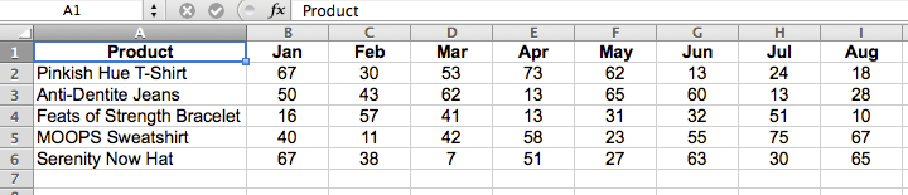
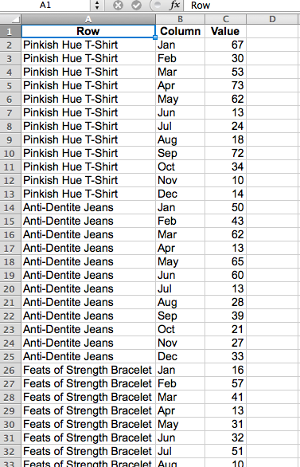

# 格式和导入财务数据

本主题讨论导入财务数据以在 [!DNL MBI].

二维交叉表数据表通常是用于财务数据的格式。 由于值按列和行中的标签进行分类，使用人眼和电子表格工具可以轻松查看此类布局，但对数据库来说却不太友好。

要在 [!DNL MBI]，则必须将表扁平化为一维列表。 扁平化后，每个数据值会按多个标签进行分类，这些标签全部位于一行中，其中每行都是唯一的，或者具有唯一标识符，例如主键列。

## 格式化Excel文件以进行导入

要使用Excel数据透视表扁平化二维表，请执行以下操作：

1. 使用二维数据表打开文件。
1. 打开数据透视表向导。 在Windows中，快捷键为 `Alt-D`. 在Mac OSX中，输入 `Command-Option-P`.
1. 选择 **[!UICONTROL Multiple consolidated ranges]** 单击 **[!UICONTROL Next]**.
1. 选择 **[!UICONTROL I will create the page fields]** 单击 **[!UICONTROL Next]**.
1. 在二维表中选择整个数据集，包括标签。 确保 `0` 为所需页面字段数选择，然后单击 **[!UICONTROL Next]**.
1. 在新工作表中创建数据透视表并单击 **[!UICONTROL Finish]**.
1. 从字段列表中取消选择列和行字段。
1. 双击所得数值，以在新页面中显示扁平化源数据。
   
1. 另存为 `CSV` 文件。

就这样！ 数据表已转换为列表格式，保留了其所有原始信息，现在可以 [导入到 [!DNL MBI]](../data-analyst/importing-data/connecting-data/using-file-uploader.md) 进行分析。
