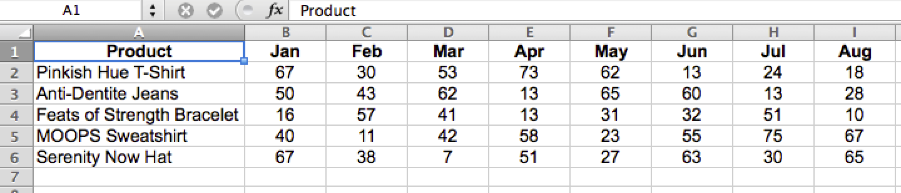

# 格式化和导入财务数据

本主题讨论在[!DNL Adobe Commerce Intelligence]中导入财务数据以进行分析的最佳方法。

二维交叉表数据表通常是用于财务数据的格式。 由于列和行中的值均按标签进行分类，因此这种类型的布局可能很容易通过人眼和电子表格工具查看，但对数据库并不友好。

若要在[!DNL Commerce Intelligence]中导入和分析此数据，必须将表平面化为一维列表。 拼合时，每个数据值都按多个标签进行分类，这些标签全部位于一行中，其中每一行都是唯一的，或者具有唯一的标识符，例如主键列。

## 设置导入的Excel文件格式

要使用[!DNL Excel]透视表拼合二维表，请执行以下操作：

1. 使用二维数据表打开文件。
1. 打开数据透视表向导。 在[!DNL Windows]中，快捷方式为`Alt-D`。 在[!DNL Mac OS]中，输入`Command-Option-P`。
1. 选择&#x200B;**[!UICONTROL Multiple consolidated ranges]**&#x200B;并单击&#x200B;**[!UICONTROL Next]**。
1. 选择&#x200B;**[!UICONTROL I will create the page fields]**&#x200B;并单击&#x200B;**[!UICONTROL Next]**。
1. 在二维表中选择整个数据集，包括标签。 确保为所需页字段数选择`0`，然后单击&#x200B;**[!UICONTROL Next]**。
1. 在新工作表中创建数据透视表并单击&#x200B;**[!UICONTROL Finish]**。
1. 从字段列表中取消选择列和行字段。
1. 双击生成的数值可在新工作表中显示展平的源数据。
   
1. 另存为`CSV`文件。

## 正在结束

数据表已转换为列表格式，保留了其所有原始信息，现在可以[导入到 [!DNL Commerce Intelligence]](../data-analyst/importing-data/connecting-data/using-file-uploader.md)进行分析。
