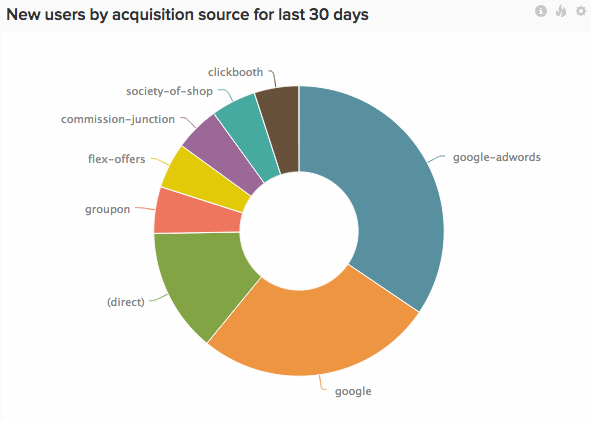

# 分段和过滤

良好的细分功能可将肤浅的统计数据转变为能够推动决策的业务量度。

想知道您最有价值的客户是谁？ 您最有价值的营销渠道是什么？ 您的哪些产品进展更快，原因何在？ 要获取上述任何答案，您必须首先对数据进行分段。

在本文中，我们共享一些我们经常向客户推荐的关键区段。 我们还将详细介绍这些区段可以帮助您回答哪些问题。 从技术上讲，区段是数据库中的数据列。 在 [!DNL MBI]，我们将它们称为维度。

## 用户区段

用户区段可帮助您了解用户身份及其行为方式。

* **年龄/出生年**:您的用户年龄是多少？ 您的最活跃用户的年龄是多少？ 通常，将值存储到范围中以便进行更有效的分析是有意义的。
* **性别**:男人和女人与您的网站互动是否不同？
* **地址**:您的用户来自何处？ 您是否应将营销工作重点放在特定地区？ 您最近的广告促销活动是否按预期在目标地区执行？
* **客户获取来源**\:您知道用户来自哪个营销渠道吗？ 他们是点击广告还是通过搜索找到您？ [按用户获取源划分数据区段](../data-analyst/analysis/google-track-user-acq.md) 是优化新客户获取的第一步。 第二步是，花更多的钱去做正在起作用的事，而杀掉不起的事。
* **注册装置**:用户是否通过您的移动设备应用程序或您的网站进行注册？ iOS还是Android? 您的移动用户群是否足够大，能够分配更多资源来开发移动产品？ (如果您尚未跟踪此内容，请参阅此主题 [关于跟踪用户设备](../data-analyst/analysis/track-usr-dev-browser.md).
* **引荐者**:谁是你最有影响力的人？ 其他用户直接引荐了多少个用户？
* **行业**:如果您是B2B企业，那么您的用户在哪些行业工作？ 哪些贸易组织值得加入？
* **调查响应**:如果执行客户调查，请将响应用作区段，以便进行更深入的分析。 您可以提出与您已了解的用户信息相辅相成的问题，或确认您的猜测。
* **第一订单金额和产品类别**:用户的首次订购与未来购买模式之间是否存在关联？

## 订单/事件区段

订单和事件区段有助于分析用户行为和参与度随时间变化的情况。

* **[!UICONTROL Billing / Shipping Address]**:你的大部分订单都从哪里来？ 帐单地址和送货地址之间是否存在差异？
* **[!UICONTROL Status]**:您有多少订单未能完成？ 过去七天内待定订单的比率是多少？
* **[!UICONTROL Customer acquisition source]**:除了在用户级别跟踪用户获取数据之外，您还可以 [在订单或事件级别跟踪](../data-analyst/analysis/google-track-user-acq.md). 通过一个源注册的用户很可能会继续通过其他源访问您的网站。
* **[!UICONTROL Device]**:移动订单数量是否在增加？ 您当前通过移动设备购买产生的收入额是多少？ (如果您尚未跟踪此内容，请参阅此主题 [关于跟踪订单设备数据](../data-analyst/analysis/track-usr-dev-browser.md).
* **[!UICONTROL Fulfillment Center]**:哪个履行中心的收入最多？ 如果您正在分析订单时间与发运时间之间的差异，那么哪个履行中心的响应最快？
* **[!UICONTROL Delivery Carrier]**:哪家最受欢迎？ 哪个承运人的退货数量最少？
* **[!UICONTROL Discount / Coupon Codes]**:您的促销活动是否实际上会产生额外业务？ 除了在销售的商品外，您的客户还购买了多少额外商品？ 优惠券如何影响平均订单价值？ 折扣项目与非折扣项目的平均利润率是多少？
* **[!UICONTROL Satisfaction / Rating]**:您的客户对其订单的满意度如何？ 您的客户是否可能将业务推荐给您？

## 产品区段

产品区段可帮助您做出促销决策。

* **[!UICONTROL Merchant / Brand]**:某个特定品牌的销售速度是否比其他品牌快？ 哪些品牌表现不佳？
* **[!UICONTROL Type / Category]**:不同的用户区段是否享受不同类型的产品？ 哪些产品类别产生的重复业务最多？
* **[!UICONTROL Discount / Coupon Codes]**:促销是否会损害非折扣产品的销售？ 优惠券如何影响产品的感知价值？
* **[!UICONTROL Social Activity]**:社交媒体上生成的资讯与产品销售数量之间是否存在关联？
* **[!UICONTROL Size / Variant]**:您需要每个变体的库存比率是多少？ 哪些变体可以以折扣价出售？

如果您对推销感兴趣，请查看我们浏览的博客文章 [如何使用产品区段推动重复业务](../data-analyst/analysis/most-value-source-channel.md).

## 建立客户用户档案

分段专家可能希望超越一维片段并开始创建真正的客户用户档案。 例如，通过移动设备注册的13至24岁年龄段的人将放入“Young &amp; Mobile”组。 此组的行为与您其余的用户群相比如何？

这类分析是《财富1000强》公司的营销人员整天都在做的。 在基于云的业务智能平台(例如 [!DNL MBI]但这对我们其他人来说已经遥不可及了。 幸运的是，情况已经不是这样了。

## 跟踪新区段

按上述维度对量度进行分段的第一步是确保跟踪数据库中的此数据。 如果未跟踪此数据，请与您的技术团队会面，并找到开始跟踪此数据的方法。

确认在您的数据库中跟踪数据后， [联系我们的支持团队](../guide-overview.md) 将维度推送到 [!DNL MBI] 量度和图表，或仅使用我们的字段管理工具在 [!DNL MBI].

## 相关

* [优化数据库以进行分析](../best-practices/opt-db-analysis.md)
