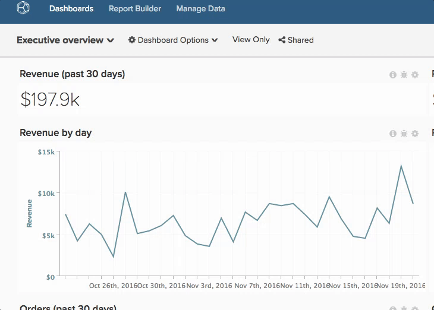

# 共享功能板

共享功能板意味着您和您的团队在任何给定时间拥有相同的信息，从而可以进行协作和讨论。 以下是共享功能板和保持你的[!DNL Adobe Commerce Intelligence]帐户整洁的一些建议。

## 避免使用重复的仪表板

有时，您可能会找到多个同名功能板，这通常是因为其他用户已创建并与您共享了类似的功能板。 这些功能板可以是主副本的重复项。 在这种情况下，Adobe建议您让一位用户共享功能板的主要副本，然后删除所有重复的功能板。

要查看谁拥有仪表板，请单击左上角的仪表板下拉菜单。 任何下面没有名称的功能板都属于您。

要删除所有重复的仪表板，请执行以下操作：

1. 与您的团队同步，并确定应该维护仪表板的人员。
1. [从所有类似的仪表板中取消共享您自己](../data-user/dashboards/leave-dashboard.md)，主用户共享的仪表板除外。
1. 如果您有仪表板的副本，请[将其删除](../data-user/dashboards/deleting-dashboard.md)。
1. 要求其他人删除他们的仪表板版本。

## 创建一组核心功能板

创建新用户时，他们没有任何功能板或图表。 但是，他们将在首次登录后看到您组织中最受欢迎的仪表板列表（具有整个团队的查看或编辑权限）。 确保功能板始终位于此列表中，以便添加新用户。

## 与新用户共享功能板

新用户还可以从访问某些未在组织范围内共享的仪表板中受益。 在这些情况下，Adobe建议仪表板所有者在创建其帐户时[与新用户共享相关仪表板](../data-user/dashboards/share-dashboard-with-users.md)。

## 具有编辑权限且具有选择性

`Edit`权限赋予用户很大的权力。 但权力越大，责任就越大。 为了防止意外更改图表和功能板，Adobe建议您选择向谁授予`Edit`权限。

## 在图表中添加批注

共享仪表板只是让用户可以访问相同的信息。 为确保信息被理解，Adobe建议使用图表注释功能共享有关特定数据点的知识和细微差别，或传达分析的目的。
