# 基本分析

如果您熟悉 [!DNL MBI] 平台，并且对该工具有基本的了解，因此您将希望开始构建报表。 你最常问的问题之一是“我该看什么？”

以下信息概述了一些可能会发现有价值的常用量度和报表。 您的帐户中已存在许多这些报表，因此请确保查看您帐户中存在的量度和报表，以避免创建重复项。

## 要了解的表和列

在构建量度时，您需要了解四条信息：

1. 数据所在的表格，
1. 要执行的特定操作，
1. 要对执行该操作的列，以及
1. 要用于跟踪该数据的时间戳。

这些示例中使用的表名称很可能与数据库中的列名称和表名称略有不同，因为每个数据库都是唯一的。 如果需要在数据库中标识相应表或列的帮助，请参考以下定义。

## 客户表

此表包含有关每个客户的关键信息，如唯一客户ID、电子邮件地址、帐户创建日期等。 在以下示例中，我们将使用 **[!UICONTROL customer_entity]** 作为示例客户表的名称。

如果数据库中当前不存在其中某些计算，则帐户中的任何管理员用户都可以生成它们。 此外，您还希望确保这些维度可对所有适用量度进行分组。

**Dimension**

* **[!UICONTROL Entity_id]**:每个客户的唯一标识符。 这也可以是唯一的客户编号或客户电子邮件地址，并且它应作为订单表的引用键。
* **[!UICONTROL Created_at]**:创建客户帐户并将其添加到数据库的日期。
* **[!UICONTROL Customer's lifetime revenue]**:客户生成的总生命周期收入。
* **[!UICONTROL Customer's first 30-day revenue]**:客户在其前30天内产生的收入总额。
* **[!UICONTROL Customer's lifetime number of orders]**:客户在其生命周期内下达的订单数。
* **[!UICONTROL Customer's lifetime number of coupons]**:客户在其生命周期内使用的优惠券总数。
* **[!UICONTROL Customer's first order date]**:客户首次订购的日期。 如果客户在创建时没有下订单，则这可能与created_at日期不同。

**你接受客人的命令吗？**

*如果是，此表可能不包含您的所有客户。 联系我们的 [支持团队](https://experienceleague.adobe.com/docs/commerce-knowledge-base/kb/troubleshooting/miscellaneous/mbi-service-policies.html?lang=en) 以确保客户分析包含所有客户。*

*不确定你是否接受客人的命令？ 请参阅 [本主题](../data-warehouse-mgr/guest-orders.md) 了解更多！*

## 订单表

在此表中，每行表示一个顺序。 此表中的列包含有关每个订单的基本信息，如订单的ID、创建日期、状态、下订单的客户的ID，等等。 在以下示例中，我们使用 **[!UICONTROL sales_flat_order]** 作为示例订单表的名称。

**Dimension**

* **[!UICONTROL Customer_id]**:下订单的客户的唯一标识符。 这通常用于在客户表和订单表之间移动信息。 在我们的示例中，我们希望 **[!UICONTROL sales_flat_order]** 表与 **[!UICONTROL entitiy_id]** 在 **[!UICONTROL customer_entity]** 表。
* **[!UICONTROL Created_at]**:创建或下单的日期。
* **[!UICONTROL Customer_email]**:下订单的客户的电子邮件地址。 这也可以是客户的唯一标识符。
* **[!UICONTROL Customer's lifetime number of orders]**:在 `Customers` 表。
* **[!UICONTROL Customer's order number]**:与订单关联的客户顺序编号。 例如，如果您要查看的行是客户的首次订单，则此列为“1”；但是，如果这是客户的第15次订单，则此列将显示此订单的“15”。 如果您的 `Customers` 桌子，问我们 [支持团队](https://experienceleague.adobe.com/docs/commerce-knowledge-base/kb/troubleshooting/miscellaneous/mbi-service-policies.html?lang=en) 来帮助您构建它。
* **[!UICONTROL Customer's order number (previous-current)]**:中两个值的串联 **[!UICONTROL Customer's order number]** 列。 在下面的示例报表中使用它来显示任意两个订单之间经过的时间。 例如，客户的第一次订购日期与其第二次订购日期之间的时间通过此计算表示为“1-2”。
* **[!UICONTROL Coupon_code]**:显示每次订购时使用的优惠券。
* **[!UICONTROL Seconds since previous order]**:客户订单之间的时间（以秒为单位）。

## 订单项目表

在此表中，每行都表示已销售的一个项目。 此表包含有关每个订单中已售项目的信息，如订单参考编号、产品编号、数量等。 在以下示例中，我们使用 `sales_flat_order_item` 作为示例订单项目表的名称。

**Dimension**

* **[!UICONTROL Item_id]**:表中每行的唯一标识符。
* **[!UICONTROL Order_id]**:引用键 `Orders` 表格，用于告知您在同一订单中购买了哪些项目。 如果订单包含多个项目，则会重复此值。
* **[!UICONTROL Product_id]**:如果您想了解有关已购买的特定产品（如颜色、大小等）的信息，可使用此列从产品表中提取该信息。
* **[!UICONTROL Order's created_at]**:下订单的时间戳，通常复制到 `order line items` 表格 `Orders` 表。
* **[!UICONTROL Order's coupon_code]**:与 `Order's created_at` 维度中，此列将从您的订单表中复制。

## 订阅表

此表用于管理您的订阅信息，如订阅ID、订阅者的电子邮件地址、订阅开始日期等。

**Dimension**

* **[!UICONTROL Customer_id]**:下订单的客户的唯一标识符。 这是在“客户”表和“订单”表之间构建路径的常用方法。 在我们的示例中，我们希望 **sales_flat_order** 表与 `entitiy_id` 在 `customer_entity` 表。
* **[!UICONTROL Start date]**:客户订阅开始的日期。

## 营销支出表

在分析营销支出时，您可以 [!DNL Facebook], [!DNL Google AdWords]，或其他来源。 如果您有多个营销支出来源，请联系我们的 [Managed Services团队](https://business.adobe.com/products/magento/fully-managed-service.html) ，以获取有关为营销活动设置统一表格的帮助。

**Dimension**

* **[!UICONTROL Spend]**:广告总支出。 在 [!DNL Facebook]，这将是 `facebook_ads_insights_####` 表。 对于 [!DNL Google AdWords]，这是 `adCost` 列 `campaigns####` 表。
* 的 `####` 附加到每个表的ID与您的 [!DNL Facebook] 或 [!DNL Google AdWords] 帐户。
* **[!UICONTROL Clicks]**:总点击次数。 在 [!DNL Facebook]，这将是 `facebook_ads_insights_####` 表。 在 [!DNL Google AdWords]，这将是 `campaigns####` 表。
* **[!UICONTROL Impressions]**:展示次数总数。 在 [!DNL Facebook]，这将是 `facebook_ads_insights_####` 表。 在 [!DNL Google AdWords]，这是 `campaigns####` 表。
* **[!UICONTROL Campaign]**:总点击次数。 在 [!DNL Facebook]，这将是 `facebook_ads_insights_####` 表。 在 [!DNL Google AdWords]，这将是 `campaigns####` 表。
* **[!UICONTROL Date]**:特定促销活动的花费、点击次数或展示次数发生的时间戳。 在 [!DNL Facebook]，这是 `date_start` 列 `facebook_ads_insights_####` 表。 在 [!DNL Google AdWords]，这将是 `campaigns####` 表。
* **[!UICONTROL Customer's first order's source]**:订单的来源是客户的首次订购。 首先，检查是否有列名为 `customer's first order's source` 在您的帐户中。 如果看不到此列，则可以按照以下说明创建所需的列。
* **[!UICONTROL Customer's first order's medium]**:客户首次订购的媒介。 首先，检查是否有列名为 `customer's first order's source` 在您的帐户中。 如果看不到此列，则可以按照以下说明创建所需的列。
* **[!UICONTROL Customer's first order's campaign]**:客户首次订购中订单的促销活动。 首先，检查是否有列名为 `customer's first order's source` 在您的帐户中。 如果看不到此列，则可以按照以下说明创建所需的列。

## 常见报表和量度

以下是一些常见的报表和量度示例，您可能会发现这些示例非常有用：

* [Customer Analytics](#customeranalytics)
* [订购分析](#orderanalytics)
* [营销支出分析](#mktgspendanalytics)

## 客户分析 {#customeranalytics}

### 新用户

* **描述**:在给定时间段内新获得用户总数的计数。 `New Users` 与 `Unique Customers`，因为 `New Users` 具有通过您的服务创建帐户的时间戳（这不意味着他们必须下订单）， `Unique Customers` 已经下了至少一份订单。
* **量度定义**:此量度执行 **计数** of `entity_id` 从 `customer_entity` 表排序依据 `created_at`.
* **报表示例**:上个月创建的新用户数
   * **[!UICONTROL Metric]**: `New Users`
   * **[!UICONTROL Time Range]**: `Last Month`
   * **[!UICONTROL Time Interval]**: `By Day`

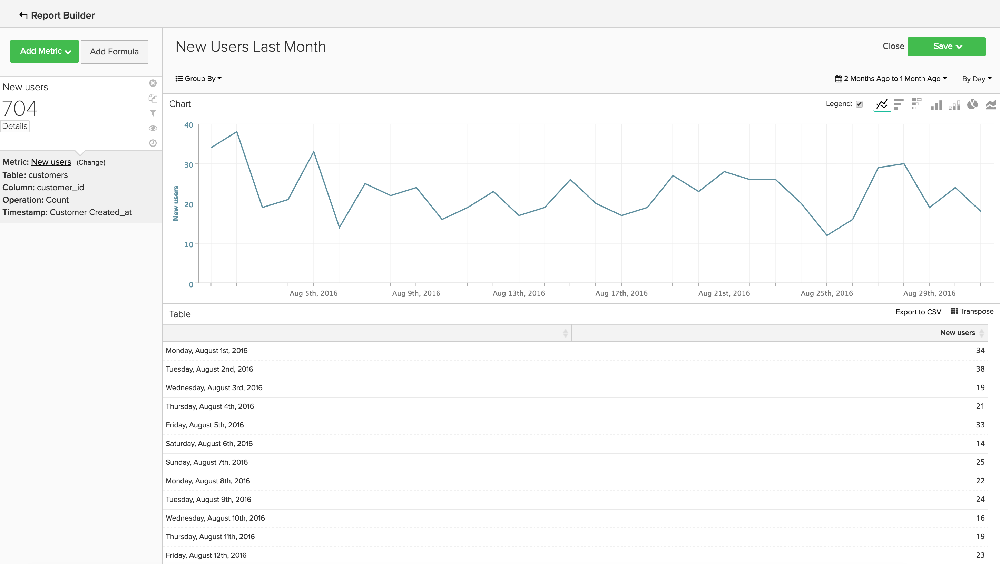<!--{: width="929"}-->

### 独特客户

* **描述**:给定时间段内独特客户总数的计数。 这与 `New Users`，因为它仅跟踪至少下了一次订单的客户。 独特客户报表将在给定时间间隔内仅跟踪一次客户。 如果将时间间隔设置为 `By Day` 当天客户购物不止一次，客户只会被计数一次。 如果要查看总购买次数，请查看 `Number of Orders`.
* **量度定义**:此量度执行 **非重复计数** of `customer_id` 从 `sales_flat_order` 表排序依据 `created_at`.
* **报表示例**:过去90天中按周划分的不同客户
   * **[!UICONTROL Metric]**: `Distinct Customers`
   * **[!UICONTROL Time Range]**: `Moving range > Last 90 Days`
   * **[!UICONTROL Time Interval]**: `By Day`

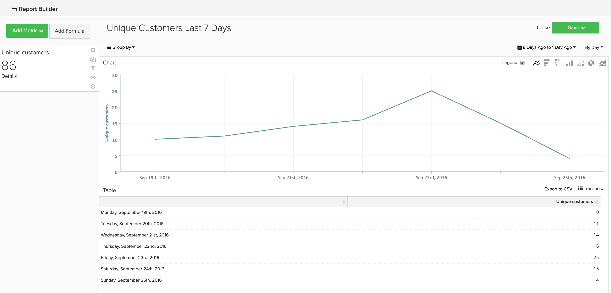<!--{: width="929"}-->

### 新订阅者

* **描述**:在给定时间段内获得的新订阅者总数的计数。
* **量度定义**:此量度执行 **非重复计数** of `customer_id` 从 `subscriptions` 表排序依据 `start_date`.
* **报表示例**:今年按月新增订阅者
   * **[!UICONTROL Metric]**: `New Subscribers`
   * **[!UICONTROL Time Range]**: `1 Year Ago to 0 Days Ago`
   * **[!UICONTROL Time Interval]**: `By Month`

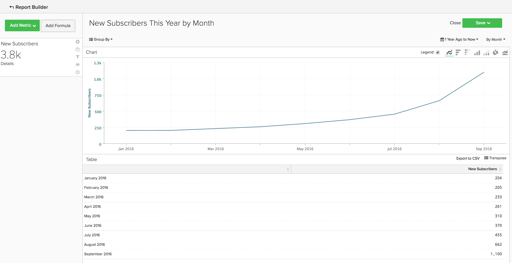<!--{: width="929"}-->

### 重复客户

* **描述**:一段时间内下了多个订单的客户总数。 在重复客户报表中，您可以使用 `Distinct Customers` 量度和 `Customer's Order Number` 维度 `orders` 表。
* **使用的量度**: `Distinct Customers`
* **报表示例**:去年第2次和第3次购买的次数
   * **[!UICONTROL Metric]**: `Distinct Customers`
   * **[!UICONTROL Time Range]**: `Moving Range > Last Year`
   * **[!UICONTROL Time Interval]**: `By Month`
   * **[!UICONTROL Group By]**: `Customer's Order Number`，然后选择 `2` 和 `3`

   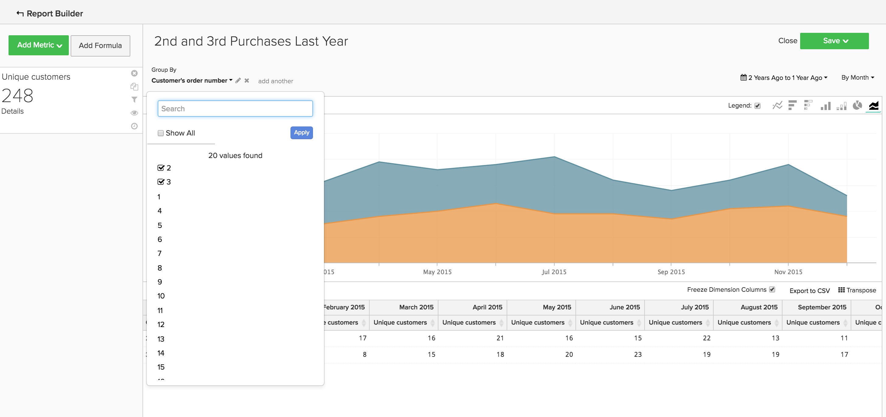

* **报表示例2**:去年的重复客户数
   * **[!UICONTROL Metric]**: `Distinct Customers`
   * **[!UICONTROL Filters]**: `Customer's Order Number Greater Than 1`
   * **[!UICONTROL Time Range]**: `Moving range > Last Year`
   * **[!UICONTROL Time Interval]**: `By Month`

   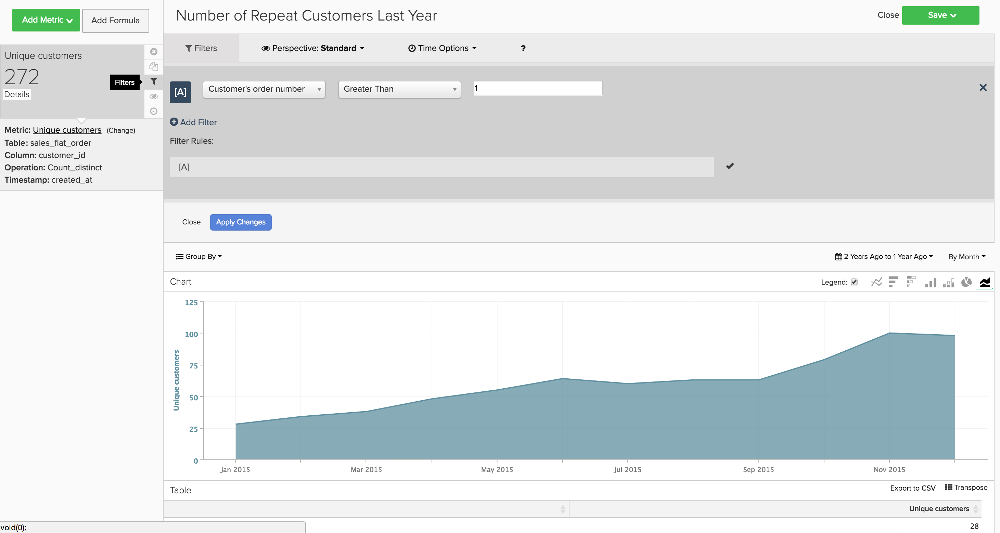<!--{: width="929"}-->

### 按订单生命周期数列出的主要客户

* **描述**:基于总订单数的排名最前的客户列表。 这可以直接列出最常购物的顾客。
* **使用的量度**: `Orders`
* **报表示例**:按订单生命周期数划分的前25位客户
   * **[!UICONTROL Metric]**: `Orders`
   * **[!UICONTROL Time Range]**: `All Time`
   * **[!UICONTROL Time Interval]**: `None`
   * **[!UICONTROL Group By]**: `customer_email`
   * **[!UICONTROL Show Top/Bottom]**:前25个按订单排序

   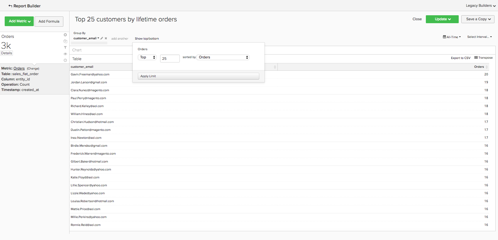<!--{: width="929"}-->

### 按存留期收入划分的主要客户

* **描述**:基于生命周期收入的热门客户列表。
* **使用的量度**: `Average Lifetime Revenue`
* **报表示例**:按存留期收入划分的25大客户
   * **[!UICONTROL Metric]**: `Average Lifetime Revenue`
   * **[!UICONTROL Time Range]**: `All time`
   * **[!UICONTROL Time Interval]**: `None`
   * **[!UICONTROL Group By]**: `customer_email`
   * **[!UICONTROL Show Top Bottom]**:前25个按生命周期收入排序

   <!--{: width="929"}-->

### 按同类群组划分的平均生命周期收入

* **描述**:跟踪 [不同同类群组的平均生命周期收入](../dev-reports/lifetime-rev-cohort-analysis.md) 用户数量，以识别性能最佳的同类群组。 同类群组按共同日期（如首次订购日期或创建日期）分组在一起。
* **使用的量度**: `Revenue`
* **报表示例**:按同类群组划分的平均客户生命周期收入
   * **[!UICONTROL Metric]**: `Revenue`
   * **[!UICONTROL Cohort Date]**: `Customer's first order date`
   * **[!UICONTROL Time Interval]**: `Month`
   * **[!UICONTROL Time Period]**:移动最近8个包含至少4个月数据的同类群组的集合
   * **[!UICONTROL Duration]**: `12 Month(s)`
   * **[!UICONTROL Table]**: `Customer_entity`
   * **[!UICONTROL Perspective]**:每个同类群组成员的累积平均值

   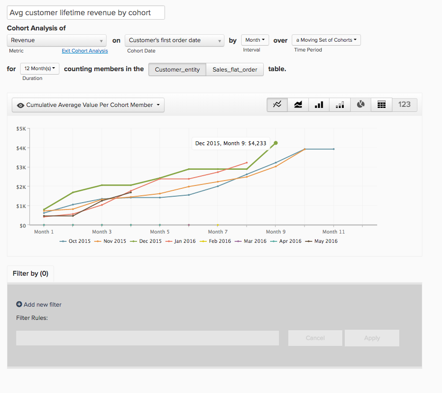<!--{: width="929"}-->

### 按优惠券使用情况划分的客户

* **描述**:已使用优惠券/折扣代码的已购客户数量的计数。 这有助于您清楚地了解您的折扣寻求者与全价购买者。
* **使用的量度**: `New Users`
* **报表示例**:按月列出的优惠券和非优惠券客户
   * **[!UICONTROL Metric A]**: `Non coupon customers`
   * **[!UICONTROL Metric]**: `New Users`
   * **[!UICONTROL Filters]**:客户的生命周期订单数大于0且客户的生命周期优惠券数等于0
   * **[!UICONTROL Metric B]**: `Coupon customers`
   * **[!UICONTROL Metric]**: `New Users`
   * **[!UICONTROL Filters]**:客户存留期订单数大于0且客户存留期优惠券数大于0
   * **[!UICONTROL Time range]**: `All Time`
   * **[!UICONTROL Time interval]**: `By Month`

   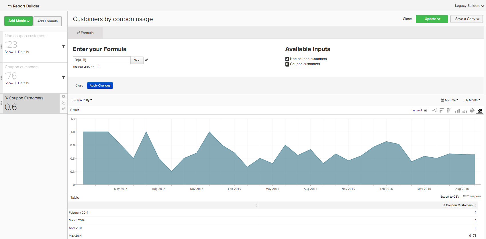<!--{: width="929"}-->

* **报表示例2**:按月列出的优惠券和非优惠券客户百分比
   * **[!UICONTROL Metric A]**: `Non coupon customers` （隐藏量度）
      * **[!UICONTROL Metric]**: `New Users`
      * **[!UICONTROL Filters]**: `Customer's Lifetime Number of Orders Greater Than 0` 和 `Customer's Lifetime Number of Coupons Equal to 0`
   * **[!UICONTROL Metric B]**: `Coupon customers`
      * **[!UICONTROL Metric]**: `New Users`
      * **[!UICONTROL Filters]**: `Customers Lifetime Number of Orders Greater Than 0` 和 `Customer's Lifetime Number of Coupons Greater Than 0`
   * **[!UICONTROL Time Range]**: `All Time`
   * **[!UICONTROL Time Interval]**: `By Month`
   * **[!UICONTROL Formula]**: `B/(A+B)`

>[!NOTE]
>
> **隐藏所有量度**

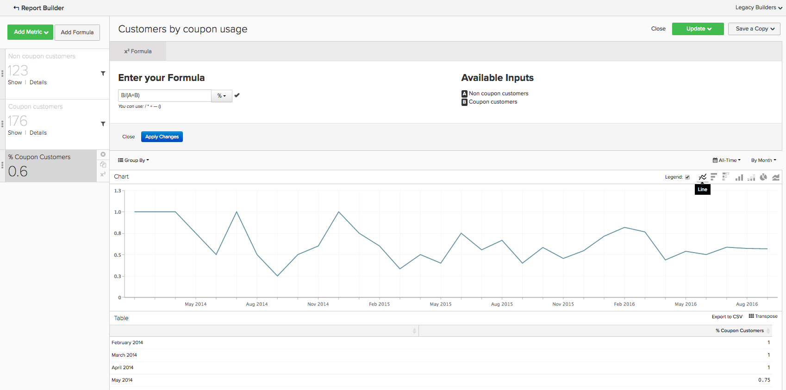<!--{: width="929"}-->

### 前30天平均收入

* **描述**:客户作为客户前30天内产生的平均收入额。
* **量度描述**:此量度执行 **平均** of `Customer's First 30 Day Revenue` 从 `customer_entity` 表排序依据 `created_at`.
* **报表描述**:客户前30天收入的所有时间平均值
* **[!UICONTROL Metric]**: `Average First 30 Day Revenue`
* **[!UICONTROL Time Range]**: `All Time`
* **[!UICONTROL Time Interval]**: `None`

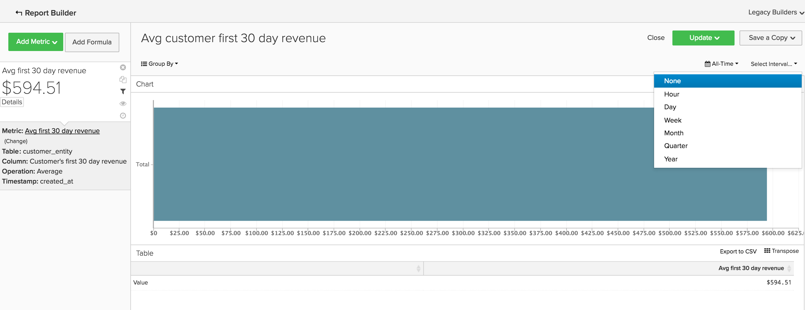<!--{: width="929"}-->

### 客户生命周期平均收入

* **描述**:客户在其生命周期内产生的平均收入额。
* **量度描述**:此量度执行 **平均** 的 `Customer's Lifetime Revenue` 列 `customer_entity` 表 `created_at`.
* **报表描述**:客户生命周期收入的所有时间平均值
   * **[!UICONTROL Metric]**: `Average Customer Lifetime Revenue`
   * **[!UICONTROL Time Range]**: `All Time`
   * **[!UICONTROL Time Interval]**: `None`

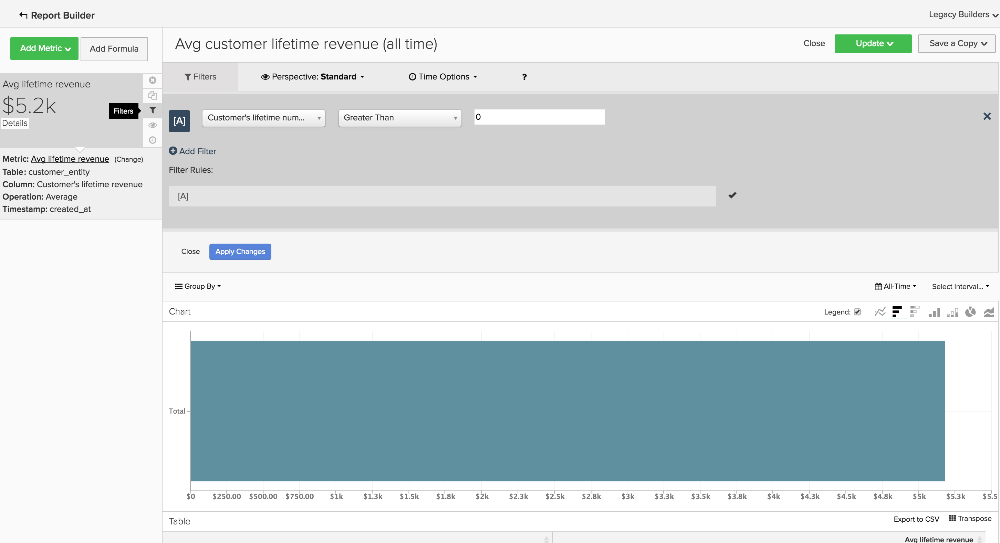<!--{: width="929"}-->

## 订购分析 {#orderanalytics}

### 收入

* **描述**:“收入”量度显示选定时间段内总收入。
* 此量度执行 **sum** of `grand_total` 从 `sales_flat_order` 表排序依据 `created_at`.
* **报表示例**:按月收入，当年截至统计日
   * **[!UICONTROL Metric]**: `Revenue`
   * **[!UICONTROL Time Range]**: `1 Year Ago to 1 Month Ago`
   * **时间间隔**: `By Month`

>[!TIP]
>
>确保收入量度的计算与您在内部讨论的定义一致。 例如，您可能只想计算已发运订单的收入，您可能需要换算不同地区的货币，并且可能想要排除税。 此外，您还可以使用 [过滤集](../../data-user/reports/ess-manage-data-filters.md) 以确保在同一表上构建的所有量度保持一致性。

<!--{: width="929"}-->

### 订单数

* **描述**:给定时间段内订购总数的计数。 订单报表将跟踪由新产品、促销或任何其他可能增加（或减少）交易量的活动所导致的订单量变化。 您可能通常希望按多个变量对此量度进行分段，以回答您的问题。
* **量度定义**:此量度执行 **计数** of `entity_id` 从 `sales_flat_order` 表排序依据 `created_at`.
* **报表示例**:按月、当年截至统计日的订单数
   * **[!UICONTROL Metric]**: `number of orders`
   * **[!UICONTROL Time Range]**: `1 Year Ago to 1 Month Ago`
   * **[!UICONTROL Time Interval]**: `By Month`

>[!TIP]
>
>与收入量度一样，您应该 [过滤集](../../data-user/reports/ess-manage-data-filters.md) 排除未完成、测试或返回的订单。

<!--{: width="929"}-->

### 订购的产品

* **描述**:“订购产品”量度可告知您特定时间段内售出的产品数量。
* **量度定义**:此量度执行 **sum** of `qty_ordered` 从 `sales_flat_order_item` 表排序依据 `created_at`.
* **报表示例**:按月销售的物料（当年截至统计日）
   * **[!UICONTROL Metric]**: `Products ordered`
   * **[!UICONTROL Time Range]**: `1 Year Ago to 1 Month Ago`
   * **[!UICONTROL Time Interval]**: `By Month`

   <!--{: width="929"}-->

* 将此量度与订单数量量度结合使用，可计算每个订单的项目数。 接下来，将优惠券代码添加到报表，以确定促销活动对购物车大小有何影响，或按新订单与重复订单进行细分，以便更好地了解客户行为。
* **报表示例**:每次订购的产品：第1次订购与重复订购
   * **[!UICONTROL Metric A]**:订购的产品：第1订单
      * **[!UICONTROL Metric]**: `Products ordered`
      * **[!UICONTROL Filter]**: `Customer's order number = 1`
   * **[!UICONTROL Metric B]**:订单数：第1订单
      * **[!UICONTROL Metric]**: `Orders`
      * **[!UICONTROL Filter]**: `Customer's order number = 1`
   * **[!UICONTROL Metric C]**:订购的产品：重复订单
      * **[!UICONTROL Metric]**: `Products ordered`
      * **[!UICONTROL Filter]**: `Customer's order number > 1`
   * **[!UICONTROL Metric D]**:订单数：重复订单
      * **[!UICONTROL Metric]**: `Orders`
      * **[!UICONTROL Filter]**: `Customer's order number > 1`
   * **[!UICONTROL Time Range]**: `1 Year Ago to 1 Month Ago`
   * **[!UICONTROL Time Interval]**: `By Week`
   * **[!UICONTROL Formula 1]**: `A/B`
   * **[!UICONTROL Formula 2]**: `C/D`

>[!NOTE]
>
>取消选中 `Multiple Y-Axes box` 和 `Hide` 所有量度

<!--{: width="929"}-->

### 平均订单值

* **描述**:跟踪一段时间内下单的平均值。 使用此量度可快速确定平均订单值(AOV)因您的营销工作、产品选件和/或业务中的其他更改而出现的波动情况。
* **量度定义**:此量度执行 **平均** of `grand_total` 从 `sales_flat_order` 表排序依据 `created_at`.
* **报表示例**:AOV与上一年（当年截至统计日）
   * **[!UICONTROL Metric]**: `Average order value`
   * **[!UICONTROL Time Range]**: `1 Year Ago to 1 Month Ago`
   * **[!UICONTROL Time Interval]**: `By Month`
   * **[!UICONTROL Perspective]**: `Amount Change vs Previous Year`

   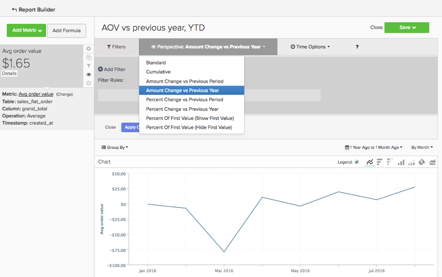<!--{: width="929"}-->

### 通过优惠券购买的产品最多

* **描述**:此报表可让您分析在提供促销活动或优惠券时正在销售哪些产品。
* **使用的量度**:订购的产品
* **报表示例**:通过优惠券购买的产品最多
   * **[!UICONTROL Metric]**: `Products ordered`
   * **[!UICONTROL Filter]**: `Order's coupon_code Is Not \[NULL\]`
   * **[!UICONTROL Time Range]**: `All-Time`
   * **[!UICONTROL Time Interval]**: `None`
   * **[!UICONTROL Group By**]: `name` (或 `SKU`，或任何其他产品标识符)
   * **[!UICONTROL Show top/bottom]**:前25个按订购产品排序

   <!--{: width="929"}-->

### 订单间隔时间

* **描述**:通过 **订购间的时间** 用于查看平均值（或中值！）的分析 两次购买之间间隔的时间。 在下图中，您可以看到您的最佳客户（那些下订单超过三个的客户）在不到六个月的时间内第二次购买产品。 未下第四次订购的客户需要等待14个月后才能第二次购买。
* **量度定义**:此量度执行 **平均** of `Time since previous order` 从 `sales_flat_order` 按顺序排序 `created_at`.
* **报表示例**:
   * **量度1**:≤ 3个订单
      * **[!UICONTROL Metric]**: `Average time between orders`
      * **[!UICONTROL Filter]**: `Customer's lifetime number of orders ≤ 3`
   * **量度2**:> 3个订单
      * **[!UICONTROL Metric]**: `Average time between orders`
      * **[!UICONTROL Filter]**: `Customer's lifetime number of orders > 3`
   * **[!UICONTROL Time Range]**: `All-Time`
   * **[!UICONTROL Time Interval]**: `None`
   * **[!UICONTROL Group By]**:` Customer's order number (previous-current)`

>[!NOTE]
>
>取消选中 `Multiple Y-Axes` 框中。

<!--{: width="929"}-->

## 营销支出分析 {#mktgspendanalytics}

### 广告支出

* **描述**:您可以按促销活动、广告集或其他区段分析不同时间段和间隔的营销支出。
* **量度定义**:此量度对 `Marketing Spend` 表按排序 `date` 列。
* **报表示例**:按促销活动划分的广告支出
   * **[!UICONTROL Metric]**: `Ad spend`
   * **[!UICONTROL Time Range]**: `All-Time`
   * **[!UICONTROL Time Interval]**: `None`
   * **[!UICONTROL Group By]**: `campaign`

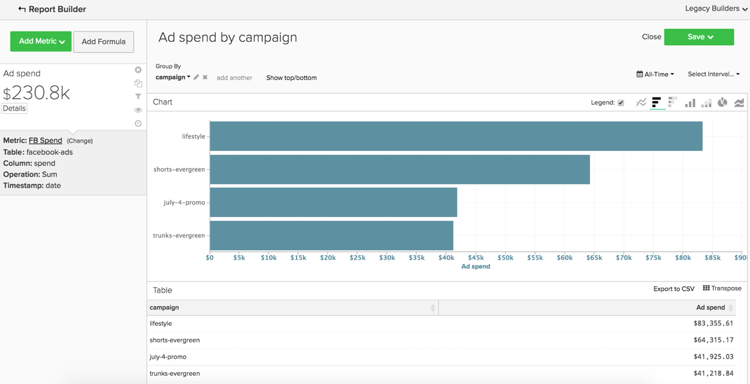<!--{: width="929"}-->

### 广告展示次数和广告点击次数

* **描述**:除了分析广告支出之外，您还可以分析广告展示次数和广告点击量。
* **量度定义**:此量度对 `Marketing Spend` 按日期列排序的表。
* **报表示例**:按天添加展示次数和广告点击次数
   * **[!UICONTROL Metric A]**: `Ad impressions`
   * **[!UICONTROL Metric B]**: `Ad clicks`
   * **[!UICONTROL Time Range]**: `1 Year Ago to 3 Months Ago`
   * **[!UICONTROL Time Interval]**: `By Day`

   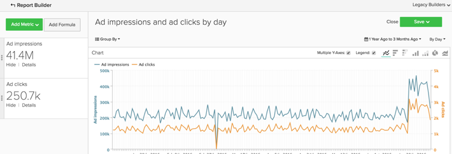<!--{: width="929"}-->

### 点进率(CTR)

* **描述**:使用上面创建的广告展示次数和广告点击量量度，您可以按不同促销活动随时间推移的点击率进行分析。
* **报表示例**:按营销活动划分的CTR
   * **[!UICONTROL Metric A]**: `Ad impressions`
   * **[!UICONTROL Metric B]**: `Ad clicks`
   * **[!UICONTROL Time Range]**:`All-Time`
   * **[!UICONTROL Time Interval]**: `None`
   * **[!UICONTROL Formula]**: `B/A`
   * 选择 `%` 选项。
   * **[!UICONTROL Group By]**: `campaign`

>[!NOTE]
>
>您可以 **标题** 公式为 `CTR`和 **隐藏** 所有量度。

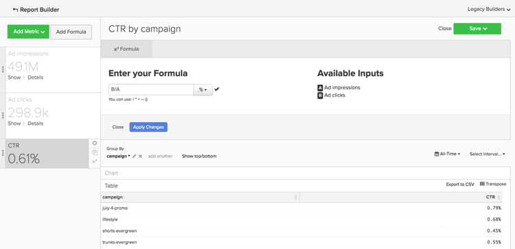<!--{: width="929"}-->

### 每次点击成本(CPC)

* **描述**:使用上面创建的广告花费和广告点击量量度，您可以分析一段时间内不同促销活动每次点击的成本。
* **报表示例**:各促销活动CPC
   * **[!UICONTROL Metric A]**: `Ad spend`
   * **[!UICONTROL Metric B]**: `Ad clicks`
   * **[!UICONTROL Time Range]**: `All-Time`
   * **[!UICONTROL Time Interval]**: `None`
   * **[!UICONTROL Formula]**: `A/B`
   * 选择 `currency` 选项
   * **[!UICONTROL Group By]**: `campaign`

>[!NOTE]
>
>您可以 **标题** 公式为 `CPC`和 **隐藏** 所有量度。

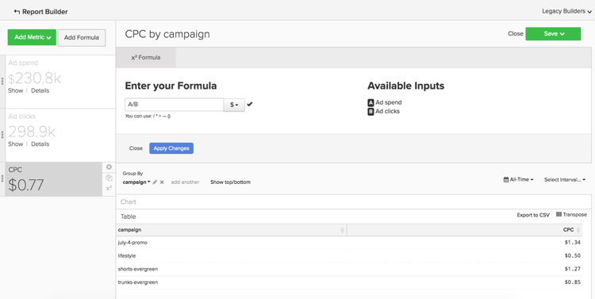<!--{: width="929"}-->

### 按客户获取来源划分的客户

* **描述**:如果您使用 [!DNL Google eCommerce]，则可以按客户获取来源分析客户。 这将帮助您确定哪些营销源正在获取客户，并回答诸如“大多数客户是通过 [!DNL Google], [!DNL Facebook]，或其他来源？”
* **报表示例**:按客户获取来源划分的客户
   * **[!UICONTROL Metric Used]**: `New Customers`
   * **[!UICONTROL Time Range]**: `All-Time`
   * **[!UICONTROL Time Interval]**: `By Month`
   * **[!UICONTROL Group By]**: `Customer's first order's source`

>[!NOTE]
>
>查看 [本文](../analysis/most-value-source-channel.md) 有关使用客户获取源的报表的更多示例。

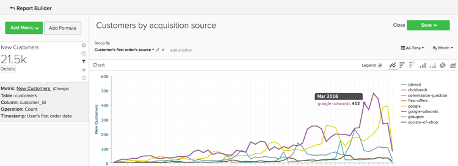<!--{: width="929"}-->

### 按客户获取媒介和客户获取促销活动划分的客户

* **描述**:与按客户获取来源分析客户类似，您还可以按客户首次订购的媒介和营销活动分析客户。 这可以帮助您回答诸如“哪些营销活动吸引新客户？”之类的问题。
* **报表示例**:按带付费媒介的客户获取促销活动划分的客户
   * **[!UICONTROL Metric Used]**: `New customers`
   * **[!UICONTROL Filter]**: `Customer's first order's medium IN ppc`
   * **[!UICONTROL Time Range]**: `All-Time`
   * **[!UICONTROL Time Interval]**: `None`
   * **[!UICONTROL Group By]**: `Customer's first order's campaign`

>[!NOTE]
>
>对于 `New Customers` 量度中，您可以为您的业务添加任何其他被视为“付费”媒介的媒体，例如cpc或付费搜索。

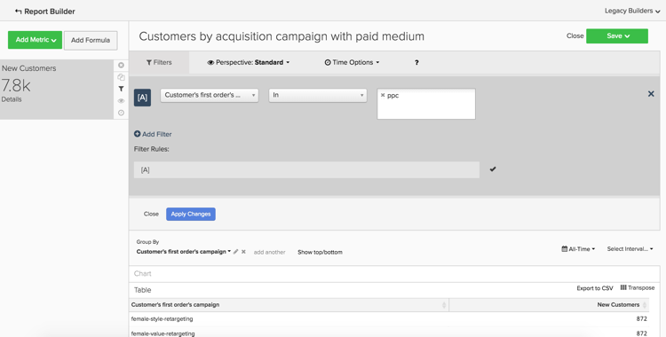<!--{: width="929"}-->

### 客户获取成本(CAC)或每次获取成本(CPA)

* **描述**:分析促销活动成本的一种方法是，仅将所有成本归因于您通过促销活动获得的客户。
* **报表示例**:按活动划分的CAC
   * **[!UICONTROL Metric A]**: `New customers`
   * **[!UICONTROL Filter]**: `Customer's first order's medium IN ppc`
   * **[!UICONTROL Metric B]**: `Ad Spend`
   * **[!UICONTROL Time Range]**: `All-Time`
   * **[!UICONTROL Time Interval]**: `None`
   * **[!UICONTROL Formula]**: `B/A`
   * 选择 `currency` 选项
   * **[!UICONTROL Group By]**:
      * 对于量度 `A`，选择 `Customer's first order's campaign`
      * 对于量度 `B`，选择 `campaign`

   

>[!NOTE]
>
>您可以 **标题** 公式为 `CTR`和 **隐藏** 所有量度。 另外，请查看 [本文](../analysis/roi-ad-camp.md) 以了解更多信息。

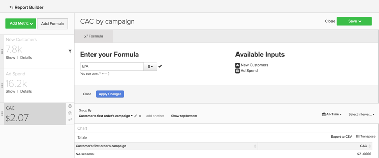

### 按客户获取来源、媒介和促销活动列出的生命周期值

* **描述**:除了分析每个营销活动获得的客户数量之外，您还可以分析这些客户的平均生命周期收入。 这将帮助您识别：
   * 如果某些促销活动吸引了大量客户，但这些客户的生命周期价值较低。
   * 如果某些促销活动吸引的客户数量较少，但这些客户的生命周期价值较高。
* **报表示例**:首先，将 `New customers` 量度。 然后，将 `Average lifetime revenue` 量度。 选择所需的时间范围，然后选择 `interval` as `None`. 最后，选择 `group by` 选项作为`Customer's first order's campaign`.
   * **[!UICONTROL Metric A]**: `New Customers`
   * **[!UICONTROL Filter A]**: `Customer's first order's source` 类似“%google%”
   * **[!UICONTROL Filter B]**: `Customer's first order's medium IN ppc`
   * **[!UICONTROL Metric B]**: `Average lifetime revenue`
   * **[!UICONTROL Filter A]**: `Customer's first order's source` 类似“%google%”
   * **[!UICONTROL Filter B]**: `Customer's first order's medium IN ppc`
   * **[!UICONTROL Time Range]**: `All-Time`
   * **[!UICONTROL Time Interval]**: `None`
   * **[!UICONTROL Group By]**: `Customer's first order's campaign`

>[!NOTE]
>
>对于这两个过滤器，您可以为您的业务添加任何其他被视为“付费”媒介的媒体，例如CPC或付费搜索，并且可以添加要分析的任何其他来源，例如Facebook。 另外，请查看 [本文](../analysis/roi-ad-camp.md) 有关CAC、LTV和ROI的更多详细信息。

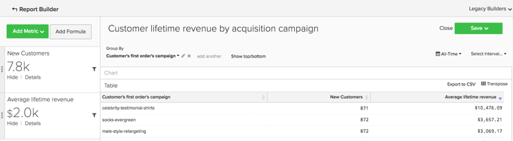<!--{: width="929"}-->

### 投资回报(ROI)

* **描述**:按促销活动计算ROI的一种方法是分析通过促销活动下达的所有订单。 但是，另一种方法是分析通过促销活动获得的客户的生命周期值。 要分析ROI，营销活动名称在您的支出数据和事务型数据中必须保持一致。 如果您创建了以下报表，并且由于促销活动名称不匹配而不存在ROI值，则可能需要查看 [UTM标记](../../best-practices/utm-tagging-google.md) 您已实施。
* **报表示例**:按活动划分的投资回报率
   * **[!UICONTROL Metric A]**: `New Customers`
   * **[!UICONTROL Filter A]**: `Customer's first order's source` 类似“%google%”
   * **[!UICONTROL Filter B]**: `Customer's first order's medium IN ppc`
   * **[!UICONTROL Metric B]**: `Average lifetime revenue`
   * **[!UICONTROL Filter A]**: `Customer's first order's source` 类似“%google%”
   * **[!UICONTROL Filter B]**: `Customer's first order's medium IN ppc`
   * **[!UICONTROL Metric C]**: `Ad spend`
   * **[!UICONTROL Time Range]**: `All-Time`
   * **[!UICONTROL Time Interval]**: `None`
   * **[!UICONTROL Formula]**: `(B-(C/A))/(C/A)`
   * 选择 `% `选项
   * **[!UICONTROL Group By]**:
      * 对于量度 `A` 和 `B`，选择 `Customer's first order's campaign`
      * 对于量度 `C`，选择 `campaign`

>[!NOTE]
>
>您可以将公式命名为“ROI”，并隐藏所有量度。 此外，您还可以调整量度中的过滤器，以分析替代来源和媒介。 另外，请查看 [本主题](../analysis/roi-ad-camp.md) 有关CAC、LTV和ROI的更多详细信息。

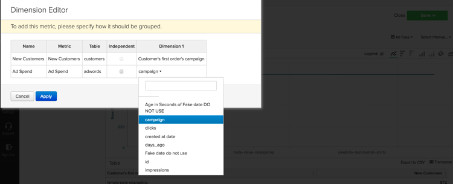<!--{: width="929"}-->

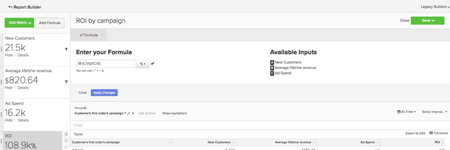<!--{: width="929"}-->
