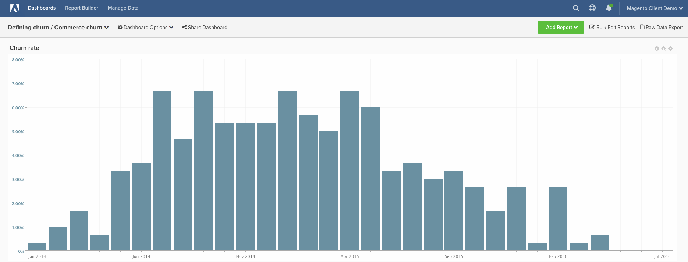

# 客户流失率

本主题演示如何计算 **客户流失率** 您的 **商业客户**. 与SaaS或传统订阅公司不同，商务客户通常没有具体的东西 **&quot;流失事件&quot;** 以向您表明他们不应再计为活跃客户。 因此，您可以通过以下说明，根据客户自上次订购以来经过的时间，将客户定义为“客户流失”。

许多客户都希望获得帮助，以便开始概念化 **时间范围** 他们应根据自己的数据使用。 如果要使用历史客户行为来定义此项，请执行以下操作 **流失时间范围**，您可能需要熟悉 [定义流失](../analysis/define-cust-churn.md) 主题。 然后，您可以在下面的说明中使用客户流失率公式中的结果。

## 计算列

要创建的列

* **`customer_entity`** 表
* **`Customer's last order date`**
   * 选择 [!UICONTROL definition]： `Max`
   * 选择 [!UICONTROL table]： `sales_flat_order`
   * 选择 [!UICONTROL column]： `created_at`
   * `sales_flat_order.customer_id = customer_entity.entity_id`
   * [!UICONTROL Filter]: `Orders we count`

* **`Seconds since customer's last order date`**
   * 选择 [!UICONTROL definition]： `Age`
   * 选择 [!UICONTROL column]： `Customer's last order date`

>[!NOTE]
>
>确保 [将所有新列作为维度添加到量度](../data-warehouse-mgr/manage-data-dimensions-metrics.md) 然后再生成新报告。

## 量度

* **新客户（按第一订单日期）**
   * 被计数的客户

>[!NOTE]
>
>此量度可能存在于您的帐户中。

* 在 **`customer_entity`** 表
* 此量度执行 **计数**
* 在 **`entity_id`** 列
* 排序依据 **`Customer's first order date`** 时间戳
* [!UICONTROL Filter]:

* **新客户（按上次订单日期）**
   * 被计数的客户

   >[!NOTE]
   >
   >此量度可能存在于您的帐户中。

* 在 **`customer_entity`** 表
* 此量度执行 **计数**
* 在 **`entity_id`** 列
* 排序依据 **`Customer's last order date`** 时间戳
* [!UICONTROL Filter]:

>[!NOTE]
>
>确保 [将所有新列作为维度添加到量度](../data-warehouse-mgr/manage-data-dimensions-metrics.md) 然后再生成新报告。

## 报告

* **客户流失率**
   * [!UICONTROL Metric]：新客户（按第一订单日期）
   * [!UICONTROL Filter]: `Lifetime number of orders Greater Than 0`
   * 
      [!UICONTROL Perspective]: `Cumulative`
   * [!UICONTROL Metric]: `New customers (by last order date)`
   * [!UICONTROL Filter]:
   * 自客户上次订购日期以来的秒数>= [您为流失客户自定义的截止日期&#x200B;]**`^`**
   * `Lifetime number of orders Greater Than 0`

   * [!UICONTROL Metric]: `New customers (by last order date)`
   * [!UICONTROL Filter]: `Lifetime number of orders Greater Than 0`
   * 
      [!UICONTROL Perspective]: Cumulative
   * [!UICONTROL Formula]: `(B / ((A + B) - C)`
   * 

      [!UICONTROL Format]: Percentage

* *量度 `A`：`New customers cumulative`*
* *量度 `B`：`Churned customers by last order date`*
* *量度 `C`：`Customers by last order date cumulative`*
* *`Formula`:`Repeat order probability`*
* *`Time period`:`All time (or custom range)`*
* *`Group by`:`Customer's order number`*
* *`Chart Type`:`Column`*

以下是一些常见的月>秒转化，但google提供了其他值，包括您可能要查找的任何自定义值的周>秒转化。

| **月** | **秒** |
|---|---|
| 3 | 7,776,000 |
| 6 | 15,552,000 |
| 9 | 23,328,000 |
| 12 | 31,104,000 |

在编译所有报告后，您可以根据需要将报告组织在功能板上。 结果可能类似于上述示例仪表板。
