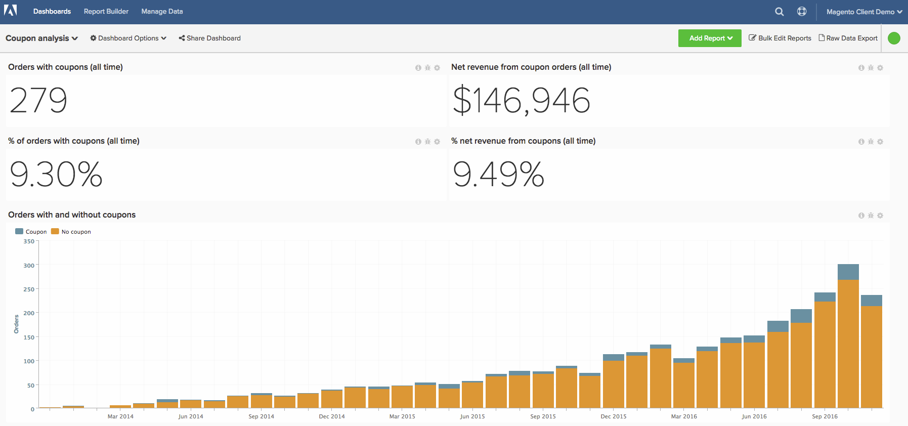

# 高级优惠券代码分析

了解业务的优惠券表现对于细分您的订单以及更好地了解您的客户非常有趣。 本主题将指导您完成创建分析的步骤，以了解您通过使用优惠券获得哪些客户，以及他们如何执行和跟踪常规优惠券使用情况。

<!--{: width="800" height="375"}-->

此分析包含 [高级计算列](../data-warehouse-mgr/adv-calc-columns.md).

## 快速入门

第一步，您需要确保将以下列同步到Data warehouse。 如果不是，请导航到 `Manage Data` > `Data Warehouse`，并同步以下内容：

* **sales\_flat\_order** 表
* **优惠券\_code**
* **base\_discount\_amount**

## 计算列

无论来宾订单策略如何，都将创建以下列：

* `sales\_flat\_order` 表
* **订单已应用优惠券？**
   * [!UICONTROL Column type]: `Same Table => CALCULATION`
   * [!UICONTROL Inputs]:
      * `A`: `coupon\_code`

   * 
     [！UICONTROL数据类型]: `String`
   * [!UICONTROL Calculation]：用例 `A` 为空，则 `No coupon` else `Coupon` 结束

* **\[INPUT\]客户\_id — 优惠券代码**
   * [!UICONTROL Column type]: `Same Table => CALCULATION`
   * [!UICONTROL Inputs]:
      * `A`: `customer\_id`
      * `B`: `coupon\_code`

   * [!UICONTROL Datatype] 字符串
   * [!UICONTROL Calculation]: `concat(A,' - ',B)`

* **具有此优惠券的订单数**
   * [!UICONTROL Column type]: `Same Table => EVENT\_NUMBER`
   * 事件所有者：`INPUT customer_id - coupon code`
   * 事件排名： `created\_at`
   * [!UICONTROL Filters]： `Orders we count` 筛选器集

如果不支持来宾订单，则创建其他列：

* `customer\_entity` 表
   * **客户的第一笔订单是否包含优惠券？ （优惠券/无优惠券）**
   * [!UICONTROL Column type]: `Many to One => MAX`
   * [!UICONTROL Path]: `sales\_flat\_order.customer\_id = customer\_entity.entity\_id`
   * 选择 [!UICONTROL column]： `Order has coupon applied? (Coupon/No coupon)`
   * [!UICONTROL Filters]:
      * `A`: `Orders we count`
      * `B`: `Customer's order number = 1`

   * **客户的首笔订单优惠券**
      * [!UICONTROL Column type]: `Many to One => MAX`
      * [!UICONTROL Path]: `sales\_flat\_order.customer\_id = customer\_entity.entity\_id`
      * 选择 [!UICONTROL column]： `coupon\_code`
      * [!UICONTROL Filter]:
         * `A`: `Orders we count`
         * `B`: `Customer's order number = 1`

   * **客户使用的优惠券的生命周期数**
      * [!UICONTROL Column type]: `Many to One => COUNT`
      * [!UICONTROL Path]: `sales\_flat\_order.customer\_id = customer\_entity.entity\_id`
      * [!UICONTROL Filter]:
         * `A`: `Orders we count`
         * `B`: `Order has coupon applied? (Coupon/No coupon) = Coupon`

   * **优惠券收购客户或非优惠券收购客户**
      * [!UICONTROL Column type]: `Same Table => CALCULATION`
      * [!UICONTROL Inputs]:
         * `A`: `Customer's first order included a coupon? (Coupon/No coupon)`

      * 
        [！UICONTROL数据类型]: `String`
      * [!UICONTROL Calculation]： **如果A=&#39;Coupon&#39;然后&#39;Coupon acquisition customer&#39;否则&#39;Non-coupon acquisition customer&#39;结束**

   * **含优惠券的客户订单百分比**
      * [!UICONTROL Column type]: `Same Table => CALCULATION`
      * [!UICONTROL Inputs]:
         * `A`: `User's lifetime number of coupons used`
         * `B`: `User's lifetime number of orders`

      * 
        [！UICONTROL数据类型]: `Decimal`
      * [!UICONTROL Calculation]： **A为null或B为null或B=0然后为null的情况，否则A/B结束**

   * **客户的优惠券使用情况**
      * [!UICONTROL Column type]: `Same Table => Calculation`
      * [!UICONTROL Inputs]:
         * `A`: `Percent of customer's orders with coupon`

      * 
        [！UICONTROL数据类型]: `String`
      * [!UICONTROL Calculation]： **当A=0时为Null，当A&lt;0.5时为“Never used coupon”，当A=0.5时为“Moverly full price”，当A=1时为“50/50”，当A>0.5时为“Coupons only”，当A>0.5时为“Moverly coupon”，否则为“Undefined”**

* `sales\_flat\_order` 表
   * **客户的第一张订单包含优惠券？ （优惠券/无优惠券）**
      * [!UICONTROL Column type]: `One to Many => JOINED\_COLUMN`
      * [!UICONTROL Path]: `sales\_flat\_order.customer\_id = customer\_entity.entity\_id`
      * 选择 [!UICONTROL column]： `Customer's first order included a coupon? (Coupon/No coupon)`
^

   * **客户的首笔订单优惠券**
      * [!UICONTROL Column type]: `One to Many => JOINED\_COLUMN`
      * [!UICONTROL Path]: `sales\_flat\_order.customer\_id = customer\_entity.entity\_id`
      * 选择 [!UICONTROL column]： `Customer's first order coupon?`

如果不支持来宾订单，则创建其他列：

* `sales\_flat\_order` 表
   * **客户的第一笔订单是否包含优惠券？ （优惠券/无优惠券）** **-** 由分析师创建，作为您的\[优惠券分析\]票证的一部分
   * **客户的首笔订单优惠券**{：：}**-** 由分析师创建，作为您的\[优惠券分析\]票证的一部分

* **客户使用的优惠券的生命周期数**{：：}**-** 由分析师创建，作为您的\[优惠券分析\]票证的一部分
* **优惠券收购客户或非优惠券收购客户**
   * [!UICONTROL Column type]: `Same Table => CALCULATION`
   * [!UICONTROL Inputs]:
      * `A`: `Customer's first order included a coupon? (Coupon/No coupon)`

   * 
     [！UICONTROL数据类型]: `String`
   * [!UICONTROL Calculation]： **如果A=&#39;Coupon&#39;然后&#39;Coupon acquisition customer&#39;否则&#39;Non-coupon acquisition customer&#39;结束**

* **含优惠券的客户订单百分比**
   * [!UICONTROL Column type]: `Same Table => CALCULATION`
   * [!UICONTROL Inputs]:
      * `A`: `User's lifetime number of coupons used`
      * `B`: `User's lifetime number of orders`

   * 
     [！UICONTROL数据类型]: `Decimal`
   * [!UICONTROL Calculation]： **A为null或B为null或B=0然后为null的情况，否则A/B结束**

* **客户的优惠券使用情况**
   * [!UICONTROL Column type]: `Same Table => Calculation`
   * [!UICONTROL Inputs]:
      * `A`: `Percent of customer's orders with coupon`

   * 
     [！UICONTROL数据类型]: `String`
   * [!UICONTROL Calculation]： **当A=0时为Null，当A&lt;0.5时为“Never used coupon”，当A=0.5时为“Moverly full price”，当A=1时为“50/50”，当A>0.5时为“Coupons only”，当A>0.5时为“Moverly coupon”，否则为“Undefined”**

## 量度

* **优惠券折扣金额**
   * `Orders we count`
   * `Order has coupon applied? (Coupon/No coupon)= Coupon`

* 在 `sales\_flat\_order` 表
* 此量度执行 **总和**
* 在 `discount\_amount` 列
* 排序依据 `created\_at` 时间戳
* [!UICONTROL Filter]:

* **使用的优惠券数量**
   * `Orders we count`
   * `Order has coupon applied? (Coupon/No coupon)= Coupon`

* 在 `sales\_flat\_order` 表
* 此量度执行 **计数**
* 在 `entity\_id` 列
* 排序依据 `created\_at` 时间戳
* [!UICONTROL Filter]:

>[!NOTE]
>
>确保 [将所有新列作为维度添加到量度](../data-warehouse-mgr/manage-data-dimensions-metrics.md) 然后再生成新报告。

## 报告

* **已收购及非收购优惠券客户百分比**
   * [!UICONTROL Metric]: `New customers`

* 量度 `A`： `Coupon acquisitions`
* [!UICONTROL Time period]: `All time`
* 
  [！UICONTROL间隔]: `None`
* [!UICONTROL Group by]： `Coupon acquisitions customer` 或 `Non coupon acquisition customer`
* 
  [！UICONTROL图表类型]: `Pie`

* **收购优惠券及非收购优惠券客户数目**
   * [!UICONTROL Metric]: `New customers`

* 量度A： `Coupon acquisitions`
* [!UICONTROL Time period]: `All time`
* [!UICONTROL Interval]: `By Month`
* [!UICONTROL Group by]： `Coupon acquisitions customer` 或 `Non coupon acquisition customer`
* [!UICONTROL Chart type]: `Stacked column`

* **平均生命周期收入：优惠券收入 （90天以上）**
   * [!UICONTROL Metric]: `Average lifetime revenue`
   * [!UICONTROL Filter]:
      * 客户的第一笔订单包括优惠券（优惠券/无优惠券）=优惠券

* 量度 `A`： `Average lifetime revenue (at least 3 months age)`
* [!UICONTROL Time period]: `X years ago to 90 days ago`
* 
  [！UICONTROL间隔]: `None`
* 
  [！UICONTROL图表类型]: `Scalar`

* **平均存留期收入：无优惠券常见问题解答。 （90天以上）**
   * [!UICONTROL Metric]：平均生命周期收入
   * [!UICONTROL Filter]:
      * 客户的第一笔订单包括优惠券（优惠券/无优惠券）=无优惠券

* 量度 `A`： `Average lifetime revenue (at least 3 months age)`
* [!UICONTROL Time period]: `X years ago to 90 days ago`
* 
  [！UICONTROL间隔]: `None`
* 
  [！UICONTROL图表类型]: `Scalar`

* **按一阶优惠券计算的平均生命周期收入**
   * [!UICONTROL Metric]: `Average lifetime revenue`

* 量度 `A`： `Average lifetime revenue`
* [!UICONTROL Time period]: `All time`
* 
  [！UICONTROL间隔]: `None`
* [!UICONTROL Group by]: `Customer's first order's coupon`
* 
  [！UICONTROL图表类型]: `Column`

>[!NOTE]
>
>如果您拥有许多优惠券代码（与许多客户端一样），则您需要应用顶部/底部，例如按平均生命周期收入排序的前10位

* **重复订购的可能性：优惠券获取**
   * [!UICONTROL Metric]: `Number of orders`
   * [!UICONTROL Filter]:
      * 客户的第一笔订单包括优惠券（优惠券/无优惠券）=优惠券

   * [!UICONTROL Metric]: `Number of orders`
   * [!UICONTROL Filter]:
      * 客户的第一笔订单包括优惠券（优惠券/无优惠券）=优惠券
      * 是客户的最后一个订单吗？ =否
   * 
     [！UICONTROL公式]: `B/A`
   * [!UICONTROL Format]: `Percentage %`

   * 从中选择统计上显著的数字 `Customer's by lifetime orders` 图表。 在查看图表时，一个好的规则是查找时段中具有30个或更多客户的订单编号。 根据您的数据集，这可能是一个很大的数字，因此请随意添加1-10。

* 量度 `A`： `Number of orders`
* 量度 `B`： `Number of non last orders`
* [!UICONTROL Formula]: `Repeat order probability`
* [!UICONTROL Time period]: `All time`
* 
  [！UICONTROL间隔]: `None`
* [!UICONTROL Group by]: `Customer's order number`
* [!UICONTROL Chart type]: `Bar chart`

* **重复订购概率：非优惠券获取**
   * [!UICONTROL Metric]: `Number of orders`
   * [!UICONTROL Filter]:
      * 客户的第一笔订单包括优惠券（优惠券/无优惠券）=无优惠券

   * [!UICONTROL Metric]: `Number of orders`
   * [!UICONTROL Filter]:
      * 客户的第一笔订单包括优惠券（优惠券/无优惠券）=无优惠券
      * 是客户的最后一个订单吗？ =否

   * 
     [！UICONTROL公式]: `B/A`
   * [!UICONTROL Format]: `Percentage %`

   * 从中选择统计上显著的数字 `Customer's by lifetime orders` 图表或1-5。

* 量度 `A`： `Number of orders`
* 量度 `B`： `Number of non last orders`
* [!UICONTROL Formula]: `Repeat order probability`
* [!UICONTROL Time period]: `All time`
* 
  [！UICONTROL间隔]: `None`
* [!UICONTROL Group by]: `Customer's order number`
* [!UICONTROL Chart type]: `Bar chart`

* **优惠券获得客户的优惠券使用率（重复订购）**
   * [!UICONTROL Metric]: `New customers`
   * [!UICONTROL Filter]:
      * 优惠券收购客户或非优惠券收购客户=优惠券收购

   * [!UICONTROL Metric]: `Number of orders`
   * [!UICONTROL Filter]:
      * 客户的订单编号> 1
      * 客户的第一笔订单是否包含优惠券？ （优惠券/无优惠券）=优惠券

   * [!UICONTROL Metric]:`Number of orders`
   * [!UICONTROL Filter]:
      * 客户的订单编号> 1
      * 客户的第一笔订单是否包含优惠券？ （优惠券/无优惠券）=优惠券
      * 订单已应用优惠券？ （优惠券/无优惠券）=优惠券

   * 
     [！UICONTROL公式]: `C/B`
   * [!UICONTROL Format]: `Percentage %`

* 量度 `A`： `Coupon-acquired customers`
* 量度 `B`： `Number of repeat orders`
* 量度 `C`： `Number of repeat orders with coupon`
* [!UICONTROL Formula]: `% of repeat orders with coupon`
* [!UICONTROL Time period]: `All time`
* 
  [！UICONTROL间隔]: `None`
* 
  [！UICONTROL图表类型]: `Table` (可以转置此表以获得更好的可视化)

* **非优惠券收购客户的优惠券使用率（重复订购）**
   * [!UICONTROL Metric]: `New customers`
   * [!UICONTROL Filter]:
      * 优惠券收购客户或非优惠券收购客户=非优惠券收购

   * [!UICONTROL Metric]: `Number of orders`
   * [!UICONTROL Filter]:
      * 客户的订单编号> 1
      * 客户的第一笔订单是否包含优惠券？ （优惠券/无优惠券）=无优惠券

   * [!UICONTROL Metric]: `Number of orders`
   * [!UICONTROL Filter]:
      * 客户的订单编号> 1
      * 客户的第一笔订单是否包含优惠券？ （票息/无票息）=无票息
      * 订单已应用优惠券？ （优惠券/无优惠券）=优惠券

   * 
     [！UICONTROL公式]: `C/B`
   * [!UICONTROL Format]: `Percentage %`

* 量度 `A`： `Non-coupon-acquired customers`
* 量度 `B`： `Number of repeat orders`
* 量度 `C`： `Number of repeat orders with coupon`
* [!UICONTROL Formula]: `% of repeat orders with coupon`
* [!UICONTROL Time period]: `All time`
* 
  [！UICONTROL间隔]: `None`
* 
  [！UICONTROL图表类型]: `Table` (可以转置此表以获得更好的可视化)

* **优惠券使用情况详细信息（首次订购）**
   * [!UICONTROL Metric]: `Number of orders`
   * [!UICONTROL Filter]:
      * 客户的订单编号= 1
      * 使用此优惠券的订单数> 10

   * 
     [！UICONTROL量度]: `Revenue`
   * [!UICONTROL Filter]:
      * 客户的订单编号= 1
      * 使用此优惠券的订单数> 10

   * [!UICONTROL Metric]: `Coupon discount amount`
   * [!UICONTROL Filter]:
      * 客户的订单编号= 1
      * 使用此优惠券的订单数> 10

   * [!UICONTROL Formula]： `B-C` （如果C为负）；B+C（如果C为正）
   * 
     [！UICONTROL格式]: `Currency`

   * [!UICONTROL Metric]: `Average order value`
   * [!UICONTROL Filter]:
      * 客户的订单编号= 1
      * 使用此优惠券的订单数> 10

* 量度 `A`： `First time orders (FTO)`
* 量度 `B`： `Revenue from FTO`
* 量度 `C`： `Discounts applied to FTO`
* [!UICONTROL Formula]: `Gross revenue from FTO`
* 量度 `E`： `Average order value for FTO`
* [!UICONTROL Time period]: `All time`
* 
  [！UICONTROL间隔]: `None`
* [!UICONTROL Group by]: `coupon code`
* 
  [！UICONTROL图表类型]: `Table`
>[!NOTE]
>
>“使用此优惠券的订单数”的数量10是任意的。 请为此过滤器使用最合适的数量。

* **含优惠券的订单数（所有时间）**
   * [!UICONTROL Metric]: `Number of coupons used`

* 量度 `A`： `Number or orders with coupon`
* [!UICONTROL Time period]: `All time`
* 
  [！UICONTROL间隔]: `None`
* 
  [！UICONTROL图表类型]: `Scalar`

* **含优惠券的订单净收入（全时）**
   * 
     [！UICONTROL量度]: `Revenue`
   * [!UICONTROL Filter]:
      * 订单已应用优惠券？ （优惠券/无优惠券）=优惠券

* 量度 `A`： `Net revenue from orders with coupons`
* [!UICONTROL Time period]: `All time`
* 
  [！UICONTROL间隔]: `None`
* 
  [！UICONTROL图表类型]: `Scalar`

* **优惠券折扣（所有时间）**
   * [!UICONTROL Metric]: `Number of coupons used`

* 量度 `A`： `Coupon discount amount`
* [!UICONTROL Time period]: `All time`
* 
  [！UICONTROL间隔]: `None`
* 
  [！UICONTROL图表类型]: `Scalar`

* **有优惠券和无优惠券的订单数**
   * [!UICONTROL Metric]: `Number of orders`

* 量度 `A`： `Number of orders`
* [!UICONTROL Time period]: `Last 24 months`
* 
  [！UICONTROL间隔]: `None`
* [!UICONTROL Group by]: `Order has coupon applied? (Coupon/No coupon)`
* [!UICONTROL Chart type]: `Stacked column`

* **重复用户中的优惠券使用情况**
   * [!UICONTROL Metric]: `New customers`
   * [!UICONTROL Filter]:
      * 客户的存留期订单数> 1

* 量度 `A`： `New customers`
* [!UICONTROL Time period]: `All time`
* 
  [！UICONTROL间隔]: `None`
* [!UICONTROL Group by]: `Customer's coupon usage`
* 
  [！UICONTROL图表类型]: `Pie`

* **优惠券使用情况详细信息**
   * [!UICONTROL Metric]: `Number of orders with coupon`
   * [!UICONTROL Filter]:
      * 使用此优惠券的订单数> 10

   * 
     [！UICONTROL量度]: `Revenue`
   * [!UICONTROL Filter]:
      * 使用此优惠券的订单数> 10

   * [!UICONTROL Metric]: `Coupon discount amount`
   * [!UICONTROL Filter]:
      * 使用此优惠券的订单数> 10

   * [!UICONTROL Formula]： `B-C` (如果 `C` 为负面)； `B+C` (如果 `C` 为正数)
   * 
     [！UICONTROL格式]: `Currency`

   * [!UICONTROL Formula]： `C/(B-C)` (如果 `C` 为负面)； `C/(B+C)` (如果 `C` 为正数)
   * 
     [！UICONTROL格式]: `Percentage`

   * [!UICONTROL Metric]: `Average order value`
   * [!UICONTROL Filter]:
      * 使用此优惠券的订单数> 10

   * 
     [！UICONTROL公式]: `C/A`
   * 
     [！UICONTROL格式]: `Currency`

   * [!UICONTROL Metric]: `Distinct buyers`
   * [!UICONTROL Filter]:
      * 使用此优惠券的订单数> 10

* 量度 `A`： `Number of orders`
* 量度 `B`： `Net revenue from orders`
* 量度 `C`： `Total discounts applied`
* [!UICONTROL Formula]: `Gross revenue`
* [!UICONTROL Formula]: `% discounted`
* 量度 `F`： `Average net order value`
* [!UICONTROL Formula]: `Average order discount`
* 量度 `H`： `Distinct buyers`
* [!UICONTROL Time period]: `All time`
* 
  [！UICONTROL间隔]: `None`
* [!UICONTROL Group by]: `coupon code`
* 
  [！UICONTROL图表类型]: `Table`

>[!NOTE]
>
>“使用此优惠券的订单数”的数量10是任意的。 请为此过滤器使用最合适的数量。

在编译所有报告后，您可以根据需要将报告组织在功能板上。 结果可能与页面顶部的图像类似。

如果您在构建此分析时遇到任何问题，或者只是想让专业服务团队参与进来， [联系支持人员](https://experienceleague.adobe.com/docs/commerce-knowledge-base/kb/troubleshooting/miscellaneous/mbi-service-policies.html).
