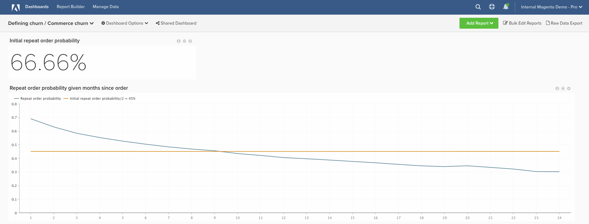

# 事务性客户流失

本主题演示如何设置功能板，帮助您定义事务型客户的流失。

此分析包含 [高级计算列](../data-warehouse-mgr/adv-calc-columns.md).

## 计算列

要创建的列

* `customer_entity` 表
* `Customer's lifetime number of orders`
* 选择定义： `Count`
* 选择 [!UICONTROL table]： `sales_flat_order`
* 选择 [!UICONTROL column]： **`entity_id`**
* [!UICONTROL Path]： sales_flat_order.customer_id = customer_entity.entity_id
* [!UICONTROL Filter]:
* 已计数的订单

* `sales_flat_order` 表
* `Customer's lifetime number of orders`
* 选择定义：“已连接”列
* 选择 [!UICONTROL table]： `customer_entity`
* 选择 [!UICONTROL column]： `Customer's lifetime number of orders`
* [!UICONTROL Path]: `sales_flat_order.customer_id = customer_entity.entity_id`
* [!UICONTROL Filter]: `Orders we count`

* `Seconds since created_at`
* 选择定义： `Age`
* 选择 [!UICONTROL column]： `created_at`

* **`Customer's order number`** 由分析师创建，作为您的一部分 **[定义流失]** 票证
* **`Is customer's last order`** 由分析师创建，作为您的一部分 **[定义流失]** 票证
* **`Seconds since previous order`** 由分析师创建，作为您的一部分 **[定义流失]** 票证
* **`Months since order`** 由分析师创建，作为您的一部分 **[定义流失]** 票证
* **`Months since previous order`** 由分析师创建，作为您的一部分 **[定义流失]** 票证

## 量度

无新量度！

>[!NOTE]
>
>确保 [将所有新列作为维度添加到量度](../data-warehouse-mgr/manage-data-dimensions-metrics.md) 然后再生成新报告。

## 报告

* **初始重复顺序概率**
* 量度A：所有时间重复订单
* [!UICONTROL Metric]: `Number of orders`
* [!UICONTROL Filter]: `Customer's order number greater than 1`

* 量度B：所有时间订单
* [!UICONTROL Metric]：订单数

* [!UICONTROL Formula]：初始重复顺序概率
* 
   [！UICONTROL公式]: `A/B`
* 

   [!UICONTROL Format]: `Percent`

* [!UICONTROL Time period]: `All time`
* 
   [!UICONTROL Interval]: `None`
* 

   [!UICONTROL Chart type]: `Scalar`

* **重复订购的概率自订购以来经过的月数**
* 量度A：按自上一个订单以来的月份重复订单（隐藏）
* [!UICONTROL Metric]: `Number of orders`
* 
   [!UICONTROL Perspective]: `Cumulative`
* [!UICONTROL Filter]: `Customer's order number greater than 1`

* 量度B：按订购后月份列出的最后订单（隐藏）
* [!UICONTROL Metric]: `Number of orders`
* 
   [!UICONTROL Perspective]: `Cumulative`
* [!UICONTROL Filter]: `Is customer's last order? (Yes/No) = Yes`

* 量度C：所有时间重复顺序（隐藏）
* [!UICONTROL Metric]: `Number of orders`
* [!UICONTROL Filter]: `Customer's order number greater than 1`

* 

   [！UICONTROL分组依据]: `Independent`

* 量度D：所有时间的最后订单（隐藏）
* [!UICONTROL Metric]: `Number of orders`
* [!UICONTROL Filter]: `Is customer's last order? (Yes/No) = Yes`

* 

   [！UICONTROL分组依据]: `Independent`

* [!UICONTROL Formula]：初始重复顺序概率
* 
   [！UICONTROL公式]: `(C-A)/(C+D-A-B)`
* 

   [!UICONTROL Format]: `Percent`

* [!UICONTROL Time period]: `All time`
* 
   [!UICONTROL Interval]: `None`
* [!UICONTROL Group by]: `Months since previous order`
* 显示top.bottom：前24个类别，按类别名称排序

* 

   [!UICONTROL Chart type]: `Line`

初始重复订单概率报表表示重复订单总数/订单总数。 每个顺序都是产生重复顺序的机会；重复顺序的数量是那些实际发生的顺序的子集。

您使用的公式简化为（X个月后发生的重复订单总数）/（至少是X个月前的订单总数）。 它向我们显示，从历史上看，由于自下订单以来已有X个月，用户下另一订单的可能性为Y%。

构建功能板后，最常见的问题是：如何使用该功能板确定流失阈值？

**对此没有“一个正确的答案”。** 但是，Adobe建议找到线条与初始重复概率比率一半的值相交的点。 在这个时候，您可以说“如果用户要重复订单，他们现在可能已经完成了。” 最终，目标是选择阈值，在此阈值下从“保留”工作切换到“重新激活”工作。

在编译所有报告后，您可以根据需要将报告组织在功能板上。 结果可能看起来像页面顶部的图像

如果您在构建此分析时遇到任何问题，或者只是想让专业服务团队参与进来， [联系支持人员](https://experienceleague.adobe.com/docs/commerce-knowledge-base/kb/troubleshooting/miscellaneous/mbi-service-policies.html).
