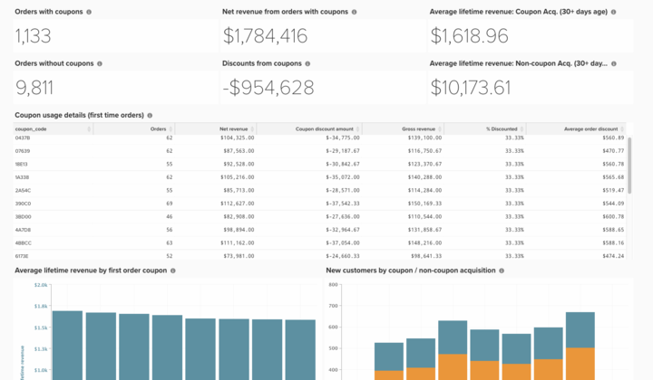

# 基本优惠券代码分析

了解业务的优惠券表现对于细分订单和更好地了解客户习惯是一种有趣的方式。

本主题记录创建此分析所需的步骤，以便了解获得优惠券的客户表现、查看趋势并跟踪单个优惠券代码的使用情况。

<!--{: width="807" height="471"}-->

## 快速入门

首先，添加有关如何跟踪优惠券代码的注释。 如果客户将优惠券应用于订单，则会发生以下三种情况：

* 折扣反映在`base_grand_total`金额(Commerce Intelligence中的`Revenue`指标)中
* 优惠券代码存储在`coupon_code`字段中。 如果此字段为NULL（空），则该订单没有与其关联的优惠券。
* 折扣金额存储在`base_discount_amount`中。 根据您的配置，此值可能显示为负值或正值。

从Commerce 2.4.7开始，客户可以向订单应用多个优惠券代码。 在本例中：

* 应用的所有优惠券代码都存储在`coupon_code`的`sales_order_coupons`字段中。 应用的第一个优惠券代码也存储在`coupon_code`的`sales_order`字段中。 如果此字段为NULL（空），则该订单没有与其关联的优惠券。

## 构建量度

第一步是通过以下步骤构建新量度：

* 导航到&#x200B;**[!UICONTROL Manage Data > Metrics > Create New Metric]**。

* 选择`sales_order`。
* 此量度对&#x200B;**base_discount_amount**&#x200B;列执行&#x200B;**Sum**，排序依据为&#x200B;**created_at**。
   * [!UICONTROL Filters]：
      * 添加`Orders we count`（保存的筛选器集）
      * 添加以下内容：
         * `coupon_code`**不是**`[NULL]`
      * 为该量度提供一个名称，如`Coupon discount amount`。

## 创建功能板

* 创建量度后：
   * 导航到[!UICONTROL Dashboards > Dashboard Options > Create New Dashboard]**。
   * 为仪表板指定名称，如`_Coupon Analysis_`。

* 您可以在此处创建和添加所有报表。

## 生成报表

* **新报告：**

>[!NOTE]
>
>每个报告的**0}列为[!UICONTROL Time Period]。 `All-time`您可以根据分析需求随意更改此设置。 Adobe建议该仪表板上的所有报告都涵盖相同的时间段，如`All time`、`Year-to-date`或`Last 365 days`。

* **含优惠券的订单**
   * 
     [！UICONTROL量度]: `Orders`
      * 添加筛选器：
         * [`A`] `coupon_code` **IS NOT** `[NULL]`

   * [!UICONTROL Time period]： `All time`
   * 
     [！UICONTROL间隔]: `None`
   * [!UICONTROL Chart type]：`Number (scalar)`

* **没有优惠券的订单**
   * 
     [！UICONTROL量度]: `Orders`
      * 添加筛选器：
         * [`A`] `coupon_code` **IS** `[NULL]`

   * [!UICONTROL Time period]： `All time`
   * 
     [！UICONTROL间隔]: `None`
   * [!UICONTROL Chart type]：`Number (scalar)`

* **含优惠券的订单净收入**
   * 
     [！UICONTROL量度]: `Revenue`
      * 添加筛选器：
         * [`A`] `coupon_code` **IS NOT** `[NULL]`

   * [!UICONTROL Time period]： `All time`
   * 
     [！UICONTROL间隔]: `None`
   * [!UICONTROL Chart type]： `Number (scalar)`

* **优惠券折扣**
   * [!UICONTROL Metric]： `Coupon discount amount`
   * [!UICONTROL Time period]： `All time`
   * 
     [！UICONTROL间隔]: `None`
   * [!UICONTROL Chart type]： `Number (scalar)`

* **平均生命周期收入：已获得优惠券的客户**
   * [!UICONTROL Metric]： `Avg lifetime revenue`
      * 添加筛选器：
         * [`A`] `Customer's first order's coupon_code` **IS NOT** `[NULL]`

   * [!UICONTROL Time period]： `All time`
   * 
     [！UICONTROL间隔]: `None`
   * [!UICONTROL Chart type]： `Number (scalar)`

* **平均生命周期收入：未获得优惠券的客户**
   * [!UICONTROL Metric]： `Avg lifetime revenue`
      * 添加筛选器：
         * [A] `Customer's first order's coupon_code` **IS**`[NULL]`

   * [!UICONTROL Time period]： `All time`
   * 
     [！UICONTROL间隔]: `None`
   * [!UICONTROL Chart type]： `Number (scalar)`

* **优惠券使用情况详细信息（首次订购）**
   * 量度`1`： `Orders`
      * 添加筛选器：
         * [`A`] `coupon_code` **不是**`[NULL]`
         * [`B`] `Customer's order number` **等于** `1`

   * 量度`2`： `Revenue`
      * 添加筛选器：
         * [`A`] `coupon_code` **不是**`[NULL]`
         * [`B`] `Customer's order number` **等于** `1`

      * 重命名： `Net revenue`

   * 量度`3`： `Coupon discount amount`
      * 添加筛选器：
         * [`A`] `coupon_code` **不是**`[NULL]`
         * [`B`] `Customer's order number` **等于** `1`

   * 创建公式： `Gross revenue`
      * [!UICONTROL Formula]： `(B – C)`
      * 
        [!UICONTROL Format]: `Currency`

   * 创建公式：**%折扣**
      * 公式： `(C / (B - C))`
      * 
        [!UICONTROL Format]: `Percentage`

   * 创建公式： `Average order discount`
      * [!UICONTROL Formula]： `(C / A)`
      * 
        [!UICONTROL Format]: `Percentage`

   * [!UICONTROL Time period]： `All time`
   * 
     [！UICONTROL间隔]: `None`
   * 
     [！UICONTROL图表类型]: `Table`

* **按第一张订单优惠券计算的平均生命周期收入**
   * [!UICONTROL Metric]：**平均生命周期收入**
      * 添加筛选器：
         * [`A`] `coupon_code` **是**`[NULL]`

   * [!UICONTROL Time period]： `All time`
   * 
     [！UICONTROL间隔]: `None`
   * [!UICONTROL Chart type]： `Number (scalar)`

* **优惠券使用情况详细信息（首次订购）**
   * [!UICONTROL Metric]： `Avg lifetime revenue`
      * 添加筛选器：
         * [`A`] `Customer's first order's coupon_code` **IS NOT** `[NULL]`

   * [!UICONTROL Time period]： `All time`
   * 
     [！UICONTROL间隔]: `None`
   * [!UICONTROL Group by]： `Customer's first order's coupon_code`
   * 
     [！UICONTROL图表类型]: **Column**

* **通过优惠券/非优惠券获取的新客户**
   * 量度`1`： `New customers`
      * 添加筛选器：
         * [`A`] `Customer's first order's coupon_code` **IS NOT** `[NULL]`

      * [!UICONTROL Rename]： `Coupon acquisition customer`

   * 量度`2`： `New customers`
      * 添加筛选器：
         * [`A`] `coupon_code` **是**`[NULL]`

      * [!UICONTROL Rename]： `Non-coupon acquisition customer`

   * [!UICONTROL Time period]： `All time`
   * [!UICONTROL Interval]： `By Month`
   * [!UICONTROL Chart type]： `Stacked Column`

构建报表后，请参阅本主题顶部的图像，了解如何在功能板上组织报表。

>[!NOTE]
>
>从Adobe Commerce 2.4.7开始，客户可以使用&#x200B;**quote_coupons**&#x200B;和&#x200B;**sales_order_coupons**&#x200B;表来了解客户如何使用多个优惠券。

