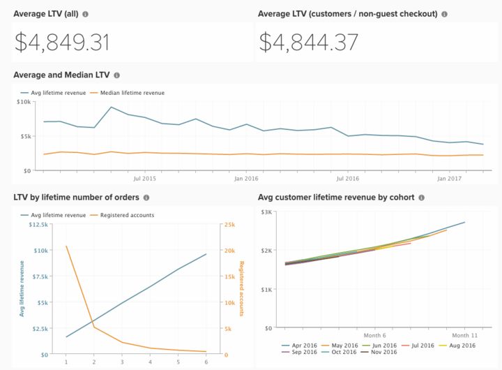

# 预期生命周期值分析

预测客户下更多订单时的存留期价值是任何规模企业最重要的方面之一。

以下是创建分析以了解当前客户的存留期值并预测存留期值如何随着更多订单增加而增加的步骤。

## 构建量度

第一步是通过以下步骤构建新量度：
* 导航到&#x200B;**[!UICONTROL Manage Data > Metrics]**
   * 查看现有&#x200B;**[!UICONTROL Avg lifetime revenue]**。

  >[!NOTE]
  >
  >构造此量度的表（可能是`customer_entity`或`sales_order`，具体取决于您的商店接受访客结账的能力。）

   * 单击&#x200B;**[!UICONTROL Create New Metric]**&#x200B;并从上方选择表。
   * 此量度对&#x200B;**列执行**&#x200B;中间值`Customer's lifetime revenue`，按`created_at`排序。
      * [!UICONTROL Filters]：
         * 添加`Customers we count (Saved Filter Set)`（或`Registered accounts we count`）

   * 为该量度提供一个名称，如`Median lifetime revenue`。

## 创建功能板

创建量度后，您可通过以下操作&#x200B;**创建功能板**：
* 导航到&#x200B;**[!UICONTROL Dashboards > Dashboard Options > Create New Dashboard]**。
* 为仪表板指定名称，如`Expected LTV`。

* 您可以在此处创建和添加所有报表。

## 生成报表

>[!NOTE]
>
>在&#x200B;**[!UICONTROL Time Period:]**&#x200B;上，每个报表的时间段均列为`All-time`。 您可以根据分析需求随意更改此设置。 Adobe建议该仪表板上的所有报告都涵盖相同的时间段，如`All time`、`Year-to-date`或`Last 365 days`。

* **[!UICONTROL Average LTV (all)]**
   * [!UICONTROL Metric]： `Avg lifetime revenue`
   * [!UICONTROL Time period]： `All time`
   * 
     [！UICONTROL间隔]: `None`
   * [!UICONTROL Chart Type]： `Number (scalar)`

* **[!UICONTROL Average LTV (customers / non-guest checkout)]**
   * [!UICONTROL Metric]： `Avg lifetime revenue`
      * 添加[!UICONTROL filters]：
         * [`A`] `Customer's group code` **不等于** `Not Logged In`
         * [`B`] `Customer's lifetime number of orders` **大于**`0`

   * [!UICONTROL Time period]： `All time`
   * 
     [！UICONTROL间隔]: `None`
   * [!UICONTROL Chart Type]： `Number (scalar)`

* **[!UICONTROL Average and Median LTV]**
   * 量度`1`： `Avg lifetime revenue`
   * 量度`2`： `Median lifetime revenue`
   * [!UICONTROL Time period]： `All time`
   * [!UICONTROL Interval]： `By Month`
   * 
     [！UICONTROL图表类型]: `Line`
   * 取消选中`Multiple Y-Axes`

* 按生命周期订单数&#x200B;**LTV**
   * 量度`1`： `Avg lifetime revenue`
   * 量度`2`： `New customers`
   * [!UICONTROL Time period]： `All time`
   * 
     [！UICONTROL间隔]: `None`
   * [!UICONTROL Group by]： `Customer's lifetime number of orders`
   * 
     [！UICONTROL图表类型]: `Line`

  >[!NOTE]
  >
  >不要添加`Customer's lifetime number of orders`的所有值。 相反，看一下新客户数量达到较小数量的情况，然后手动将每个客户的存留期订单数量值添加到该点。 例如，如果一次订购有200位客户，其中两位75位，三位15位，四位3位，则添加&#x200B;*1、2和3*。

* 添加现有[!UICONTROL Avg customer lifetime revenue by cohort]报告。

构建报表后，请参阅本主题顶部的图像，了解如何在功能板上组织报表。
