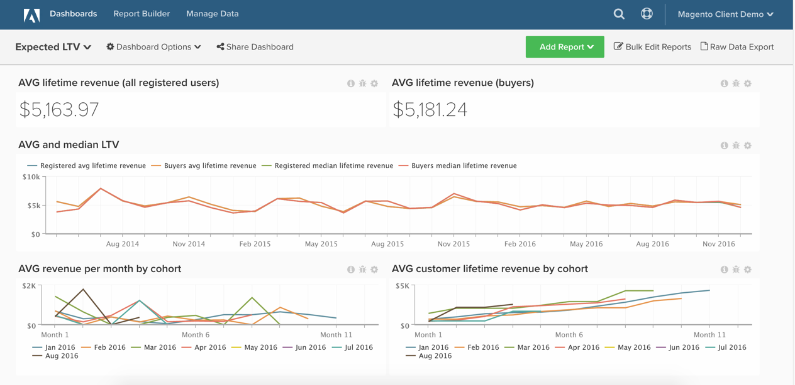

# 预期生命周期值分析

本主题将演示如何设置功能板，以帮助您了解客户的存留期价值增长和预期存留期价值。

此分析仅适用于采用新架构的Pro客户。 如果您的帐户有权访问`Manage Data`侧栏下的`Persistent Views`功能，则表明您使用的是新架构，可以按照此处列出的说明自行构建此分析。

在开始使用之前，您想要熟悉[同类群组Report Builder。](../dev-reports/cohort-rpt-bldr.md)

## 计算列

如果使用&#x200B;**30天月**，则在&#x200B;**订单**&#x200B;表中创建的列：

* [!UICONTROL Column name]： `Months between first order and this order`
* [!UICONTROL Column type]： `Same Table`
* &#x200B;
  [!UICONTROL Column equation]: `CALCULATION`
* [!UICONTROL Column input]： A = `Seconds between customer's first order date and this order`
* &#x200B;
  [!UICONTROL Datatype]: `Integer`
* **定义：**`case when A is null then null when A <= 0 then '1'::int else (ceil(A)/2629800)::int end`

* [!UICONTROL Column name]： `Months since order`
* [!UICONTROL Column type]： `Same Table`
* &#x200B;
  [!UICONTROL Column equation]: `CALCULATION`
* [!UICONTROL Column input]： A = `created_at`
* &#x200B;
  [!UICONTROL Datatype]: `Integer`
* 定义： `case when created_at is null then null else (ceil((extract(epoch from current_timestamp) - extract(epoch from created_at))/2629800))::int end`

如果使用&#x200B;**日历**&#x200B;月，则在&#x200B;**`orders`**&#x200B;表中创建的列：

* [!UICONTROL Column name]： `Calendar months between first order and this order`
* [!UICONTROL Column type]： `Same Table`
* &#x200B;
  [!UICONTROL Column equation]: `CALCULATION`
* [!UICONTROL Column inputs]：
   * `A` = `created_at`
   * `B` = `Customer's first order date`

* &#x200B;
  [!UICONTROL Datatype]: `Integer`
* 定义： `case when (A::date is null) or (B::date is null) then null else ((date_part('year',A::date) - date_part('year',B::date))*12 + date_part('month',A::date) - date_part('month',B::date))::int end`

* [!UICONTROL Column name]： `Calendar months since order`
* [!UICONTROL Column type]： `Same Table`
* &#x200B;
  [!UICONTROL Column equation]: `CALCULATION`
* [!UICONTROL Column input]： `A` = `created_at`
* &#x200B;
  [!UICONTROL Datatype]: `Integer`
* **定义：**`case when A is null then null else ((date_part('year',current_timestamp::date) - date_part('year',A::date))*12 + date_part('month',current_timestamp::date) - date_part('month',A::date))::int end`

* [!UICONTROL Column name]： `Is in current month? (Yes/No)`
* [!UICONTROL Column type]： `Same Table`
* &#x200B;
  [!UICONTROL Column equation]: `CALCULATION`
* [!UICONTROL Column input]： A = `created_at`
* &#x200B;
  [!UICONTROL Datatype]: `String`
* 定义： `case when A is null then null when (date_trunc('month', current_timestamp::date))::varchar = (date_trunc('month', A::date))::varchar then 'Yes' else 'No' end`

## 量度

### 量度说明

要创建的量度

* 按第一订单日期&#x200B;**不同的客户**
   * 如果启用来宾订单，请使用`customer_email`

* 在&#x200B;**`orders`**&#x200B;表中
* 此量度执行&#x200B;**对非重复值计数**
* 在&#x200B;**`customer_id`**&#x200B;列上
* 按&#x200B;**`Customer's first order date`**&#x200B;时间戳排序

>[!NOTE]
>
>确保在生成新报告之前[将所有新列作为维度添加到量度](../../data-analyst/data-warehouse-mgr/manage-data-dimensions-metrics.md)。

## 报告

### 报表说明

按月份&#x200B;**每个客户的预期收入**

* 量度`A`： `Revenue (hide)`
   * `Calendar months between first order and this order` `<= X` （为X选取一个合理的数字，例如24个月）
   * `Is in current month?` = `No`

* &#x200B;
  [!UICONTROL 量度]: `Revenue`
* [!UICONTROL Filter]：

* 量度`B`： `All time customers (hide)`
   * `Is in current month?` = `No`

* [!UICONTROL Metric]： `New customers by first order date`
* [!UICONTROL Filter]：

* 量度`C`： `All time customers by month since first order (hide)`
   * `Calendar months since order` `<= X`
   * `Is in current month?` = `No`

* [!UICONTROL Metric]： `New customers by first order date`
* [!UICONTROL Filter]：

* [!UICONTROL Formula]： `Expected revenue`
* [!UICONTROL Formula]： `A / (B - C)`
* &#x200B;
  [!UICONTROL Format]: `Currency`

其他图表详细信息

* [!UICONTROL Time period]： `All time`
* 时间间隔： `None`
* [!UICONTROL Group by]： `Calendar months between first order and this order` — 全部显示
* 使用`group by`旁边的铅笔图标将`All time customers`量度的`group by`更改为“独立”
* 按如下方式编辑`Show top/bottom`字段：
   * [!UICONTROL Revenue]： `Top 24 sorted by Calendar months between first order and this order`
   * [!UICONTROL All time customers]： `Top 24 sorted by All time customers`
   * [!UICONTROL All time customers by month since first order]： `Top 24 sorted by All time customers by month since first order`

按同类群组&#x200B;**每月平均收入**

* 量度`A`： `Revenue`
* &#x200B;
  [!UICONTROL Metric view]: `Cohort`
* [!UICONTROL Cohort date]： `Customer's first order date`
* [!UICONTROL Perspective]： `Average value per cohort member`

**按同类群组列出的每月累计平均收入**

* 量度`A`： `Revenue`
* &#x200B;
  [!UICONTROL Metric view]: `Cohort`
* [!UICONTROL Cohort date]： `Customer's first order date`
* [!UICONTROL Perspective]： `Cumulative average value per cohort member`

在编译所有报告后，您可以根据需要将报告组织在功能板上。 结果可能与页面顶部的图像类似。

如果您在构建此分析时遇到任何问题，或只是想与专业服务团队接洽，请[联系支持人员](https://experienceleague.adobe.com/docs/commerce-knowledge-base/kb/troubleshooting/miscellaneous/mbi-service-policies.html?lang=zh-Hans)。
