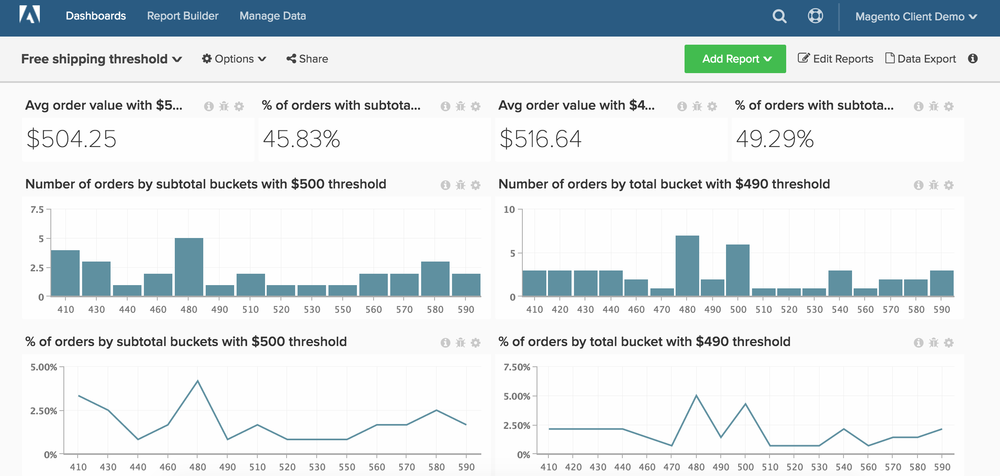

# 免费送货

>[!NOTE]
>
>本主题包含有关使用原始架构和新架构的客户端的说明。 如果您在主工具栏中选择`Data Warehouse Views`后有`Manage Data`部分可用，则表示您使用的是新架构。

本主题将演示如何设置一个功能板来跟踪免费配送阈值的性能。 该仪表板（如下所示）是A/B测试两个免费运输阈值的好方法。 例如，贵公司可能不确定您应提供50美元还是100美元的免运费。 您应该对客户的两个随机子集执行A/B测试，并在[!DNL Commerce Intelligence]中执行该分析。

在开始使用之前，您需要确定两个单独的时间段，在这些时间段中，您的商店的免运费阈值具有不同的值。

此分析包含[高级计算列](../data-warehouse-mgr/adv-calc-columns.md)。

## 计算列

如果您使用的是原始架构（例如，如果您的`Data Warehouse Views`菜单下没有`Manage Data`选项），则您需要联系支持团队以构建以下列。 在新架构上，可从`Manage Data > Data Warehouse`页面创建这些列。 下面提供了详细说明。

* **`sales_flat_order`**&#x200B;表
   * 此计算将创建存储段，存储段以相对于您的典型购物车大小的增量进行递增。 这可以从增量开始，包括5、10、50、100

* **`Order subtotal (buckets)`**&#x200B;原始架构：由分析人员创建，作为`[FREE SHIPPING ANALYSIS]`票证的一部分
* **`Order subtotal (buckets)`**&#x200B;新架构：
   * 如上所述，此计算会创建存储段，存储段以相对于您的典型购物车大小的增量递增。 如果您有一个本机小计列（如`base_subtotal`），该列可用作此新列的基础。 如果没有，则它可以是计算列，其中不包含收入中的配送和折扣。

  >[!NOTE]
  >
  >“存储桶”的大小取决于适合您作为客户端的情况。 您可以从`average order value`开始创建一些小于或大于该金额的分段。 在查看下面的计算时，您会看到如何轻松复制部分查询、编辑查询和创建其他分段。 示例以50为增量完成。

   * `Column type - Same table, Column definition - Calculation, Column Inputs-` `base_subtotal`或`calculated column`，`Datatype`： `Integer`
   * [!UICONTROL Calculation]： `case when A >= 0 and A<=200 then 0 - 200`
当`A< 200`和`A <= 250`时，则`201 - 250`
当`A<251`和`A<= 300`时，则`251 - 300`
当`A<301`和`A<= 350`时，则`301 - 350`
当`A<351`和`A<=400`时，则`351 - 400`
当`A<401`和`A<=450`时，则`401 - 450`
否则“超过450”
结束

## 量度

无新量度!!!

>[!NOTE]
>
>确保在生成新报告之前[将所有新列作为维度添加到量度](../data-warehouse-mgr/manage-data-dimensions-metrics.md)。

## 报告

* 装运规则为A **的**&#x200B;平均订单值
   * [!UICONTROL Metric]： `Average order value`

* 量度`A`： `Average Order Value`
* [!UICONTROL Time period]： `Time period with shipping rule A`
* &#x200B;
  [!UICONTROL Interval]: `None`
* &#x200B;
  [!UICONTROL Chart Type]: `Scalar`

* **装运规则为A**&#x200B;的按小计分段列出的订单数
   * [!UICONTROL Metric]： `Number of orders`

  >[!NOTE]
  >
  >您可以通过显示`X`中的前`sorted by` `Order subtotal` `Show top/bottom`（存储段）来切断尾端。

* 量度`A`： `Number of orders`
* [!UICONTROL Time period]： `Time period with shipping rule A`
* &#x200B;
  [!UICONTROL Interval]: `None`
* [!UICONTROL Group by]： `Order subtotal (buckets)`
* &#x200B;
  [!UICONTROL Chart Type]: `Column`

* 装运规则为A **的订单小计的**&#x200B;百分比
   * [!UICONTROL Metric]： `Number of orders`

   * [!UICONTROL Metric]： `Number of orders`
   * &#x200B;
     [!UICONTROL 分组依据]: `Independent`
   * [!UICONTROL Formula]： `(A / B)`
   * &#x200B;
     [!UICONTROL Format]: `%`

* 量度`A`： `Number of orders by subtotal (hide)`
* 量度`B`： `Total number of orders (hide)`
* [!UICONTROL Formula]： `% of orders`
* [!UICONTROL Time period]： `Time period with shipping rule A`
* &#x200B;
  [!UICONTROL Interval]: `None`
* [!UICONTROL Group by]： `Order subtotal (buckets)`
* &#x200B;
  [!UICONTROL Chart Type]: `Line`

* 小计超过装运规则A **的订单的**&#x200B;百分比
   * [!UICONTROL Metric]： `Number of orders`
   * &#x200B;
     [!UICONTROL Perspective]: `Cumulative`

   * [!UICONTROL Metric]： `Number of orders`
   * &#x200B;
     [!UICONTROL 分组依据]: `Independent`

   * [!UICONTROL Formula]： `1- (A / B)`
   * &#x200B;
     [!UICONTROL Format]: `%`

* 量度`A`： `Number of orders by subtotal`
* 量度`B`： `Total number of orders (hide)`
* [!UICONTROL Formula]： `% of orders`
* [!UICONTROL Time period]： `Time period with shipping rule A`
* &#x200B;
  [!UICONTROL Interval]: `None`
* [!UICONTROL Group by]： `Order subtotal (buckets)`
* &#x200B;
  [!UICONTROL Chart Type]: `Line`

对配送B以及配送规则B的时间段重复上述步骤和报告。

在编译所有报告后，您可以根据需要将报告组织在功能板上。 结果可能类似于此页面顶部的图像。
