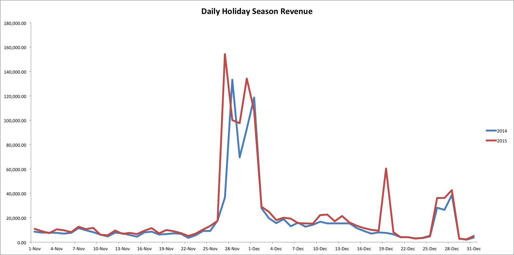

# 假日购物分析

对于您的企业而言，假日可能是一年中最繁忙的时节之一。 对于拥有庞大美国客户基础的零售商来说，假日季节通常跨越感恩节和新年之间的几个月。

在当年的任何时候，你都可能遇到忙碌的情况；例如，如果你的公司销售短裤或泳池补给，你可能会在夏天遇到忙碌的情况。 本主题探索有助于您比较不同年份的高季的分析。

## 推荐的指标

在分析假日季节表现时，请考虑分析([或正在构建](../../data-user/reports/ess-manage-data-metrics.md))这些指标：

### 新客户数、订单数、收入

为了帮助您了解今年与往年相比的增长模式，请考虑分析这些指标。 新客户数、新订单数和收入额会向您显示指定时间范围（假日季节）内业务的逐日执行情况。 您还可以使用累积透视来分析这些度量，以查看度量随时间的变化。

### 平均订单值

此衡量标准显示假日季节的总体平均订单值。

## 示例：每日假日季节收入

现在您知道了要分析的量度，接下来查看了一些示例收入数据，这些数据涵盖了2014年和2015年假日季节的11月和12月。

在此范例中，2014年和2015年的收入都有两个较大的峰值：这些增长与“黑色星期五”和“网购星期一”同时发生。 请注意，2014年和2015年的峰值并非在同一天。 这是因为2014年黑色星期五为11月27日，2015年是11月28日。 同样，2014年的网购星期一是11月30日，2015年的网购星期一是12月1日。

此外，二零一五年十二月十九日的收入急升，并未于二零一四年出现。 有可能是在这个特定的星期六出售的，而前一年没有提供。

除上述少数日期外，该两年之收益均相互追踪。

## 我应该考虑哪些问题？

为了帮助您了解业务的季节性趋势，在浏览您自己的数据时，请牢记以下一些问题：

* 各年的趋势是否符合预期？
* 这些趋势是否反映了您对跨季节变化的预期？
* 各年之间是否有差异？ 可以解释这些差异吗？
* 是否在特定年度提供促销活动？
* 价格是否在某一特定年度内上涨？
* 广告支出是否在某一特定年度有所增加？

## 我还应该分析哪些其他内容？

一种选择是分析客户在假日季节的购买行为。 在假日季节获得的客户支出或购买的频率是否高于在假日季节之外获得的客户？

另一个选项是在假日季节按促销活动分析投资回报率。 您在假日季节运行的特定促销活动的ROI是否更高？ 在这些季节期间，您是否应该增加高ROI营销活动的支出？

此外，您还可以分析折扣订单数与全价订单数。 [大多数客户是否等待对采购订单进行销售](../analysis/coupon-usage.md) 在节假日期间，还是购买全价商品？

### 相关

* [分析优惠券对吸引和留住客户的影响](../analysis/coupon-impact.md)
* [分析客户回购行为](../analysis/repurchase-behavior.md)
