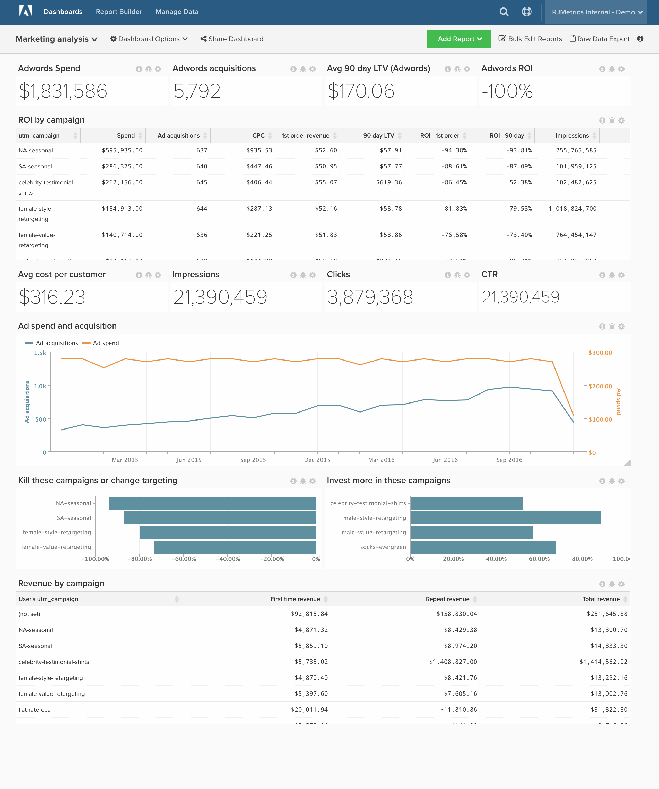

# 营销ROI

>[!NOTE]
>
>本文包含针对使用原始架构和新架构的客户端的说明。 你在 [新架构](../../administrator/account-management/new-architecture.md) 如果在从主工具栏中选择“管理数据”后，“Data warehouse视图”部分可用，则

如果您在在线广告上花钱，那么您将不可避免地希望跟踪您在这方面支出的回报，并就进一步的投资做出数据驱动的决策。 在本文中，我们将演示如何设置功能板来跟踪您的渠道分析，包括汇总和营销活动的ROI。

开始之前，您需要连接 [!DNL [Facebook Ads]](../importing-data/integrations/facebook-ads.md), [!DNL [Adwords]](../importing-data/integrations/google-adwords.md)和 [!DNL [Google Ecommerce]](../importing-data/integrations/google-ecommerce.md) 帐户，以及引入任何额外的在线广告支出数据。 此分析包含 [高级计算列](../data-warehouse-mgr/adv-calc-columns.md).

## 统一表

**原始架构：** 从各种来源(如 [!DNL Facebook Ads] 或 [!DNL Google Adwords])，我们建议创建 **统一表** 广告支出的全部。 您需要一名分析师来为您完成此步骤。 如果你还没有， [提交支持请求](../../guide-overview.md) 主题 `[MARKETING ROI ANALYSIS]`，分析师将创建此表。

**新架构：** 您可以按照 [此分析库](../../data-analyst/data-warehouse-mgr/create-dw-views.md) 主题。 统一表现在称为新架构上的Data warehouse视图。

## 计算列

要创建的列

* **`Consolidated Digital Ad Spend`** 表
* **`Campaign name`** 将由分析师创建，作为 **[营销ROI分析]** 票

>[!NOTE]
>
>请参阅上文，了解新的架构差异。

**原始和新架构：**

* **`sales_flat_order`** 表
   * **`Order's GA campaign`**
      * 选择定义： `Joined Column`
      * [!UICONTROL Create Path]:
      * 
         [!UICONTROL Many]: `sales_flat_order.increment_id`
      * 

         [!UICONTROL One]: `ecommerce####.transaction_id`

      * 选择 [!UICONTROL table]: `ecommerce####`
      * 选择 [!UICONTROL column]: `campaign`
      * [!UICONTROL Path]: `sales_flat_order.increment_id = ecommerce#####.transactionID`
   * **`Order's GA medium`**
      * 选择定义：联接列
      * 选择 [!UICONTROL table]: `ecommerce####`
      * 选择 [!UICONTROL column]: `medium`
      * [!UICONTROL Path]:sales_flat_order.increment_id = ecommerce####.transactionId
   * **`Order's GA source`**
      * 选择定义：联接列
      * 选择 [!UICONTROL table]: `ecommerce####`
      * 选择 [!UICONTROL column]: `source`
      * [!UICONTROL Path]:sales_flat_order.increment_id = ecommerce####.transactionId ^

* **`customer_entity`** 表
* **`Customer's first order GA campaign`**
   * 选择定义： `Max`
   * 选择 [!UICONTROL table]: `sales_flat_order`
   * 选择 [!UICONTROL column]: `Order's GA campaign`
   * [!UICONTROL Path]: `sales_flat_order.customer_id = customer_entity.entity_id`
   * [!UICONTROL Filter]:
      * `Orders we count`
      * `Customer's order number = 1`

* **`Customer's first order GA source`**
   * 选择定义： `Max`
   * 选择 [!UICONTROL table]: `sales_flat_order`
   * 选择 [!UICONTROL column]: `Order's GA source`
   * [!UICONTROL Path]:sales_flat_order.customer_id = customer_entity.entity.id
   * [!UICONTROL Filter]:
      * `Orders we count`
      * `Customer's order number = 1`

* **`Customer's first order GA medium`**
   * 选择定义： `Max`
   * 选择 [!UICONTROL table]: `sales_flat_order`
   * 选择 [!UICONTROL column]: `Order's GA medium`
   * [!UICONTROL Path]: `sales_flat_order.customer_id = customer_entity.entity_id`
   * [!UICONTROL Filter]:
      * `Orders we count`
      * `Customer's order number = 1`

* **`sales_flat_order`** 表
* **`Customer's first order GA campaign`**
   * 选择定义： `Joined Column`
   * 选择 [!UICONTROL table]: `customer_entity`
   * 选择 [!UICONTROL column]: `Customer's first order GA campaign`
   * [!UICONTROL Path]: `sales_flat_order.customer_id = customer_entity.entity_id`

* **`Customer's first order GA source`**
   * 选择定义：联接列
   * 选择 [!UICONTROL table]: `customer_entity`
   * 选择 [!UICONTROL column]: `Customer's first order GA source`
   * [!UICONTROL Path]: `sales_flat_order.customer_id = customer_entity.entity_id`

* **`Customer's first order GA medium`**
   * 选择定义： `Joined Column`
   * 选择 [!UICONTROL table]: `customer_entity`
   * 选择 [!UICONTROL column]: `Customer's first order GA medium`
   * [!UICONTROL Path]: `sales_flat_order.customer_id = customer_entity.entity_id`

## 量度

* **广告支出**
* 在 **`Consolidated Digital Ad Spend`** 表
* 此量度执行 **总和**
* 在 **`adCost`** 列
* 由 **`date`** timestamp

* **广告展示次数**
* 在 **`Consolidated Digital Ad Spend`** 表
* 此量度执行 **总和**
* 在 **`Impressions`** 列
* 由 **`Month`** timestamp

* **广告点击量**
* 在 **`Consolidated Digital Ad Spend`** 表
* 此量度执行 **总和**
* 在 **`adClicks`** 列
* 由 **`Month`** timestamp

>[!NOTE]
>
>确保 [将所有新列作为量度的维度添加到](../../data-analyst/data-warehouse-mgr/manage-data-dimensions-metrics.md) 生成新报告之前。

## 报表

* **广告花费（所有时间）**
   * [!UICONTROL Metric]:广告支出

* 量度 `A`:广告支出
* [!UICONTROL Time period]: `All time`
* 
   [!UICONTROL间隔]: `None`
* 

   [!UICONTROL Chart Type]: `Scalar`

* **广告客户获取（始终）**
   * [!UICONTROL Metric]: `New customers`
   * [!UICONTROL Filters]:
      * `User's first order's source LIKE %google%`
      * `User's first order's source LIKE %facebook%`
      * `User's first order's source LIKE %fb%`
      * `User's first order's medium IN cpc, ppc`
      * 过滤器逻辑：([`A`] 或 [`B`] 或 [`C`])和 [`D`]

* 量度 `A`: `Ad customer acquisitions`
* [!UICONTROL Time period]: `All time`
* 
   [!UICONTROL间隔]: `None`
* 

   [!UICONTROL Chart Type]: `Scalar`

* **广告ROI**
   * [!UICONTROL Metric]:广告支出

   * [!UICONTROL Metric]: `New customers`
   * [!UICONTROL Filters]:
      * `User's first order's source LIKE %google%`
      * `User's first order's source LIKE %facebook%`
      * `User's first order's source LIKE %fb%`
      * `User's first order's medium IN cpc, ppc`
      * 过滤器逻辑：([`A`] 或 [`B`] 或 [`C`])和 [`D`]
   * [!UICONTROL Metric]:平均存留期收入
   * [!UICONTROL Filters]:
      * `User's first order's source LIKE %google%`
      * `User's first order's source LIKE %facebook%`
      * `User's first order's source LIKE %fb%`
      * `User's first order's medium IN cpc, ppc`
      * 过滤器逻辑：([`A`] 或 [`B`] 或 [`C`])和 [`D`]
   * [!UICONTROL Formula]: `((C - (A / B)) / (A / B))`
   * 

      [!UICONTROL Format]: `Percentage`

* 量度 `A`: `Ad Spend (hide)`
* 量度 `B`: `Ad customer acquisitions (hide)`
* 量度 `C`: `Average LTV (hide)`
* [!UICONTROL Formula]: `Ads ROI`
* [!UICONTROL Time period]: `All time`
* 
   [!UICONTROL间隔]: `None`
* 

   [!UICONTROL Chart Type]: `Scalar`

* **按ga介质排列的订单数**
   * 

      [!UICONTROL量度]: `Orders`

* 量度 `A`: `Orders`
* [!UICONTROL Time period]: `All time`
* [!UICONTROL Interval]: `By Month`
* [!UICONTROL Group by]: `Order's medium`
* 

   [!UICONTROL Chart Type]: `Area`

* **按促销活动划分的广告投资回报率**
   * [!UICONTROL Metric]: `Ad Spend`

   * [!UICONTROL Metric]:`New customers`
   * [!UICONTROL Filters]:
      * `User's first order's source LIKE %google%`
      * `User's first order's source LIKE %facebook%`
      * `User's first order's source LIKE %fb%`
      * `User's first order's medium IN cpc, ppc`
      * 过滤器逻辑：([`A`] 或 [`B`] 或 [`C`])和 [`D`]
   * [!UICONTROL Metric]:平均存留期收入
   * [!UICONTROL Filters]:
      * `User's first order's source LIKE %google%`
      * `User's first order's source LIKE %facebook%`
      * `User's first order's source LIKE %fb%`
      * `User's first order's medium IN cpc, ppc`
      * 过滤器逻辑：([`A`] 或 [`B`] 或 [`C`])和 [`D`]
   * [!UICONTROL Metric]:订单的平均生命周期数
   * [!UICONTROL Filters]:
      * `User's first order's source LIKE %google%`
      * `User's first order's source LIKE %facebook%`
      * `User's first order's source LIKE %fb%`
      * `User's first order's medium IN cpc, ppc`
      * 过滤器逻辑：([`A`] 或 [`B`] 或 [`C`])和 [`D`]
   * [!UICONTROL Formula]: `(A / B)`
   * 

      [!UICONTROL Format]: `Currency`

   * [!UICONTROL Formula]: `(C - (A / B))`
   * 

      [!UICONTROL Format]: `Currency`

   * [!UICONTROL Formula]: `((C - (A / B)) / (A / B))`
   * 

      [!UICONTROL Format]: `Percentage`

   * [!UICONTROL Metric]: `Ad Clicks`

   * [!UICONTROL Metric]: `Ad Impressions`

   * [!UICONTROL Formula]: `(H / I)`
   * 

      [!UICONTROL Format]: `Percentage`

   * [!UICONTROL Formula]: `(A / H)`
   * 

      [!UICONTROL Format]: `Currency`

* 量度 `A`: `Ad Spend` （隐藏）
* 量度 `B`: `Ad customer acquisitions`
* 量度 `C`: `Average LTV`
* 量度 `D`: `Average lifetime # of orders`
* 
   [!UICONTROL公式]: `CAC`
* [!UICONTROL Formula]: `Avg return`
* [!UICONTROL Formula]: `Ads ROI`
* 量度 `H`: `adClicks`
* 量度 `I`: `Impressions`
* 
   [!UICONTROL公式]: `CTR`
* 
   [!UICONTROL公式]: `CPC`
* [!UICONTROL Time period]: `All time`
* 
   [!UICONTROL间隔]: `None`
* 
   [!UICONTROL组依据]: `campaign` (将“客户的第一订单”促销活动用于非广告支出表量度)
* 

   [!UICONTROL Chart Type]: `Table`

如果您在构建此分析时遇到任何问题，或者只想与我们的专业服务团队接洽， [联系支持](../../guide-overview.md).

### 相关

* [中UTM标记的最佳实践 [!DNL Google Analytics]](../../best-practices/utm-tagging-google.md)
* [如何 [!DNL Google Analytics] UTM归因工作？](../analysis/utm-attributes.md)
