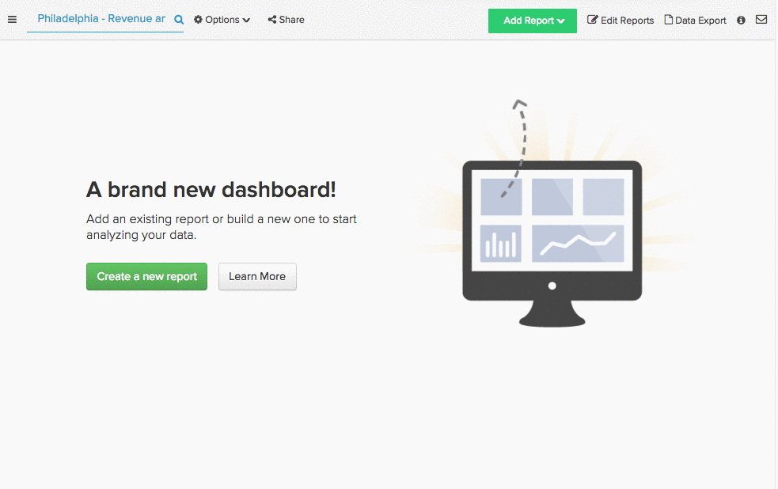
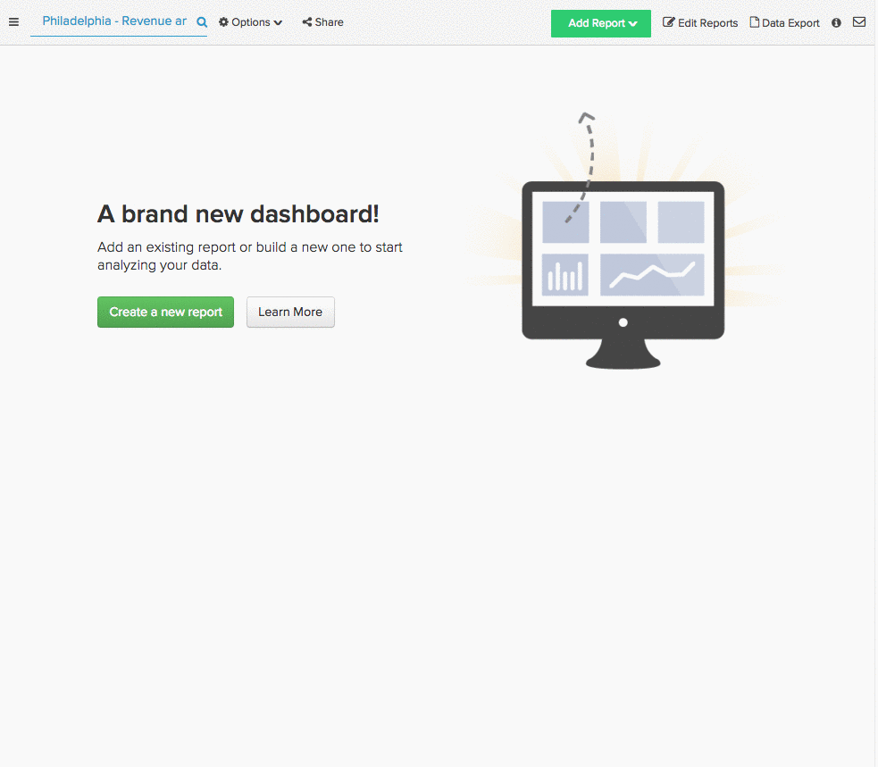
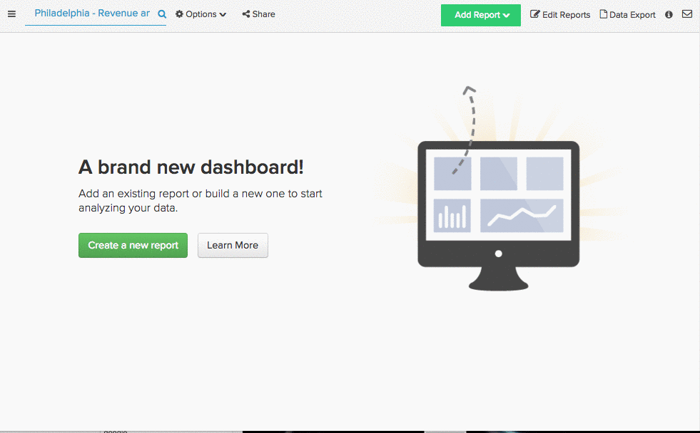
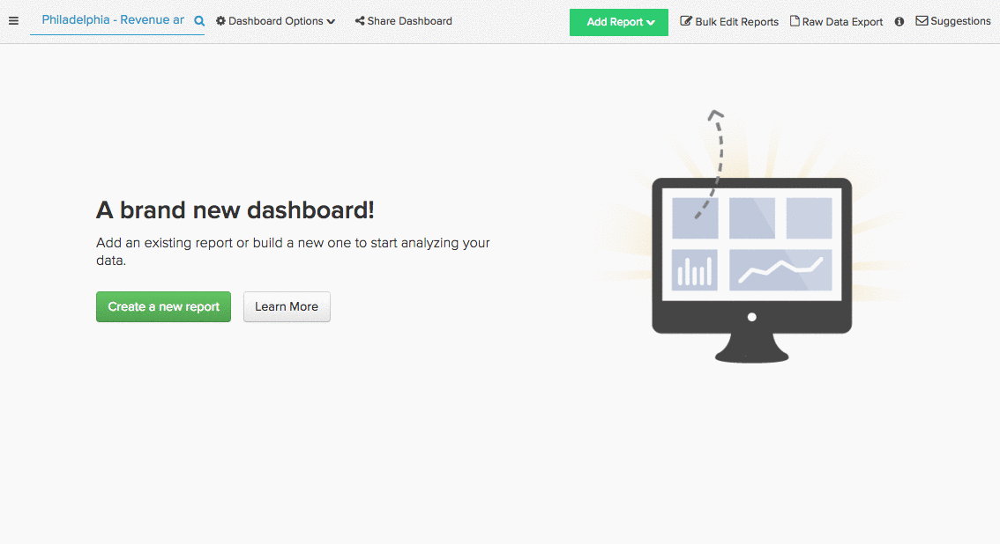
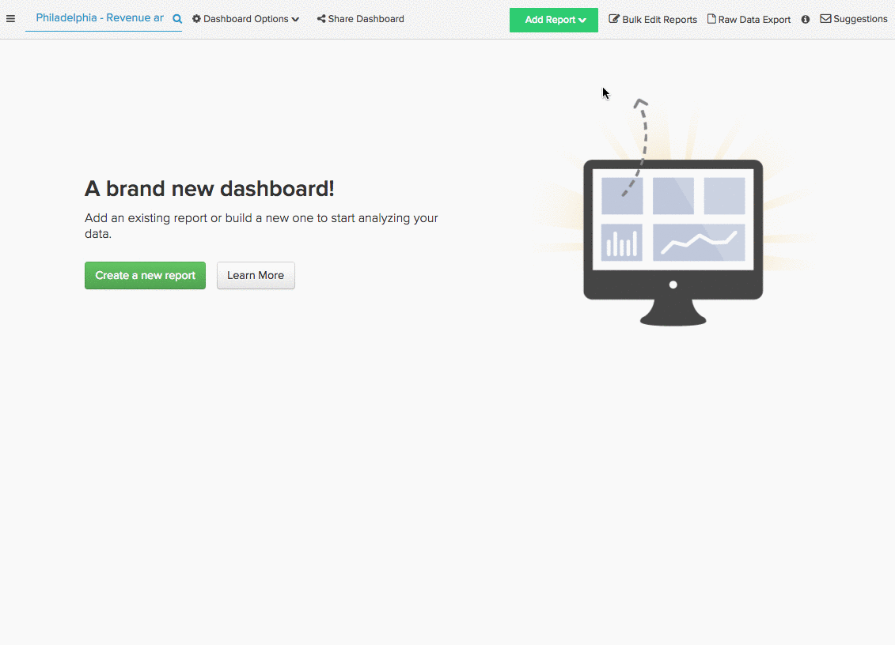

# 确定成功的营销源

你调查了你的受众，你创建了你的营销活动，你投资了几个营销渠道。 一段时间过去了，这些渠道的表现如何？ 哪个渠道吸引的新用户最多？ 哪个来源对您的总收入贡献最大？

替换为 [!DNL Adobe Commerce Intelligence]，您可以轻松地按反向链接来源对您的收入和用户进行分段，无论它是否与 [!DNL [Google Analytics' UTM fields]](https://support.google.com/analytics/answer/1191184?hl=en) 或自定义数据字段。 此分段允许您找到性能最佳的渠道，并更好地投入营销预算。

本主题探索了一些可用于发现您最有价值的营销渠道的报表：

* [按源的新用户](#newusersbysource)
* [按用户来源列出的平均生命周期收入](#avglifetimerev)
* [按用户来源的平均订单值](#avgorderval)
* [按用户注册日期和来源列出的收入](#revbyregdateandsource)
* [按用户来源重复订单](#repeatordersbysource)

## 先决条件 {#prereqs}

要构建本主题中的分析，您需要访问营销客户获取/反向链接源数据。 如果您尚未跟踪该活动，则需要 [订单反向链接源数据来源 [!DNL Google ECommerce]](../importing-data/integrations/google-ecommerce.md) 到 [!DNL Adobe Commerce Intelligence] 才能继续。 此外，将用户设备信息添加到分析中使您能够查看反向链接使用的技术。

## 按源的新用户 {#newusersbysource}

评估反向链接来源的表现是确定最有价值渠道的关键。 此报告按客户获取来源显示一段时间内新注册用户的数量，从而允许您跟踪反向链接来源在获取新注册用户时的性能。

要在中创建此报告，请执行以下操作 [Report Builder](../../tutorials/using-visual-report-builder.md)，添加 **新用户** 报表中的指标（或计算一段时间内新用户数的等效指标）。 然后执行以下操作：

1. 设置 [!UICONTROL Time Period] 到要分析的注册期间。
1. 设置 [!UICONTROL Interval] 到每月。
1. 设置 [!UICONTROL Group By] 至客户获取（或反向链接）源，然后选择要包含的源。
1. 此示例使用 `stacked columns` [!UICONTROL chart type].

下面是可视化演练：

## 按用户来源列出的平均生命周期收入 {#avglifetimerev}

找到带来新用户的渠道很重要，但是这些推荐总的价值有多大？ 此报表显示一段时间内来自特定客户获取来源的用户平均生命周期收入。 换言之，这允许您查看从特定来源获取的用户在其一生中与您共用的时间是否比从不同来源获取的一组用户多。

要在Report Builder中创建此报表，请添加 **平均生命周期收入** 报表的量度。 然后执行以下操作：

1. 设置 [!UICONTROL Time Period] 到要分析的时间段。
1. 设置 [!UICONTROL Interval] 到每月。
   [!UICONTROL Group By] 至客户获取（或反向链接）源，然后选择要包含的源。
1. 此示例使用 `line chart` 类型。

下面是可视化演练：

.

此示例仅查看生命周期收入，但您也可以复制此分析以查看 [!UICONTROL Number of orders] 或 [!UICONTROL Distinct buyers] 通过反向链接来源。

## 按用户来源的平均订单值 {#avgorderval}

要更好地了解用户从特定客户获取来源中花费了多少资金，您可以构建一份报告来查看其平均订单价值。 这样，您就可以跟踪从特定来源获取的用户在订单上的支出是否高于从其他来源获取的用户在订单上的支出。

要在Report Builder中创建此报表，请添加 **平均订单值** 量度，然后执行以下操作：

1. 设置 [!UICONTROL Time Period] 到要分析的注册期间。
1. 设置 [!UICONTROL Time Interval] 到每月。
1. 设置 [!UICONTROL Group By] 至客户获取（或反向链接）源，然后选择要包含的源。
1. 此示例使用 **栈叠的列** 图表类型。

下面是可视化演练：

## 按用户注册日期和来源列出的总收入 {#revbyregdateandsource}

通过前面介绍的生命周期收入分析，您可以查看从不同来源获得的用户的平均生命周期收入，但是总生命周期收入呢？ 通过此报告，可识别在特定时间内注册并从特定来源产生的总收入用户数。

要在Report Builder中创建此报表，请添加 `Revenue by user registration date` 量度。 如果您没有 [已创建此量度](../../data-user/reports/ess-manage-data-metrics.md) 您已经可以通过复制 `Revenue` 量度并更改 `time stamp` 至用户的 `creation date`. 添加量度后，执行以下操作：

1. 设置 [!UICONTROL Time Period] 到要分析的注册期间。
1. 设置 [!UICONTROL Time Interval] 到每月。
1. 设置 [!UICONTROL Group By] 至客户获取（或反向链接）源，然后选择要包含的源。
1. 此示例使用 `stacked columns` 图表类型。

下面是可视化演练：

## 按用户来源重复订单 {#repeatordersbysource}

平均订单值报表显示从特定来源获得的用户在下订单时的平均花费。 但是，此报表不显示这些相同的用户是否为回头客户。 但是，通过按用户来源重复订购，您可以查看特定来源的用户是否进行了更多或更少的重复购买。

要在中创建此报告，请执行以下操作 [Report Builder](../../tutorials/using-visual-report-builder.md)，添加 **订单数** 量度，然后执行以下操作：

1. 设置 [!UICONTROL Time Period] 到要分析的注册期间。
1. 设置 [!UICONTROL Time Interval] 到每月。
1. 添加 [!UICONTROL filter] 以便仅包含重复订购的用户：

   用户的订单号大于1

1. 设置 [!UICONTROL Group By] 至客户获取（或反向链接）源，然后选择要包含的源。
1. 此示例使用 `stacked columns` 图表类型。

下面是可视化演练：

## 总结 {#wrapup}

本主题仅涉及可用于分析您的收购和营销渠道价值的几个分析，但这只是冰山一角。

## 相关 {#related}

* [通过以下方式跟踪订单反向链接来源 [!DNL Google ECommerce]](../importing-data/integrations/google-ecommerce.md)
* [正在连接 [!DNL Google Adwords] 帐户](../importing-data/integrations/google-adwords.md)
* [构建 [!DNL Google ECommerce] 包含订单和客户数据的维度](../data-warehouse-mgr/bldg-google-ecomm-dim.md)
* [中的UTM标记最佳实践 [!DNL Google Analytics]](../../best-practices/utm-tagging-google.md)
