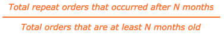
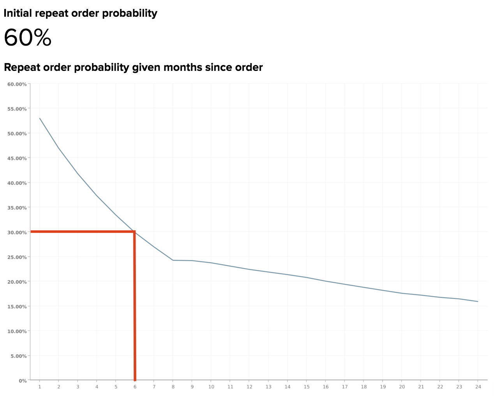

# 重复概率衰减和流失

如果部分收入来自重复购买，那么您可能意识到忠诚客户群的巨大价值。 为此，了解订单之间的时间流逝情况以及客户预计何时流失至关重要。

本主题探讨了可以帮助您回答以下问题的分析：

* 客户再次购买的可能性有多大？
* 自客户最近购买以来，重复订购的概率随时间的变化如何？
* 何时应将客户视为已流失？ 因此，何时应该启动重启营销活动？

## 推荐的指标

在分析重复概率衰减和流失时，请考虑使用（[或生成](../../data-user/reports/ess-manage-data-metrics.md)）以下量度：

### 初始重复顺序概率

此度量定义为重复订单的总数，占总订单的百分比。 换句话说，这是订单被另一订单跟进的可能性。 当此概率高于50%时，这意味着所有订单的一半以上随后是后续订单。

### 重复订购概率给定订购后的月份

此度量用于演示用户再次进行排序的概率，该概率给定自上次排序以来经过的月数。 用于生成此量度的公式简化为：

根据您的业务模式，重复订购的概率可能会在客户下订单后立即下降，并在随后的几个月中继续下降，也可能会显示季节性变化和峰值。

通过了解预期重复购买的客户百分比（以及这种随时间变化的趋势），您可以定期定位客户，以最大限度地提高重复购买的可能性。 因此，当重复购买的可能性降低时，您可以选择时间将客户识别为已流失，并将您的工作从保留更改为重新激活。

## 今天的示例

查看典型电子商务业务的重复概率衰减。

### 初始重复顺序概率

在本例中，初始重复订购概率（即客户重复购买的可能性）为60%。 这意味着60%的此业务订购之后是后续订购。

### 重复订购概率给定订购后的月份

此报表显示客户再次订购的可能性，假定自上次订购以来已经过了几个月。 尽管在此报告中没有单一的客户流失阈值定义，但Adobe建议将客户流失定义为概率衰减超过初始重复概率率一半的值。

由于此示例的初始重复概率率为60%，因此客户流失日期将是重复订单概率低于60%/2 = 30%或大约6个月的时间。 在预计会接到其他订单的60%的订单中，有一半是在前6个月内下达的。

换句话说，如果客户要下跟进订单，则他们更有可能在上次订单的6个月内完成订单，而不是在6个月期限之后。 如果客户在六个月后未重新购买，则应启动重新激活促销活动以吸引该客户重新购买。

根据您的业务模式，您可能希望选择不同的阈值，例如重复订购概率降至50%或10%以下的点。 如果你的内部知识给出了一个不同的数字，那么你当然应该使用它！

最终，目标是选择阈值，在该阈值中，从保留工作切换到重新激活工作是可行的。 保留工作可能涉及通过电子邮件重新吸引现有客户，并建议进行后续购买，而重新激活工作可能涉及通过电子邮件向有优惠券和交易的失效客户发送电子邮件。

## 我应该考虑哪些问题？

为了帮助您了解适用于您的业务的重复订购概率，Adobe建议您在浏览自己的数据时考虑以下问题：

* 是否期望初始重复顺序概率？ 如果没有，为什么你认为应该更高或更低？
* 自上次订购以来，特定月份内的重复订购概率是否大幅降低？ 如果是这样，这些更改是否属于预期范围？
* 您当前的流失阈值是多少？
* 您的当前流失阈值是否与重复订单概率中自上次订单报告以来几个月的某个值一致？
* 您当前的阈值是否反映了从保留到重新激活的广告工作？
* 您的企业是否应该将阈值更改为概率衰减超过初始重复概率率一半值的月份？

## 我还应该分析哪些其他内容？

创建上述分析并确定流失阈值后，您可以构建更多分析以确定流失用户的常见趋势。 例如，客户流失是在同一时间段内购买的，还是在上一次订购中购买了类似的产品？ 设置流失阈值后，您可以进一步深入了解这些流失客户的特定特征。

如果您提供多个产品，您可能会想知道购买特定产品的客户与其他客户相比随着时间的推移表现如何。 想了解更多信息？ 查看本教程，探索客户同类群组（基于他们购买的特定产品）的生命周期购买行为。

此最佳实践由[!DNL Adobe Commerce Intelligence] Data Analysis Services (DAS)提供。 [联系支持人员](https://experienceleague.adobe.com/docs/commerce-knowledge-base/kb/troubleshooting/miscellaneous/mbi-service-policies.html)以获取更多信息。

### 相关

* [分析优惠券对吸引和留住客户的影响](../analysis/coupon-impact.md)
* [分析客户回购行为](../analysis/repurchase-behavior.md)
