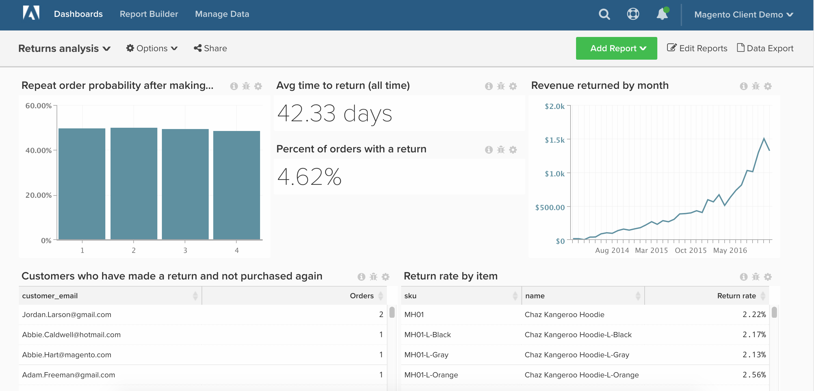

# 返回的订单

本主题将演示如何设置一个功能板，用于提供对商店退货的详细分析。

在开始之前，您必须是[Adobe Commerce](https://business.adobe.com/products/magento/magento-commerce.html)客户，并且应确保您的公司正在使用`enterprise\_rma`表进行退货。

此分析包含[高级计算列](../data-warehouse-mgr/adv-calc-columns.md)。

## 快速入门

要跟踪的列

* **`enterprise_rma`**&#x200B;或&#x200B;**`rma`**&#x200B;表
* **`entity_id`**
* **`status`**
* **`order_id`**
* **`customer_id`**
* **`date_requested`**

* **`enterprise_rma_item_entity`**&#x200B;或&#x200B;**`rma_item_entity`**&#x200B;表
* **`entity_id`**
* **`rma_entity_id`**
* **`qty_returned`**
* **`status`**
* **`order_item_id`**
* **`product_name`**
* **`product_sku`**

要创建的筛选器集

* **`enterprise_rma`**&#x200B;表
* 筛选器集名称： `Returns we count`
* 筛选器集逻辑：
   * 占位符 — 在此处输入自定义逻辑

* **`enterprise_rma_item_entity`**&#x200B;表
* 筛选器集名称： `Returns items we count`
* 筛选器集逻辑：
   * 占位符 — 在此处输入自定义逻辑

### 计算列

要创建的列

* **`enterprise_rma`**&#x200B;表
* **`Order's created at`**
* 选择定义： `Joined Column`
* [!UICONTROL Create Path]：
* &#x200B;
  [!UICONTROL Many]: `enterprise_rma.order_id`
* &#x200B;
  [!UICONTROL One]: `sales_flat_order.entity_id`

* 选择[!UICONTROL table]： `sales_flat_order`
* 选择[!UICONTROL column]： `created_at`
   * `enterprise_rma.order_id = sales_flat_order.entity_id`

* **`Customer's order number`**
* 选择定义： `Joined Column`
* 选择[!UICONTROL table]： `sales_flat_order`
* 选择[!UICONTROL column]： `Customer's order number`
   * `enterprise_rma.order_id = sales_flat_order.entity_id`

* **`Time between order's created_at and date_requested`**&#x200B;由分析师创建，作为`[RETURNS ANALYSIS]`票证的一部分

* **`enterprise_rma_item_entity`**&#x200B;表
* **`return_date_requested`**
* 选择定义： `Joined Column`
* [!UICONTROL Create Path]：
   * &#x200B;
     [!UICONTROL Many]: `enterprise_rma_item_entity.rma_entity_id`
   * &#x200B;
     [!UICONTROL One]: `enterprise_rma.entity_id`

* 选择[!UICONTROL table]： `enterprise_rma`
* 选择[!UICONTROL column]： `date_requested`
   * `enterprise_rma_item_entity.rma_entity_id = enterprise_rma.entity_id`

* **`Return item total value (qty_returned * price)`**&#x200B;由分析师创建，作为`[RETURNS ANALYSIS]`票证的一部分

* **`sales_flat_order`**&#x200B;表
* **`Order contains a return? (1=yes/0=No)`**
* 选择定义： `Exists`
* 选择[!UICONTROL table]： `enterprise_rma`
   * `enterprise_rma.order_id = sales_flat_order.entity_id`

* **`Customer's previous order number`**&#x200B;由分析师创建，作为`[RETURNS ANALYSIS]`票证的一部分
* **`Customer's previous order contains return? (1=yes/0=no)`**&#x200B;由分析师创建，作为`[RETURNS ANALYSIS]`票证的一部分

>[!NOTE]
>
>如果您只想分析解决问题所需的营业时间或首次响应所需的营业时间，请在请求票证时告知分析人员。

### 量度

* **返回**
* 在&#x200B;**`enterprise_rma`**&#x200B;表中
* 此量度执行&#x200B;**计数**
* 在&#x200B;**`entity_id`**&#x200B;列上
* 按&#x200B;**`date_requested`**&#x200B;排序
* [!UICONTROL Filter]： `Returns we count`

* **返回的项目**
* 在&#x200B;**`enterprise_rma_item_entity`**&#x200B;表中
* 此量度执行&#x200B;**总和**
* 在&#x200B;**`qty_approved`**&#x200B;列上
* 按&#x200B;**`return date_requested`**&#x200B;排序
* [!UICONTROL Filter]： `Returns we count`

* **返回项总计值**
* 在&#x200B;**`enterprise_rma_item_entity`**&#x200B;表中
* 此量度执行&#x200B;**总和**
* 在&#x200B;**`Returned item total value (qty_returned * price)`**&#x200B;列上
* 按&#x200B;**`return date_requested`**&#x200B;排序
* [!UICONTROL Filter]： `Returns we count`

* **订单与退货之间的平均间隔时间**
* 在&#x200B;**`enterprise_rma`**&#x200B;表中
* 此量度执行&#x200B;**平均值**
* 在&#x200B;**`Time between order's created_at and date_requested`**&#x200B;列上
* 按&#x200B;**`date_requested`**&#x200B;排序
* [!UICONTROL Filter]： `Returns we count`

>[!NOTE]
>
>确保在生成新报告之前[将所有新列作为维度添加到量度](../data-warehouse-mgr/manage-data-dimensions-metrics.md)。

### 报告

* 返回后&#x200B;**重复排序概率**
* 量度`A`： `Number of orders with returns`
* [!UICONTROL Metric]： `Number of orders`
* [!UICONTROL Filter]：
   * `Order contains a return? (1=yes/0=No) = 1`
   * `Is in current month? = No`

* 量度`B`： `Non-last orders with returns`
* [!UICONTROL Metric]： `Number of orders`
* [!UICONTROL Filter]：
   * `Is customer's last order? (1=yes/0=no) = 0`
   * `Order contains a return? (1=yes/0=No) = 1`

* 公式：重复订单概率
* [!UICONTROL Formula]： `B / A`
* &#x200B;
  [!UICONTROL Format]: `Percentage`

* [!UICONTROL Time period]： `All time`
* &#x200B;
  [!UICONTROL 间隔]: `None`
* [!UICONTROL Group by]： `Customer's order number`
* &#x200B;
  [!UICONTROL 图表类型]: `Bar`

* **平均返回时间（所有时间）**
* 量度`A`： `Avg time between order and return`
* [!UICONTROL Metric]： `Avg time between order and return`

* [!UICONTROL Time period]： `All time`
* &#x200B;
  [!UICONTROL 间隔]: `None`
* &#x200B;
  [!UICONTROL 图表类型]: `Number`

* **包含退货的订单百分比**
* 量度`A`： `Number of orders`
* [!UICONTROL Metric]： `Number of orders`

* 量度`B`： `Orders w/ return`
* [!UICONTROL Metric]： `Number of orders`
* [!UICONTROL Filter]：
   * `Order contains a return? (1=yes/0=No) = 1`

* 公式：包含退货的订单百分比
* [!UICONTROL Formula]： `B / A`
* &#x200B;
  [!UICONTROL Format]: `Percentage`

* [!UICONTROL Time period]： `All time`
* &#x200B;
  [!UICONTROL 间隔]: `None`
* [!UICONTROL Chart Type]： `Number - % of orders with return`

* **按月返回的收入**
* 量度`A`： `Returned item total value`
* [!UICONTROL Metric]： `Returned item total value`

* [!UICONTROL Time period]： `All time`
* [!UICONTROL Interval]： `By month`
* &#x200B;
  [!UICONTROL 图表类型]: `Line`

* **已退货且不再购买的客户**
* 量度`A`： `Number of orders with returns`
* [!UICONTROL Metric]： `Number of orders`
* [!UICONTROL Filter]：
   * `Order contains a return? (1=yes/0=No) = 1`
   * `Is customer's last order? (1=yes/0=no) = 1`

* [!UICONTROL Time period]： `All time`
* &#x200B;
  [!UICONTROL 间隔]: `None`
* &#x200B;
  [!UICONTROL 分组依据]: `Customer_email`
* &#x200B;
  [!UICONTROL 图表类型]: `Table`

* **返回率（按项目）**
* 量度`A`： `Returned items` （隐藏）
* [!UICONTROL Metric]：返回的项目

* 量度`B`： `Items sold` （隐藏）
* [!UICONTROL Metric]： `Number of orders`
* [!UICONTROL Filter]：

* [!UICONTROL Formula]： `Return %`
* [!UICONTROL Formula]： `B / A`
* &#x200B;
  [!UICONTROL Format]: `Percentage`

* [!UICONTROL Time period]： `All time`
* &#x200B;
  [!UICONTROL 间隔]: `None`
* [!UICONTROL Group by]： `product_sku AND/OR product_name`
* &#x200B;
  [!UICONTROL 图表类型]: `Table`

在编译所有报告后，您可以根据需要将报告组织在功能板上。 结果可能类似于上面的示例仪表板。

如果您在构建此分析时遇到任何问题，或者希望与专业服务团队接洽，请[联系支持人员](https://experienceleague.adobe.com/docs/commerce-knowledge-base/kb/troubleshooting/miscellaneous/mbi-service-policies.html)。
