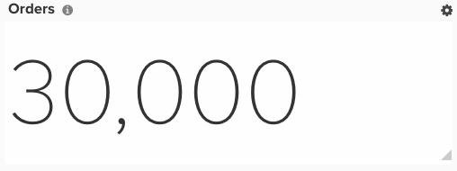

# RFM分析

本主题将演示如何设置一个功能板，以允许您按回访间隔、频度和货币排名对客户进行分段。 RFM分析是一种营销技术，它考虑客户行为，帮助您确定外联的分段。 它包含三个方面：

1. 客户最近从您的商店购买的回访间隔
1. 他们向您购买的频率
1. 客户花费的金额

只有在新架构上具有[!DNL Adobe Commerce Intelligence] Pro计划时（例如，如果在`Data Warehouse Views`菜单下具有`Manage Data`选项），才能配置RFM分析。 可从&#x200B;**[!DNL Manage Data > Data Warehouse]**&#x200B;页面创建这些列。 下面提供了详细说明。

## 快速入门

您需要首先上传一个文件，其中只包含值为1的主键。 这允许为分析创建一些必要的计算列。

您可以使用此[文章](../importing-data/connecting-data/using-file-uploader.md)和下面的图像来格式化您的文件。

## 计算列

如果您的企业允许客户订购，则需作进一步的区分。 如果是，则可以忽略`customer_entity`表的所有步骤。 如果不允许来宾订单，请忽略`sales_flat_order`表的所有步骤。

要创建的列

* **`Sales_flat_order/customer_entity`**&#x200B;表
* `Customer's last order date`
* [!UICONTROL Column type]： `Many to one > Max`
* [!UICONTROL Pat]： `sales_flat_order.customer_id > customer_entity.entity_id`
* 已选择[!UICONTROL column]： `created_at`
* [!UICONTROL Filter]： `Orders we count`

* &#x200B;
  自客户上次订购日期起    秒
  * [!UICONTROL Column type]： -     “同一张表>年龄
* 已选择[!UICONTROL column]： `Customer's last order date`

* （输入）计数引用
* [!UICONTROL Column type]： `Same table > Calculation`
* &#x200B;
  [!UICONTROL 输入]: `entity_id`
* [!UICONTROL Calculation]： `**case when A is null then null else 1 end**`
* &#x200B;
  [!UICONTROL 数据类型]: `Integer`

* **计数引用**&#x200B;表（这是您上传的编号为“1”的文件）
* 客户数量
* [!UICONTROL Column type]： `Many to One > Count Distinct`
* [!UICONTROL Path]： `ales_flat_order.(input) reference > Count reference.Primary Key`或`customer_entity.(input)reference > Count Reference`。`Primary Key`
* 已选择[!UICONTROL column]： `sales_flat_order.customer_email`或`customer_entity.entity_id`

* **Customer_entity**&#x200B;表
* 客户数量
* [!UICONTROL Column type]： `One to Many > JOINED_COLUMN`
* [!UICONTROL Path]： `customer_entity`。（输入）参考>客户集中。`Primary Key`
* 已选择[!UICONTROL column]： `Number of customers`

* （输入） `Ranking by customer lifetime revenue`
* [!UICONTROL Column type]： `Same table > Event Number`
* [!UICONTROL Event owner]： `(input) reference for count`
* [!UICONTROL Event rank]： `Customer's lifetime revenue`

* 按客户存留期收入排名
* [!UICONTROL Column type]： `Same table > Calculation`
* [!UICONTROL Inputs]： `(input) Ranking by customer lifetime revenue`，`Number of customers`
* [!UICONTROL Calculation]： `case when A is null then null else (B-(A-1)) end`
* &#x200B;
  [!UICONTROL 数据类型]: `Integer`

* 客户的货币得分（以百分位数为单位）
* [!UICONTROL Column type]： `Same table > Calculation`
* [!UICONTROL Inputs]： `(input) Ranking by customer lifetime revenue`，`Number of customers`
* [!UICONTROL Calculation]： `Case when round((B-A+1)*100/B,0) <= 20 then 5 when round((B-A+1)*100/B,0) <= 40 then 4 when round((B-A+1)*100/B,0) <= 60 then 3 when round((B-A+1)*100/B,0) <= 80 then 2 when round((B-A+1)*100/B,0) <= 100 then 1 else 0 end`
* &#x200B;
  [!UICONTROL 数据类型]: `Integer`

* （输入）按客户存留期订单数排名
* [!UICONTROL Column type]： `Same table > Event Number`
* [!UICONTROL Event owner]： `(input) reference for count`
* [!UICONTROL Event rank]： `Customer's lifetime number of orders`

* 按客户存留期订单数排名
* &#x200B;
  [!UICONTROL 列类型]: – "相同表>计算"
* [!UICONTROL Inputs]： - **（输入）按客户存留期订单数**&#x200B;排名，**客户数**
* [!UICONTROL Calculation]： - **当A为null时为null，否则(B-(A-1))结束**
* [!UICONTROL Datatype]： — 整数

* 客户的频率得分（按百分位数）
* [!UICONTROL Column type]： `Same table > Calculation`
* [!UICONTROL Inputs]： `(input) Ranking by customer lifetime number of orders`，`Number of customers`
* [!UICONTROL Calculation]： `Case when round((B-A+1)*100/B,0) <= 20 then 5 when round((B-A+1)*100/B,0) <= 40 then 4 when round((B-A+1)*100/B,0) <= 60 then 3 when round((B-A+1)*100/B,0) <= 80 then 2 when round((B-A+1)*100/B,0) <= 100 then 1 else 0 end`
* &#x200B;
  [!UICONTROL 数据类型]: `Integer`

* 自客户上次订购日期以来按秒排名
* [!UICONTROL Column type]： `Same table > Event Number`
* [!UICONTROL Event owner]： `(input) reference for count`
* [!UICONTROL Event rank]： `Seconds since customer's last order date`

* 客户的回访间隔分数（按百分位数）
* [!UICONTROL Column type]： `Same table > Calculation`
* [!UICONTROL Inputs]： `(input) Ranking by customer lifetime number of orders`，`Number of customers`
* [!UICONTROL Calculation]： `Case when (A * 100/B,0) <= 20 then 5 when (A * 100/B,0) <= 40 then 4 when (A * 100/B,0) <= 60 then 3 when (A * 100/B,0) <= 80 then 2 when (A * 100/B,0) <= 100 then 1 else 0 end`
* &#x200B;
  [!UICONTROL 数据类型]: `Integer`

* 客户的回访间隔分数（按百分位数）
* [!UICONTROL Column type]： `Same table > Calculation`
* [!UICONTROL Inputs]： `Customer's recency score (by percentiles)`，`Customer's frequency score (by percentiles)`，`Customer's monetary score (by percentiles)`
* [!UICONTROL Calculation]： `case when (A IS NULL or B IS NULL or C IS NULL) then null else concat(A,B,C) end`
* &#x200B;
  [!UICONTROL 数据类型]: String

* **引用计数**&#x200B;表
* [!UICONTROL Number of customers]： `(RFM > 0)`
* [!UICONTROL Column type]： `Many to One > Count Distinct`
* [!UICONTROL Path]： `sales_flat_order.(input) reference > Customer Concentration. Primary Key`或`customer_entity.(input)reference > Customer Concentration.Primary Key`
* 已选择[!UICONTROL column]： `sales_flat_order.customer_email`或`customer_entity.entity_id`
* [!UICONTROL Filter]： `Customer's RFM score (by percentile)`不等于000

* **Customer_entity**&#x200B;表
* [!UICONTROL Number of customers]： `(RFM > 0)`
* [!UICONTROL Column type]： `One to Many > JOINED_COLUMN`
* [!UICONTROL Path]： `customer_entity.(input) reference > Customer Concentration.Primary Key`
* 已选择[!UICONTROL column]： - `Number of customers`

* 客户的回访间隔分数`(R+F+M)`
* [!UICONTROL Column type]： `Same table > Calculation`
* [!UICONTROL Inputs]： - `Customer's recency score (by percentiles)`，`Customer's frequency score (by percentiles)`，`Customer's monetary score (by percentiles)`
* [!UICONTROL Calculation]： `case when (A IS NULL or B IS NULL or C IS NULL) then null else A+B+C end`
* &#x200B;
  [!UICONTROL 数据类型]: `Integer`

* （输入）按客户的整体RFM得分排名
* [!UICONTROL Column type]： `Same table > Event Number`
* [!UICONTROL Event owner]： `(input) reference for count`
* [!UICONTROL Event rank]： `Customer's recency score (R+F+M)`
* [!UICONTROL Filter]： `Customer's RFM score (by percentile)`不等于000

* 按客户的整体RFM分数排名
* [!UICONTROL Column type]： `Same table > Calculation`
* [!UICONTROL Inputs]： `(input) Ranking by customer's overall RFM score`，`Number of customers (RFM > 0)`
* [!UICONTROL Calculation]： `case when A is null then null else (B-(A-1)) end`
* &#x200B;
  [!UICONTROL 数据类型]: `Integer`

* 客户的RFM组
* [!UICONTROL Column type]： `Same table > Calculation`
* [!UICONTROL Inputs]： `(input) Ranking by customer lifetime revenue`，`Number of customers`
* [!UICONTROL Calculation]： `Case when round(A * 100/B,0) <= 20 then '5. copper' when round(A * 100/B,0) <= 40 then '4. bronze' when round(A * 100/B,0) <= 60 then '3. silver' when round(A * 100/B,0)<= 80 then '2. gold' else '1. Platinum' end`
* &#x200B;
  [!UICONTROL 数据类型]: `Integer`

>[!NOTE]
>
>使用的百分比甚至是对客户的分段（例如，20%存储段可返回1-5）。 如果您希望通过自定义方式对这些内容进行加权，请在提交票证时告知分析人员。

## 量度

无新量度！

>[!NOTE]
>
>确保在生成新报告之前[将所有新列作为维度添加到量度](../data-warehouse-mgr/manage-data-dimensions-metrics.md)。

## 报告

* 按RFM分组&#x200B;**客户**
* 量度`A`： `New customers`
* [!UICONTROL Metric]： `New customers`
* [!UICONTROL Filter]： `Customer's RFM score (by percentiles) Not Equal to 000`

* [!UICONTROL Time period]： `All time`
* &#x200B;
  [!UICONTROL Interval]: `None`
* 隐藏图表
* [!UICONTROL Group by]： `Customer's RFM group`
* &#x200B;
  [!UICONTROL 分组依据]: `Email`
* &#x200B;
  [!UICONTROL Chart type]: `Table`

* **有五个回访间隔分数的客户**
* 量度`A`： `New customers`
* [!UICONTROL Metric]： `New customers`
* [!UICONTROL Filter]： `Customer's recency score (by percentiles) Equal to 5`

* [!UICONTROL Time period]： `All time`
* &#x200B;
  [!UICONTROL Interval]: `None`
* &#x200B;
  [!UICONTROL Chart Type]: `Scalar`
* 隐藏图表
* &#x200B;
  [!UICONTROL 分组依据]: `Email`
* [!UICONTROL Group by]： `Customer's RFM score (R+F+M)`
* &#x200B;
  [!UICONTROL Chart type]: `Table`

* **具有一个回访间隔分数的客户**
* 量度`A`： `New customers`
* [!UICONTROL Metric]： `New customers`
* [!UICONTROL Filter]： `Customer's recency score (by percentiles) Equal to 1`

* [!UICONTROL Time period]： `All time`
* &#x200B;
  [!UICONTROL Interval]: `None`
* &#x200B;
  [!UICONTROL Chart Type]: `Scalar`
* 隐藏图表
* &#x200B;
  [!UICONTROL 分组依据]: `Email`
* [!UICONTROL Group by]： `Customer's RFM score (R+F+M)`
* &#x200B;
  [!UICONTROL Chart type]: `Table`

在编译所有报告后，您可以根据需要将报告组织在功能板上。 结果可能类似于上面的示例仪表板，但生成的三个表只是您可以执行的客户分段类型的示例。
