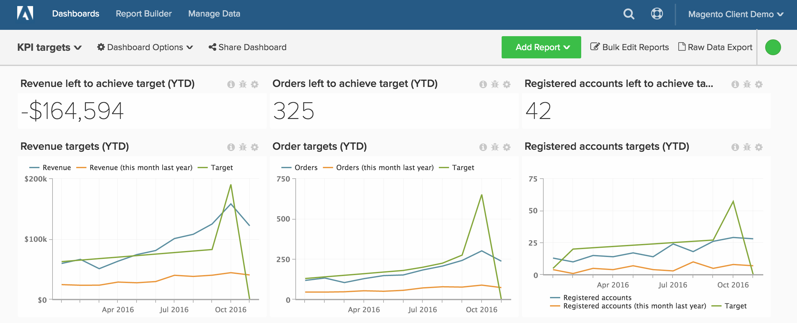
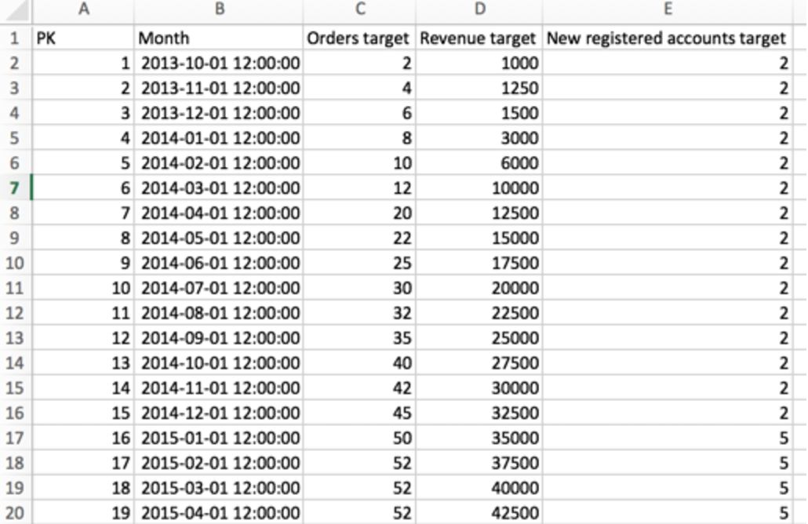

# 根据绩效量度跟踪目标

我们的大多数客户经常希望跟踪他们的 **业务目标**，但没有意识到在 [!DNL MBI]. 在本文中，我们演示了如何设置功能板，以帮助您根据实际数据（包括一段时间内的收入、新注册用户和订单）跟踪您的业务目标。 我们还将向您展示如何比较年度绩效，所有这些都在如下功能板中：

在开始之前，您需要熟悉我们的 [文件加载程序](../importing-data/connecting-data/using-file-uploader.md) 并确保在给定时间段内定义了业务目标。

## 快速入门

您首先需要上传一个文件，其中包含您的业务的特定每日/每月/每季目标。

您可以使用 [文件加载程序](../importing-data/connecting-data/using-file-uploader.md) 和下图以设置文件格式。 客户跟踪的最常见目标 [!DNL MBI] 包括订单、收入和新注册帐户。

## 量度

您需要为每个目标创建新量度。 例如，如果您上传月收入和订单目标，则需要创建两个新量度：

* **月收入目标**
* 在 **`Monthly goals`** 表
* 此量度执行 **总和**
* 在 **`Revenue target`** 列
* 由 **`Month`** timestamp

* **月订单目标**
* 在 **`Monthly goals`** 表
* 此量度执行 **总和**
* 在 **`Orders target`** 列
* 由 **`Month`** timestamp

* **每月新注册帐户目标**
* 在 **`Monthly goals`** 表
* 此量度执行 **总和**
* 在 **`New registered accounts target`** 列
* 由 **`Month`** timestamp

## 报表

与往常一样，在分析目标时混合使用静态值和可视化图表非常有用。 以下是三个帮助您开始跟踪收入绩效的示例报表。

* **剩余收入用于实现目标**
* 量度 `A`: `Revenue`
* 

   [!UICONTROL量度]: `Revenue`

* 量度 `B`: `Target Revenue`
* [!UICONTROL Metric]: `Monthly Revenue Target`

* [!UICONTROL Formula]: `Revenue left to achieve target`
* 
   [!UICONTROL公式]: `(B-A)`
* 

   [!UICONTROL Format]: `Number`

* [!UICONTROL Time period]:（无论您需要何种相关时间段）
* 
   [!UICONTROL Interval]: `Month`
* 

   [!UICONTROL图表类型]: `Scalar`

* **收入目标**
* 量度 `A`: `Revenue`
* 

   [!UICONTROL量度]: `Revenue`

* 量度 `B`: `Target Revenue`
* [!UICONTROL Metric]: `Monthly Revenue Target`

* 量度 `C`: `Revenue (amount change since previous year)` （隐藏）
* 
   [!UICONTROL量度]: `Revenue`
* [!UICONTROL Perspective]: `Amount change vs. Previous year`

* [!UICONTROL Formula]:（去年这个月）
* 
   [!UICONTROL公式]: `(A-C)`
* 

   [!UICONTROL Format]: `Currency`

* 关闭 `Multiple Y-Axes`
* [!UICONTROL Time period]:（不论您需要何种相关时间段）*
* 
   [!UICONTROL Interval]: `Month`
* [!UICONTROL Chart Type]: `Line Chart`

完成上述收入目标报表后，您可以为与订单、注册帐户或目标文件上传中包含的任何其他值相关的目标创建相同的报表。

编译完所有报告后，您可以在功能板上根据需要组织报告。 最终结果可能与本页顶部的图像类似。
