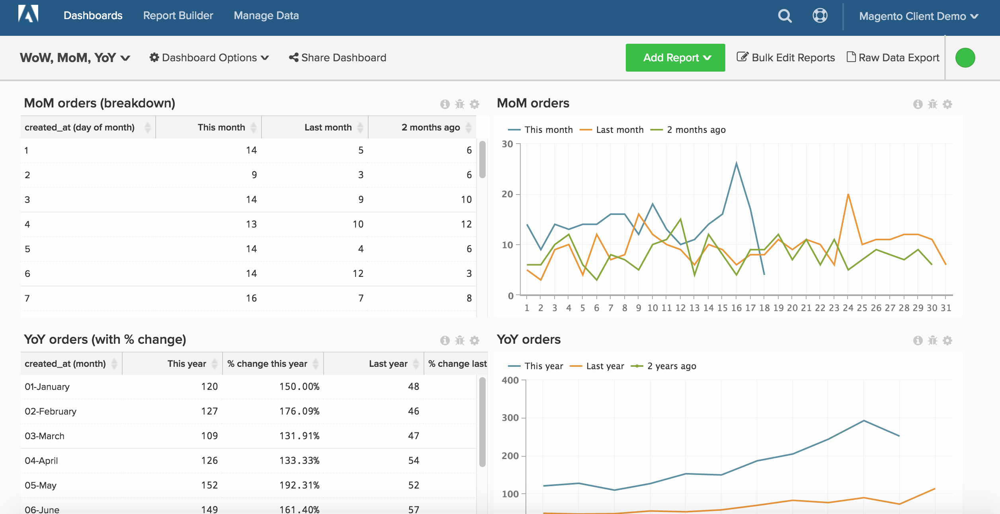

# 按时间段报告

>[!NOTE]
>
>本主题包含有关使用原始架构和新架构的客户端的说明。 您位于 [新架构](../../administrator/account-management/new-architecture.md) 如果您拥有 [!DNL _data warehouse查看次数_] 部分在选择后可用 [!DNL Manage Data] 从主工具栏中。

Report Builder允许您轻松查看一段时间的趋势，并更改您可能想要比较的时间段的视角。 本主题演示如何设置仪表板以更深入地进行分析，使您能够创建按周、按月、按年分析的报告。

在开始之前，您应该更详细地查看浏览透视 [此处](../../tutorials/using-visual-report-builder.md) 和独立时间选项 [此处](../../tutorials/time-options-visual-rpt-bldr.md).

此分析包含 [高级计算列](../data-warehouse-mgr/adv-calc-columns.md).

## 计算列

* **`Sales_flat_order`** 表
* **原始架构：** 以下列由分析师创建，作为您的一部分 `[YoY WoW MoM ANALYSIS]` 票证
* `created_at (month-day)`
* `created_at (month)`
* `created_at (day of the month)`
* `created_at (day of the week)`
* `created_at (hour of the day)`

* **新架构：** 下面列出的SQL，其中包含有关如何创建此计算的示例照片
   * `created_at (month-day)` [!UICONTROL Calculation]： **to_char(A， &#39;mm-dd&#39;)**
   * `created_at (month)` [!UICONTROL Calculation]： **to_char(A， &#39;mm-month&#39;)**
   * `created_at (day of the month)`&lt; [!UICONTROL Calculation]： **to_char(A， &#39;dd&#39;)**
   * `created_at (day of the week)` [!UICONTROL Calculation]： **to_char(A， &#39;d-Day&#39;)**
   * **`created_at (hour of the day)` [!UICONTROL Calculation]： **to_char(A， &#39;hh24&#39;)**

      

## 量度

无。

>[!NOTE]
>
>确保 [将所有新列作为维度添加到量度](../data-warehouse-mgr/manage-data-dimensions-metrics.md) 然后再生成新报告。

## 报告

* **按年图表**
   * [!UICONTROL Metric]: `Number of orders`

   * [!UICONTROL Metric]: `Number of orders`
   * [!UICONTROL Time options]: `Time range (Custom)`: `2 years ago to 1 year ago`

   * [!UICONTROL Show top/bottom]：前100%的排序依据 **`created_at (month-day)`***

* 量度 `A`： `This year`
* 量度 `B`： `Last year`
* [!UICONTROL Time period]: `1 year ago to 0 years ago`
* 
   [!UICONTROL Interval]: `None`
* [!UICONTROL Group by]: `created_at (month-day)`
* 
   [!UICONTROL Chart Type]: `Line`

* **MoM图表**
   * [!UICONTROL Metric]: `Number of orders`

   * [!UICONTROL Metric]: `Number of orders`
   * 时间选项： `Time range (Custom)`： `2 months ago to 1 month ago`

   * 显示前/后：前100%的排序依据 **`created_at (day of month)`***

* 量度 `A`：本月*
* 量度 `B`：上个月*
* [!UICONTROL Time period]：一个月前至0个月前
* 
   [!UICONTROL Interval]: None
* [!UICONTROL Group by]: `created_at (day of month)`
* 
   [!UICONTROL Chart Type]: Line

* **WoW图表**
   * [!UICONTROL Metric]: `Number of orders`

   * [!UICONTROL Metric]: `Number of orders`
   * [!UICONTROL Time options]: `Time range (Custom)`: `2 weeks ago to 1 week ago`

   * [!UICONTROL Show top/bottom]：前100%的排序依据 `created_at (day of week)`

* 量度 `A`： `This week`
* 量度 `B`： `Last week`
* [!UICONTROL Time period]: `1 week ago to 0 weeks ago`
* 
   [!UICONTROL Interval]: `None`
* [!UICONTROL Group by]: `created_at (day of week)`
* 
   [!UICONTROL Chart Type]: `Line`

* **DoD图表**
   * [!UICONTROL Metric]: `Number of orders`

   * [!UICONTROL Metric]: `Number of orders`
   * [!UICONTROL Time options]: `Time range (Custom)`: `2 days ago to 1 day ago`

   * [!UICONTROL Show top/bottom]：前100%的排序依据 `created_at (hour of day)`

* 量度 `A`： `Today`
* 量度B： `Yesterday`
* [!UICONTROL Time period]: `1 day ago to 0 days ago`
* 
   [!UICONTROL Interval]: `None`
* [!UICONTROL Group by]: `created_at (hour of day)`
* 
   [!UICONTROL Chart Type]: `Line`

在编译所有报告后，您可以根据需要将报告组织在功能板上。 结果可能类似于此页面顶部的图像。
