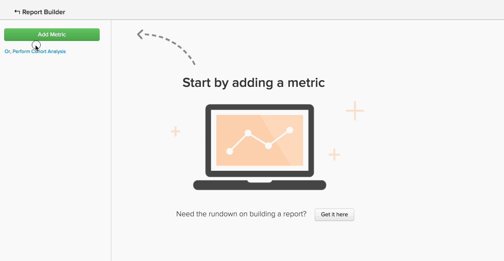

# 高级计算列类型

您可能尝试创建的许多分析都涉及使用 **新建列** 您希望 `group by` 或 `filter by`. 此 [创建计算列](../data-warehouse-mgr/creating-calculated-columns.md) 本教程介绍了大多数用例的基础知识，但您可能希望计算列比Data warehouse管理器可以创建的列更复杂。
{： #top}

这些类型的列可由Data warehouse分析员的Adobe团队创建。 要定义新的计算列，请提供以下信息：

1. 此 **`definition`** （包括输入、公式或格式）
1. 此 **`table`** 您希望在其上创建列
1. 任意 **`example data points`** 描述列应包含的内容

以下是用户通常认为有用的高级计算列的一些常见示例：

* [按顺序订购（或排名）事件](#compareevents)
* [查找两个事件之间的时间](#twoevents)
* [比较序列事件值](#sequence)
* [转换货币](#currency)
* [转换时区](#timezone)
* [其他内容](#else)

## 我正在尝试按顺序排列活动 {#compareevents}

这称为 **事件编号** 计算列。 这意味着您正在尝试查找特定事件所有者（如客户或用户）发生事件的顺序。

示例如下：

| **`event\_id`** | **`owner\_id`** | **`timestamp`** | **`Owner's event number`** |
|-----|-----|-----|-----|
| 1 | `A` | 2015-01-01 00:00:00 | 1 |
| 2 | `B` | 2015-01-01 00:30:00 | 1 |
| 3 | `A` | 2015-01-01 02:00:00 | 2 |
| 4 | `A` | 2015-01-02 13:00:00 | 3 |
| 5 | `B` | 2015-01-03 13:00:00 | 2 |

{style="table-layout:auto"}

事件数计算列可用于观察数据中首次事件、重复事件或第n个事件之间的行为差异。

要查看客户订单编号列的实际操作情况吗？ 单击图像可查看它在报表中用作分组依据维度。

<!--{: style="max-width: 500px;"}-->

要创建此类型的计算列，您需要知道：

* 要在其上创建此列的表
* 标识事件所有者的字段(`owner\_id` 在此示例中)
* 要按其排序事件的字段(`timestamp` 在此示例中)

[返回页首](#top)

## 我试着找出两件事之间的时间。 {#twoevents}

这称为 `date difference` 计算列。 这意味着您正在尝试根据事件时间戳查找属于单条记录的两个事件之间的时间。

示例如下：

| `id` | `timestamp\_1` | `timestamp\_2` | `Seconds between timestamp\_2 and timestamp\_1` |
|-----|-----|-----|-----|
| `A` | 2015-01-01 00:00:00 | 2015-01-01 12:30:00 | 45000 |
| `B` | 2015-01-01 08:00:00 | 2015-01-01 10:00:00 | 7200 |

{style="table-layout:auto"}

日期差异计算列可用于创建计算两个事件之间的平均时间或中间时间的量度。 单击以下图像以查看 `Average time to first order` 量度在报表中使用。

<!--{: style="max-width: 500px;"}-->

要创建此类型的计算列，您需要知道：

* 要在其上创建此列的表
* 您希望了解两者之间差异的两个时间戳

[返回页首](#top)

## 我正在尝试比较顺序事件值。 {#sequence}

这称为 **顺序事件比较**. 这意味着您正在尝试查找某个值（货币、数字、时间戳）与所有者上一个事件的相应值之间的差值。

示例如下：

| **`event\_id`** | **`owner\_id`** | **`timestamp`** | **`Seconds since owner's previous event`** |
|-----|-----|-----|-----|
| 1 | `A` | 2015-01-01 00:00:00 | 空 |
| 2 | `B` | 2015-01-01 00:30:00 | 空 |
| 3 | `A` | 2015-01-01 02:00:00 | 7720 |
| 4 | `A` | 2015-01-02 13:00:00 | 126000 |
| 5 | `B` | 2015-01-03 13:00:00 | 217800 |

{style="table-layout:auto"}

顺序事件比较可用于查找每个顺序事件之间的平均时间或中间时间。 单击以下图像查看 **订单之间的平均时间和中间时间** 量度正在起作用。

=<!--{: style="max-width: 500px;"}-->

要创建此类型的计算列，您需要知道：

* 要在其上创建此列的表
* 标识事件所有者的字段(`owner\_id` 在此示例中)
* 要查看每个连续事件之间差异的值字段(`timestamp` 在此示例中)

[返回页首](#top)

## 我正在尝试兑换货币。 {#currency}

A **货币换算** 计算列根据事件时的汇率将交易记录金额从记录的币种折换为报告币种。

示例如下：

| **`id`** | **`timestamp`** | **`transaction\_value\_EUR`** | **`transaction\_value\_USD`** |
|-----|-----|-----|-----|
| `1` | 2015-01-01 00:00:00 | 30 | 33.57 |
| `2` | 2015-01-02 00:00:00 | 50 | 55.93 |

{style="table-layout:auto"}

要创建此类型的计算列，您需要知道：

* 要在其上创建此列的表
* 要转换的交易记录金额列
* 指示记录数据的货币（通常是ISO代码）的列
* 首选报表货币

[返回页首](#top)

## 我正在尝试转换时区。 {#timezone}

A **时区转换** 计算列将特定数据源的时间戳从其记录的时区转换为报表时区。

示例如下：

| **`id`** | **`timestamp\_UTC`** | **`timestamp\_ET`** |
|-----|-----|-----|
| `1` | 2015-01-01 00:00:00 | 2014-12-31 19:00:00 |
| `2` | 2015-01-01 12:00:00 | 2015-01-01 07:00:00 |

{style="table-layout:auto"}

要创建此类型的计算列，您需要知道：

* 要在其上创建此列的表
* 要转换的时间戳列
* 记录数据时区
* 首选报表时区

[返回页首](#top)

## 我正在尝试做这里没有列出的事情。 {#else}

别担心。 这里没有列出它并不意味着它不可能。 data warehouse分析员的Adobe团队可以提供帮助。

要定义新的计算列， [提交支持服务单](https://experienceleague.adobe.com/docs/commerce-knowledge-base/kb/troubleshooting/miscellaneous/mbi-service-policies.html?lang=en) 其中包含您希望构建的确切内容的详细信息。

## 相关文档

* [创建计算列](../data-warehouse-mgr/creating-calculated-columns.md)
* [计算列类型](../data-warehouse-mgr/calc-column-types.md)
* [构建 [!DNL Google ECommerce] 包含订单和客户数据的维度](../data-warehouse-mgr/bldg-google-ecomm-dim.md)
