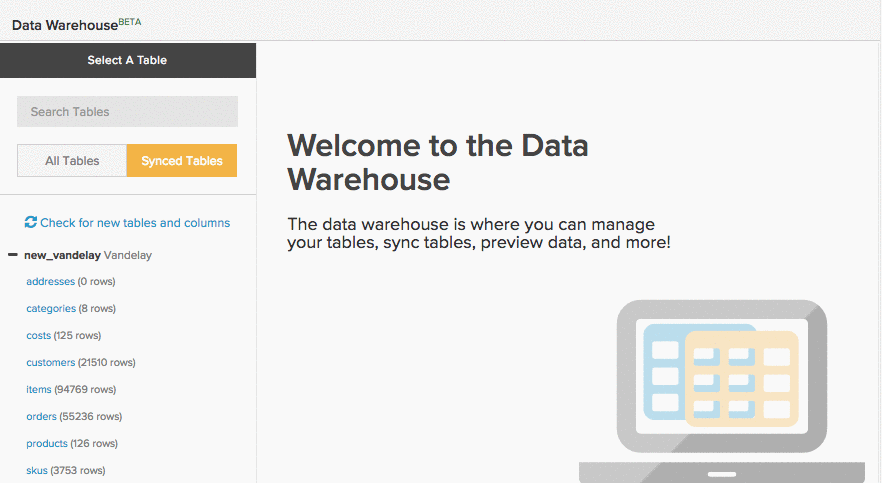
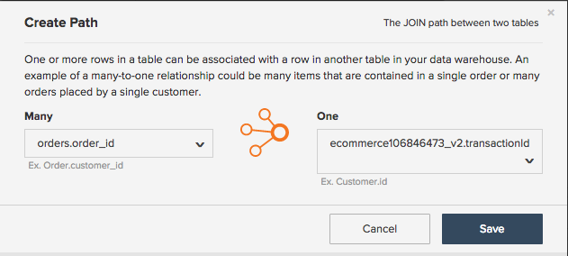
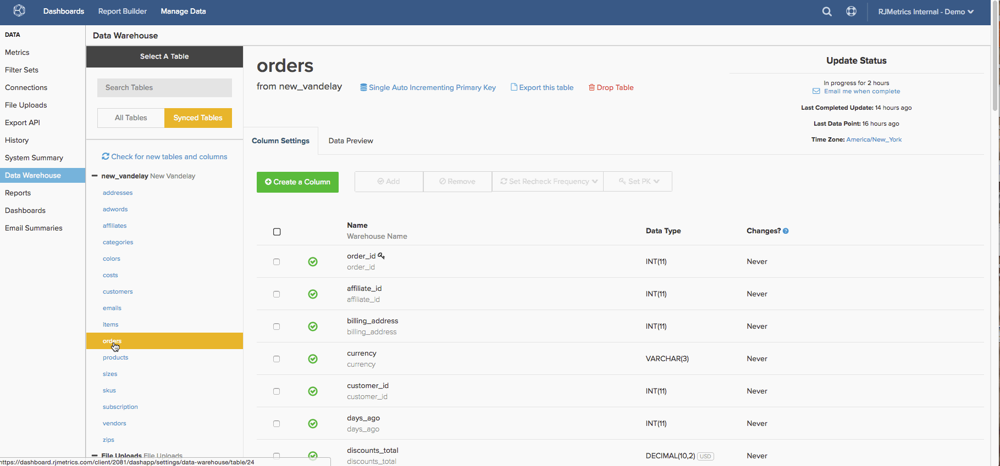
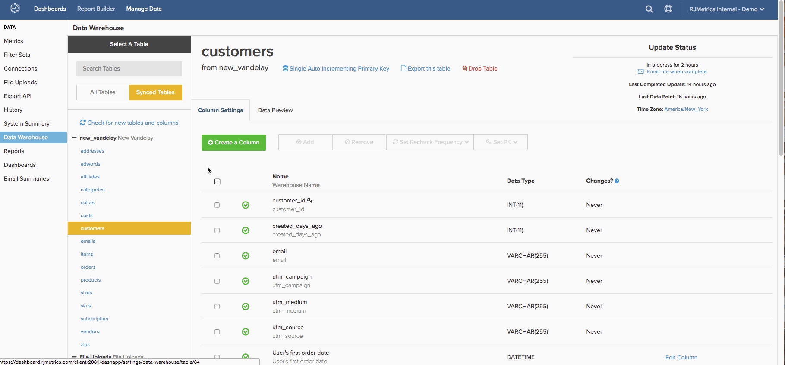

# 生成[!DNL Google ECommerce]维度

>[!NOTE]
>
>需要[管理员权限](../../administrator/user-management/user-management.md)。

现在您已完成[连接[!DNL Google ECommerce]帐户](../../data-analyst/importing-data/integrations/google-ecommerce.md)，在[!DNL Commerce Intelligence]中可以如何处理这些数据？ 本主题将指导您构建将电子商务数据与订单和客户数据关联的维度。

所涵盖的维度使您能够构建分析，这些分析可[回答有关您的营销渠道和营销活动的重要问题](../../data-analyst/analysis/most-value-source-channel.md)。 每个来源占收入的百分比是多少？ 与从[!DNL Facebook]获得的客户相比，[!DNL Google]获得的客户的生命周期值如何？

## 先决条件和概述

要在此主题中创建维度，您需要一个[!DNL Google ECommerce]表、`orders`表和`customers`表。 在生成维度之前，这些表必须[同步到Data Warehouse](../../data-analyst/data-warehouse-mgr/tour-dwm.md)。 已同步的表显示在`Synced Tables`的`Data Warehouse Manager`部分中。

如果需要刷新程序，可以快速查看同步表和列：

创建从`orders`表到[!DNL Google eCommerce]表的连接后，您将在下面的列表中创建前三个维度。 接下来，使用这些维度在`customers`表中创建三个用户/客户维度。 若要完成，请将这些列加入`orders`表。

以下是涉及的维度：

* **订单表**

* 订单的[!DNL Google Analytics]源
* 订单的[!DNL Google Analytics]媒介
* 订单的[!DNL Google Analytics]营销活动
* 客户第一张订单的[!DNL Google Analytics]来源
* 客户第一张订单的[!DNL Google Analytics]媒介
* 客户第一张订单的[!DNL Google Analytics]营销活动

* **客户表**

* 客户第一张订单的[!DNL Google Analytics]来源
* 客户第一张订单的[!DNL Google Analytics]媒介
* 客户第一张订单的[!DNL Google Analytics]营销活动

## 构建维度

要创建维度，请单击[&#x200B; > &#x200B;](../data-warehouse-mgr/tour-dwm.md)以打开&#x200B;**[!UICONTROL Data]** Data Warehouse Manager **[!UICONTROL Data Warehouse]**。

### 订单表，第1轮

此示例构建&#x200B;**订单的[!DNL Google Analytics] Source**&#x200B;维度。

1. 从Data Warehouse中的表列表中，单击包含订单信息的表（在本例中为`orders`）。
1. 单击&#x200B;**[!UICONTROL Create a Column]**。
1. 命名列。
1. 从`Joined Column`定义下拉列表[中选择](../data-warehouse-mgr/calc-column-types.md)。 此示例适用于[一对一关系](../data-warehouse-mgr/table-relationships.md)，将`eCommerce.transactionID`列与`orders`表的一行完全匹配。
1. 接下来，您需要定义路径，或者定义正在使用的表和列的连接方式。 单击`Select a table and column`下拉菜单。
1. 您需要的路径不可用，因此需要创建一个新路径。 单击&#x200B;**[!UICONTROL Create new Path]**。
1. 在显示的窗口中，将`Many`端设置为`orders.order\_id`，或将`orders`表中包含订单ID的列设置为。
1. 在`One`端，找到`Google ECommerce`表，然后将该列设置为`transactionID`。

   

1. 单击&#x200B;**[!UICONTROL Save]**&#x200B;以创建路径。
1. 添加路径后，再次单击&#x200B;**[!UICONTROL Select table and column]**&#x200B;下拉列表。
1. 找到`ECommerce`表，然后单击`Source`列。 这会将订单与源信息绑定。
1. 返回表架构后，再次单击&#x200B;**[!UICONTROL Save]**&#x200B;以创建维度。

下面是整个过程的概况：

接下来，尝试创建&#x200B;**订单的[!DNL Google Analytics]媒介**&#x200B;和`campaign`。 这些维度没有多少变化，所以尝试一下。 但是，如果卡住，可以查看[本文结尾](#stuck)以查看其他内容。

### Customers表 {#customers}

此示例构建&#x200B;**客户第一订单的[!DNL Google Analytics]源**&#x200B;维度。

1. 从Data Warehouse中的表列表中，单击包含客户信息的表（在本例中为`customers`）。
1. 单击&#x200B;**[!UICONTROL Create a Column]**。
1. 命名列。
1. 对于此示例，请从`is MAX`定义下拉列表[中选择](../../data-analyst/data-warehouse-mgr/calc-column-types.md)定义。 如果应用于只有一个可能值的文本列，`is MIN`定义也可以正常工作。 重要的部分是确保设置正确的过滤器，您稍后可以这样做。
1. 单击&#x200B;**[!UICONTROL Select a table and column]**&#x200B;下拉菜单并选择`orders`表，然后选择`Order's [!DNL Google Analytics] source`列。
1. 单击&#x200B;**[!UICONTROL Save]**。
1. 返回表架构后，单击`Options`下拉列表，然后单击`Filters`。
1. 单击&#x200B;**[!UICONTROL Add Filter Set]**，然后选择`Orders we count`集。 您只希望计入您盘点筛选器集的订单中包含的订单，因此选择此筛选器集非常重要。
1. 单击&#x200B;**[!UICONTROL Add Filter]**。 您要查找客户第一张订单的[!DNL Google Analytics]来源，因此您需要添加一个过滤器：

   _orders.Customer的订单号= 1

   _
1. 单击&#x200B;**[!UICONTROL Save]**&#x200B;创建维度。

接下来，尝试创建&#x200B;**客户第一张订单的[!DNL Google Analytics]媒介**&#x200B;和`campaign`。 这些维度没有多少变化，所以尝试一下。 但是，如果卡住，可以查看[本文结尾](#stuck)以查看其他内容。

### 奖励：订单表，第2轮

如果需要，可以在此处停止，但此部分通过将您在&#x200B;**最后一个部分[!DNL Google Analytics]中创建的**&#x200B;客户第一订单的[维度](#customers)引入`orders`表支持进一步分析。 在此部分中创建维度允许您使用客户第一订单的`orders`属性分析在您的`Revenue`表（`Number of orders`、`Distinct buyers`、[!DNL Google Analytics]等）上构建的所有量度。

此示例将`Customer's first order's [!DNL Google Analytics] source`维度联接到`orders`表。

1. 从Data Warehouse中的表列表中，单击包含订单信息的表（在本例中为`orders`）。
1. 单击&#x200B;**[!UICONTROL Create a Column]**。
1. 命名列。
1. 从定义下拉列表中选择`Joined Column`。 这会将您在上一节中创建的客户维度加入`orders`表。
1. 单击&#x200B;**[!UICONTROL Select a table and column]**&#x200B;下拉列表，然后选择`customers`表和`Customer's first order's [!DNL Google Analytics] source`列。
1. 如果路径未自动填充，请选择最能连接customers和orders表的路径。
1. 单击&#x200B;**[!UICONTROL Save]**&#x200B;创建维度。

下面是整个过程的概况：

将`Customer's first order's`媒体和`campaign`维度加入`orders`表即可完成。 加入维度，如果遇到问题，则在需要帮助时查看[文章的结尾](#stuck)。

### 正在结束

您已完成维度创建，这意味着您现在可以创建强大的分析来跟踪各种渠道和营销活动的性能。 请记住，在下一次更新完成&#x200B;**之前，**&#x200B;新列将不可用。

本主题中介绍了一些更受欢迎的维度，但天空才是极限 — 请尝试创建您自己的维度，或者如果您希望获得探索其他选项的帮助，请随时联系我们。 

### 其他说明

**`Orders`表#1**：创建`Order's [!DNL Google Analytics]`媒体和`campaign`维度时，差异为步骤12中选择的列。 在此示例中，该列为`Source`。

**`Customers`表**：创建`Customer's first order's [!DNL Google Analytics]`媒体和`campaign`维度时，差异为步骤5中选择的列。 在此示例中，该列是`Order's [!DNL Google Analytics]`源。

**`Orders`表#2**：将`Customer's first order's [!DNL Google Analytics]`媒体和`campaign`列联接`orders`表时，差异为步骤5中选择的列。 在此示例中，该列是`Customer's first order's [!DNL Google Analytics]`源。
