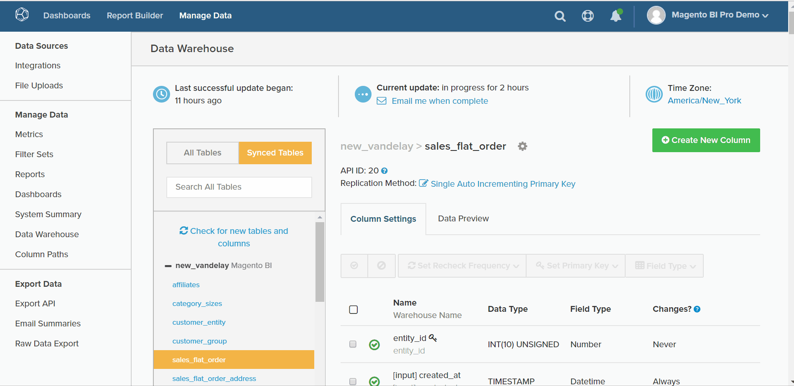
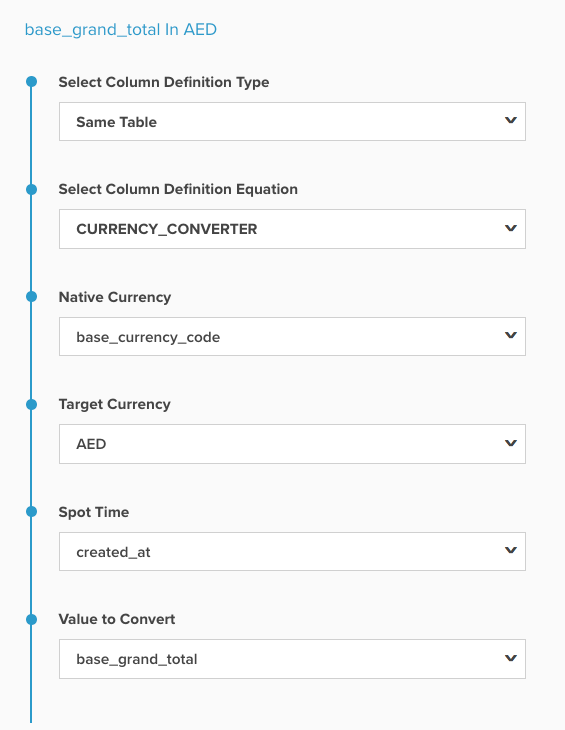
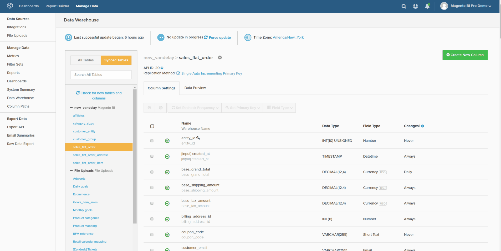
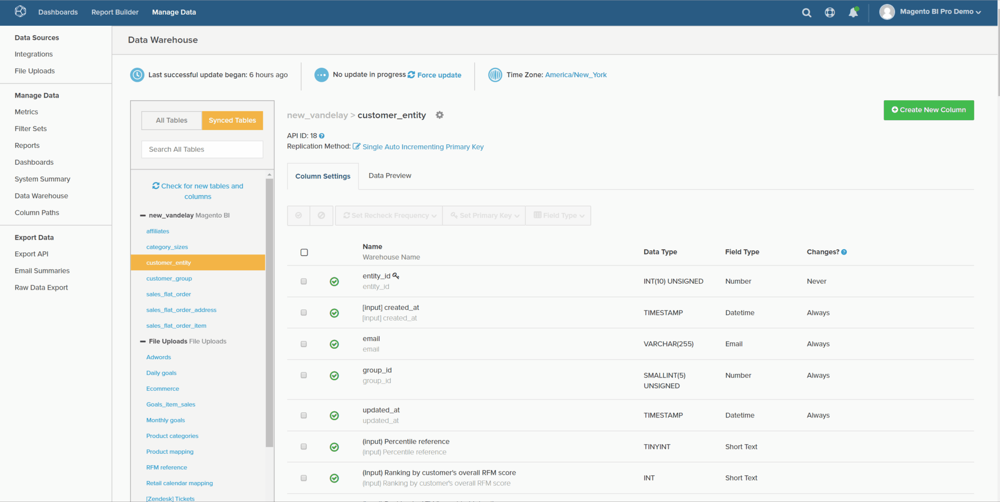
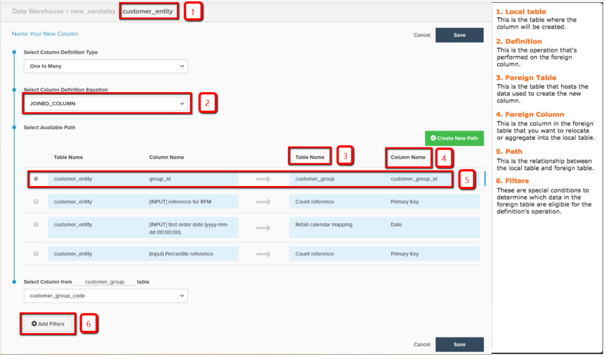

# 计算列类型

* [相同的表计算](#sametable)
* [一对多计算](#onetomany)
* [多对一计算](#manytoone)
* [方便的参考地图](#map)
* [高级计算列](#advanced)

在[Data Warehouse Manager](../data-warehouse-mgr/tour-dwm.md)中，您可以创建列以扩充和优化数据以供分析。 [可以通过选择Data Warehouse管理器中的任何表并单击](../data-warehouse-mgr/creating-calculated-columns.md)来访问此功能&#x200B;**[!UICONTROL Create New Column]**。

本主题介绍可使用Data Warehouse Manager创建的列类型。 它还涵盖了说明、该列的视觉浏览以及创建列所需的所有输入的[引用映射](#map)。 有三种方法可创建计算列：

1. [相同表计算列](#sametable)
1. [一对多计算列](#onetomany)
1. [多对一计算列](#manytoone)

## 相同表计算列 {#sametable}

这些列是使用同一表中的输入列生成的。

### 年龄 {#age}

年龄计算列返回当前时间和某个输入时间之间的秒数。

以下示例在`Seconds since customer's most recent order`表中创建`customers`。 这可用于构建未在`X days`中进行购买（有时称为流失）的客户的用户列表。

### 货币转换器

货币转换器计算列将列的本机货币转换为所需的新货币。

下面的示例创建了`base\_grand\_total In AED`，在`base\_grand\_total`表中将`sales\_flat\_order`从本机货币转换为AED。 此列非常适用于具有多种货币、希望以当地货币进行报告的商店。

对于Commerce客户端，`base\_currency\_code`字段通常存储本机货币。 `Spot Time`字段应与量度中使用的日期匹配。

## 一对多计算列 {#onetomany}

`One-to-Many`列[使用两个表之间的路径](../../data-analyst/data-warehouse-mgr/create-paths-calc-columns.md)。 此路径始终表示一个表（属性所在的位置）和多个表（属性会向下重定位到）。 可将路径描述为`foreign key--primary key`关系。

### 已联接列 {#joined}

联结的列重新定位一个表&#x200B;*到*&#x200B;多个表上的属性。 一个/多个客户的典型示例是客户（一个）和订单（多个）。

在以下示例中，`Customer's group\_id`维度向下联接到`orders`表中。

## 多对一计算列 {#manytoone}

这些列使用与一对多列相同的路径，但它们将数据指向相反方向。 将在路径的一侧而不是多侧创建列。 由于这种关系，列中的值需要是一个聚合，也就是说，对多个数据点执行的数学运算。 这方面的使用案例很多，下面列出了几个。

### 计数 {#count}

此类型的计算列返回多个表&#x200B;*上的值的计数*&#x200B;到同一个表。

在以下示例中，在`Customer's lifetime number of canceled orders`表上创建维度`customers`（具有`orders.status`的筛选器）。

{: width="699" height="351"}

### 总和 {#sum}

计算列的总和是`many`表上的值加到一个表上的总和。

这可用于创建客户级别的维度，如`Customer's lifetime revenue`。

### 最小值或最大值 {#minmax}

最小值或最大值计算列将返回多个方面存在的最小或最大记录。

这可用于创建客户级别的维度，如`Customer's first order date`。

### 存在 {#exists}

计算列是确定多面记录存在的二进制测试。 换言之，如果路径在每个表中至少连接一行，则新列返回`1`；如果无法建立连接，则返回`0`。

例如，此类维度可以确定客户是否购买过特定产品。 使用`customers`表和`orders`表之间的连接、特定产品的筛选器可以生成维度`Customer has purchased Product X?`。

## 方便的参考地图 {#map}

如果在创建计算列时记住所有输入内容时遇到问题，请在构建时方便使用此参考映射：

## 高级计算列 {#advanced}

当您试图分析和回答有关业务的问题时，可能会遇到无法构建所需确切列的情况。

为确保快速回转，Adobe建议查看[高级计算列类型](../../data-analyst/data-warehouse-mgr/adv-calc-columns.md)指南，以了解Adobe支持团队可以构建的列类型。 该主题还涵盖了创建列所需的信息 — 请将其包含在您的请求中。

## 相关文档

* [创建计算列](../../data-analyst/data-warehouse-mgr/creating-calculated-columns.md)
* [为计算列创建/删除路径](../../data-analyst/data-warehouse-mgr/create-paths-calc-columns.md)
* [了解和评估表关系](../../data-analyst/data-warehouse-mgr/table-relationships.md)
