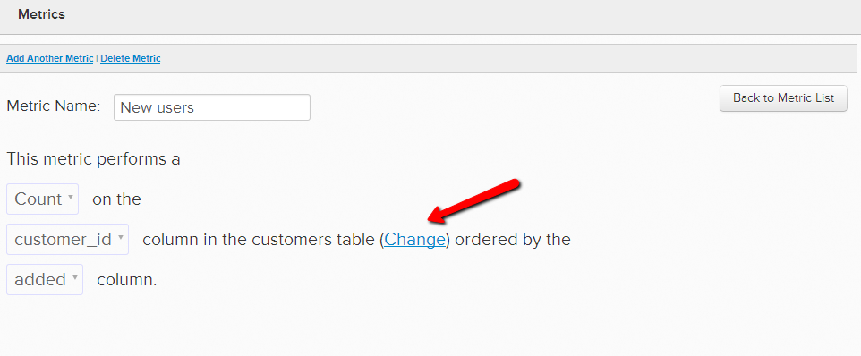
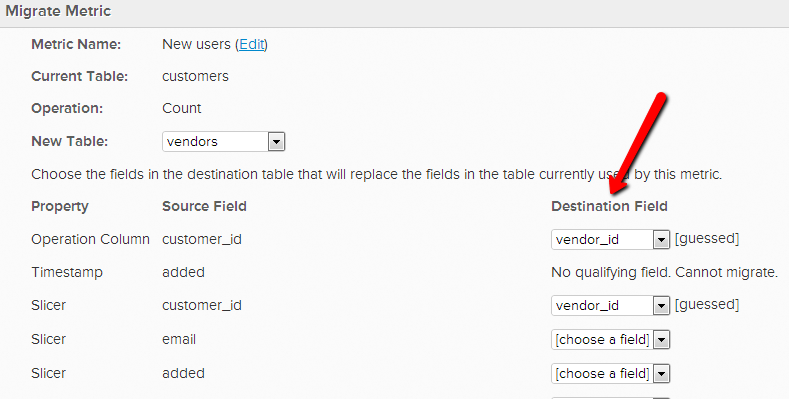
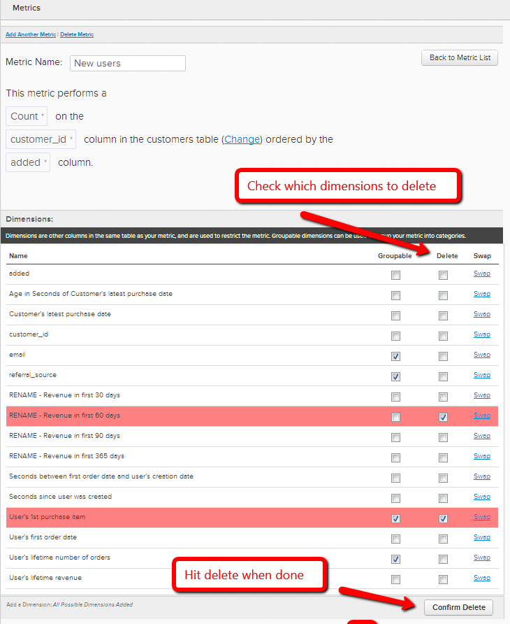

# 更改量度的操作表

在某些情况下，您可以决定更改量度用来执行操作的数据表。 例如，如果您有一个新的用户表，您希望从`Users\_Old`表中迁移与用户相关的量度以改用`Users\_New`表。

1. 转到&#x200B;**[!UICONTROL Data]** > **[!UICONTROL Metrics]**
1. 单击要切换`operational`表的量度旁边的&#x200B;**[!UICONTROL Edit]**。
1. 在编辑器中，单击&#x200B;**[!UICONTROL Change]**。

   
1. 选择要作为此量度基础的新表。
1. 将现有数据维度与新表中的相应维度匹配。 例如，如果您有一个名为`User's registration date`的列，只需选择新表中的哪一列记录相同的日期数据即可。 （如果新表中没有匹配的列，请参阅下一步）

   

1. 如果新表中没有匹配的列，您可以&#x200B;**在数据表中创建它**，或者[联系支持人员](https://experienceleague.adobe.com/docs/commerce-knowledge-base/kb/troubleshooting/miscellaneous/mbi-service-policies.html?lang=zh-Hans)（如果它是由[!DNL Commerce Intelligence]创建的计算列或维度）。 您也可以&#x200B;**从指标**&#x200B;中删除维度。 要删除您不再需要的维度，只需返回量度的编辑器，并在`Dimensions`下选择要删除的维度。

   
