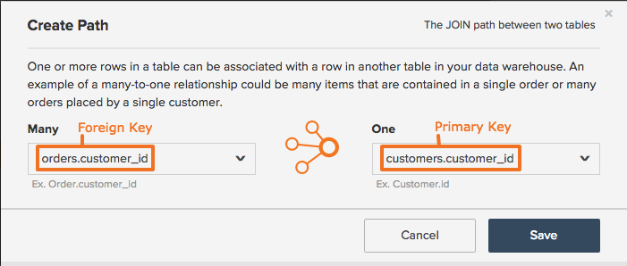

# 创建或删除计算列的路径

## 计算列刷新程序

在Data Warehouse中[创建计算列](../data-warehouse-mgr/creating-calculated-columns.md)时，系统会要求您定义一个路径，描述您正在创建列的表如何与您从中提取信息的表相关。 要成功创建路径，您需要了解两件事：

1. 数据库中的表如何相互关联
1. 定义此关系的主键和外键

如果您知道此信息，可以按照本主题中的说明轻松创建路径。 您可能需要咨询组织中的技术专家，或联系[专业服务团队](https://experienceleague.adobe.com/docs/commerce-knowledge-base/kb/troubleshooting/miscellaneous/mbi-service-policies.html?lang=zh-Hans)。

## 刷新表关系和键类型 {#refresher}

### 表关系 {#relationships}

此概念包含在[了解和评估表关系文章](../../data-analyst/data-warehouse-mgr/table-relationships.md)中，但快速摘要不会伤害任何人，对吗？

表可以通过以下三种方式之一相互关联：

| **`Relationship Type`** | **`Example`** |
|-----|-----|
| **`one-to-one`** | 人与驾照号码之间的关系。 一个人只能有一个驾驶执照号码，一个驾驶执照号码只属于一个人。 |
| **`one-to-many`** | 订单与物料之间的关系 — 一个订单可以包含多个物料，但一个物料属于单个订单。 在这种情况下，订单表是单侧，而物料表是多侧。 |
| **`many-to-many`** | 产品与类别之间的关系：一个产品可以属于多个类别，而一个类别可以包含多个产品。 |

{style="table-layout:auto"}

当理解两个表之间的关系时，可以使用该关系来确定应该创建什么路径来将信息从一个表带到另一个表。 此下一步需要了解有助于建立表关系的主键和外键。

### 主键和外键 {#keys}

`Primary Key`是未更改的列或列集，在表中生成唯一值。 例如，当客户在网站上订购时，购物车中的`orders`表中会添加一个新行，其中包含新的`order_id`。 此`order_id`允许客户和公司跟踪该特定订单的进度。 由于订单ID是唯一的，因此它通常是`orders`表的`Primary Key`。

`Foreign Key`是在链接到另一个表的`Primary Key`列的表中创建的列。 外键可在表之间创建引用，使分析人员能够轻松地查找记录并将记录链接到一起。 假设您想了解哪些订单属于您的每个客户。 `customer id`列（`customers`表的`Primary Key`）和`order_id`列（`customers`表中的`Foreign Key`，引用`orders`表的`Primary Key`）允许我们链接和分析此信息。 创建路径时，需要您同时定义`Primary Key`和`Foreign Key`。

## 创建路径 {#createpath}

在Data Warehouse中创建列时，必须定义将信息从一个表引入另一个表的路径。 有时，路径会预先填充，因为表之间存在路径，但如果不存在路径，则必须创建路径。

使用&#x200B;**客户**&#x200B;和&#x200B;**订单**&#x200B;之间的关系来向您说明如何完成此操作。 划分：

* 关系为`one-to-many` — 一个客户可以有多个订单，但一个订单只能有一个客户。 这告诉我们关系的方向，或应在何处创建计算列。 在这种情况下，这意味着可以将`orders`表中的信息引入`customers`表中。
* 您要使用的`primary key`是`customers.customerid`或`customers`表中的`customer ID`列。
* 您要使用的`foreign key`是`orders.customerid`或`orders`表中的`customer ID`列。

现在，您可以创建路径。

1. 单击&#x200B;**[!UICONTROL Data > Data Warehouse]**。
1. 在表列表中，单击要在其中创建列的表。 在此示例中，它是`customers`表。
1. 此时将显示表架构。 单击&#x200B;**[!UICONTROL Create New Column]**。
1. 为您的列提供一个名称，例如，`Customer's orders`。
1. 选择列的定义。 请查看[计算列指南](../data-warehouse-mgr/creating-calculated-columns.md)，查看方便的备忘单。
1. 在[!UICONTROL Select table and column]下拉列表中，单击&#x200B;**[!UICONTROL Create new path]**&#x200B;选项。

   

1. 使用下拉列表，选择每个表的主键和外键。

   在`Many`侧，您选择`orders.customerid` — 请记住，客户可以有多个订单。

   在`One`侧，您选择`customers.customerid` — 一个订单只能有一个客户。

1. 单击&#x200B;**[!UICONTROL Save]**&#x200B;保存路径并完成创建列。

### 创建路径的限制 {#limits}

* **[!DNL Commerce Intelligence]无法猜测主/外键关系**。 您不希望将不正确的数据引入帐户，因此必须手动创建路径。

* **目前，只能在两个不同的表**&#x200B;之间指定路径。 您尝试重新创建的逻辑是否涉及两个以上的表？ 然后，(1)先将列连接到中间表，然后再连接到“最终目标”表，或者(2)咨询[专业服务团队](https://experienceleague.adobe.com/docs/commerce-knowledge-base/kb/troubleshooting/miscellaneous/mbi-service-policies.html?lang=zh-Hans)以找到实现目标的最佳方法，这样做可能会有意义。

* **列一次只能是ONE路径的外键引用**。 例如，如果`order_items.order_id`指向`orders.id`，则`order_items.order_id`无法指向任何其他内容。

* 从技术上讲，可以创建&#x200B;**`Many-to-many`个路径，但通常生成错误数据，因为任何一方都不是真`one-to-many`外键**。 接近这些路径的最佳方法始终取决于特定的所需分析。 请咨询RJ分析团队以发现最佳解决方案。

如果由于上述一个或多个限制而无法创建计算列，请与支持人员联系并提供您当前列的说明

## 删除计算列路径 {#delete}

在您的Data Warehouse中创建了错误的路径？ 或者你春天要打扫一下，想打扫一下？ 如果需要从帐户中删除路径，您可以[将票证发送给Adobe支持分析人员](../../guide-overview.md#Submitting-a-Support-Ticket)。 **请确保包含路径的名称！**

## 正在结束 {#wrapup}

现在，您已熟悉如何在Data Warehouse中为计算列创建路径。 如果您仍不确定特定路径，请记住，您始终可以在[!DNL Commerce Intelligence]帐户中单击&#x200B;**[!UICONTROL Support]**&#x200B;以获取帮助。

## 相关

* [了解和评估表关系](../data-warehouse-mgr/table-relationships.md)
* [为计算列创建路径](../data-warehouse-mgr/create-paths-calc-columns.md)
* [计算列类型](../data-warehouse-mgr/calc-column-types.md)正在尝试创建。
