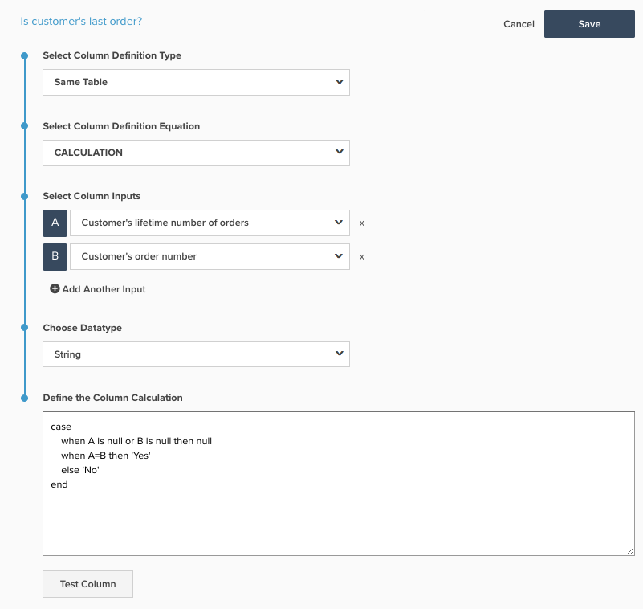
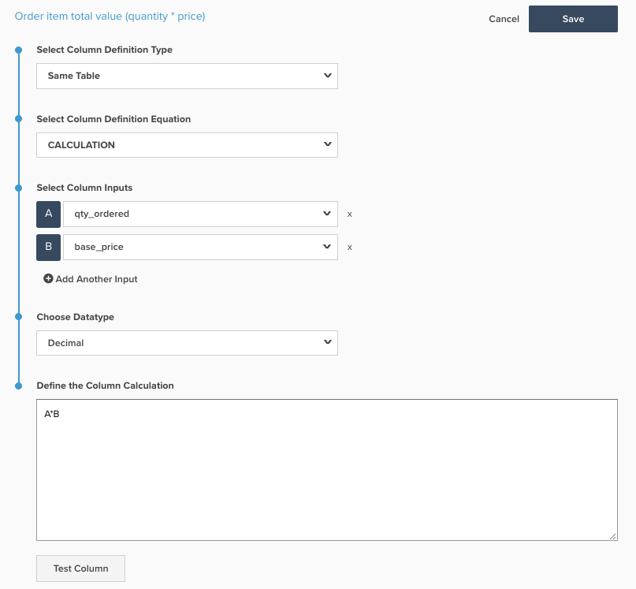
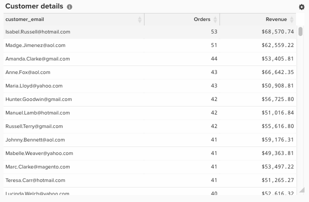

# 创建SQL计算列

本主题概述了`Calculation`列类型的用途和用途，可以使用[Data Warehouse Manager](../data-warehouse-mgr/tour-dwm.md)将其添加到表中。 下面说明了SQL计算的用途、使用它们的原因、创建SQL计算的过程以及两个示例。

**解释**

过去，被视为`advanced`的列只能由[!DNL Adobe Commerce Intelligence]处的客户成功团队分析师完成。 现在，所有权力都掌握在最终用户手中，可以在新的`SQL Calculation`架构上以[!DNL Commerce Intelligence]列的形式创建高级列。

`Calculation`列类型现在作为Data Warehouse Manager中的选项提供，它和允许您使用PostgreSQL逻辑转换表上的列的表操作是相同的。 可以在PostgreSQL网站`Calculation`此处[找到有关](https://www.postgresql.org/docs/9.6/functions.html)列类型中可用的函数和运算符的文档。

可以使用`Calculation`列创建的不同列几乎不受限制，但大多数列都可以使用IF-THEN语句和基本算术来创建，这些语句用于下面的示例。

**示例1：客户的上次订单是否为？**

大多数帐户的`Is customer's last order?`表中都有一个名为`orders`的列，用于对重复购买率和客户流失率进行分析。 如果您的帐户采用新架构，则此列是使用`Calculation`列构建的，可在下面的屏幕快照中看到：

`Is customer's last order?`列使用分别作为`Customer's lifetime number of orders`和`Customer's order number`别名的输入`A`和`B`。

逐行，PostgreSQL的含义是：

* 用例：这将启动一系列If - Then语句
* 当`A`为null或`B`为null时为null：如果任一输入为空，则输出也应为空。 这是为了防止SQL错误
* 当`A=B`时，则`Yes`：如果该行的`Customer's lifetime number of orders`等于`Customer's order number`，则返回`Yes`。 因此，如果客户已下四张订单，则第四张订单的行将返回`Yes`的`Is customer's last order?`
* else `No`：如果满足语句时没有其他语句，则返回`No`
* end：这将结束If - Then语句

此列(`NULL`、`Yes`、`No`)可能返回的值包含非数字字符，因此此处的数据类型为String。

**示例2：订单项目总值（数量*价格）**

许多客户都喜欢在项目级别分析收入，并按`product name`或`category`等字段对其进行分片。 大多数数据库实际上并不提供订单中产品的收入；而是提供订单中销售的数量和项目的价格。

为了启用产品收入分析，大多数帐户在其`Order item total value (quantity * price)`表中都有一个名为`Orders Items`的列。 如果您的帐户采用新架构，则此列也是使用`Calculation`列构建的，并且可在下面的屏幕快照中看到：

在Commerce架构中，`Order item total value (quantity * price)`列使用分别作为`qty ordered`和`base price`别名的输入`A`和`B`。

此新列返回的值以美元和美分表示，因此正确的数据类型为`Decimal(10,2)`。

**机械**

通过导航到`Calculation`，可将新&#x200B;**[!DNL Manage Data > Data Warehouse]**&#x200B;列添加到表中，如下所示：

在此处，您可以按照以下步骤创建`Calculation`列：

1. 选择要添加`Calculation`列的表。
1. 在正确的表上，单击屏幕右上角的&#x200B;**[!UICONTROL Create New Column]**。
1. 从`Select a definition`下拉列表中，选择`Same Table`。
1. 选择`Calculation`作为`column definition equation`。
1. 输入列名。
1. 从表中为新列选择逻辑中使用的`input`列。 您添加的每一列都有一个字母别名，因此第一列为`A`，第二列为`B`，依此类推。
1. 在窗口中，使用输入的字母别名键入新列的PostgreSQL逻辑。 SQL计算应限于单个列定义，包括SQL查询的SELECT和FROM语句之间的所有逻辑。 使用任何输入字母的SQL关键字都应使用小写。 例如，使用`CASE`语句时，应将其写入小写 — `case`。 系统假定大写`A`是指输入之一。
1. 选择适当的数据类型。
   * `Integer` — 整数
   * `Decimal(10,2)` — 总位数为10的小数，其中2位在小数点的右侧
   * `String` — 使用非数字的任何文本类型或字符系列
   * `Datetime` - `yyyy-MM-dd hh:mm:ss`格式

1. 单击&#x200B;**[!UICONTROL test column]**。 这会为每个输入生成一个包含五个测试值的列表，并显示步骤6中针对每组测试值的逻辑结果。 如果SQL的任何部分生成错误，则会返回相应的错误消息。 仅当所有输入列都是本地字段时，才能生成示例结果。 如果有任何输入列是计算列，则必须通过将该列添加到指标并在可视化Report Builder中查看来验证结果

1. 如果对结果满意，请单击&#x200B;**[!UICONTROL Save]**。 列允许使用。
