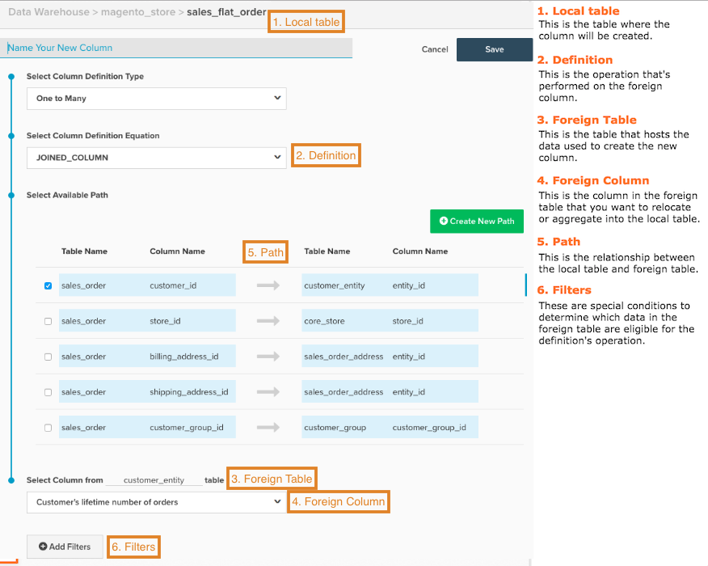

# 创建计算列

在分析数据时，整合来自不同来源的数据会很有帮助。 希望按客户获取来源对收入进行分组，并关联来自您的客户获取的数据： `orders` 表格和 [!DNL Google Analytics] 数据？ 您可能需要按客户性别对收入进行分组，或将客户属性加入交易数据以进行分段。 本主题将讨论如何做到这一点。

在开始之前，Adobe建议您查阅 [计算列类型指南](../../data-analyst/data-warehouse-mgr/calc-column-types.md) 有关可在Data Warehouse管理器中创建的列类型及其定义和示例的信息。

1. 要开始配置，请单击 **[!DNL Manage Data > Data Warehouse]**.

1. 单击要在其中创建列的表。 例如，如果要创建 `Customer Gender` 对于收入分段，您可以选择 `sales_flat_order` 表格。

1. 此时将显示表方案。 单击 **[!UICONTROL Create New Column]**.

1. 为您的列提供一个名称。 例如， `Customer Gender`.

1. 选择列的定义。 这就是 [计算列类型指南](../data-warehouse-mgr/calc-column-types.md) 派上用场！

1. 对于某些类型的列，需要更多信息才能正确创建列：

   * 对象 `One to Many` （已加入）和 `Many to One` （聚合）列，您需要选择表和列。

   * 对于 `Same Table calculation`中，您需要从下拉列表中选择所需的日期字段。

如果您要创建 `One to Many` （已加入）或 `Many to One` （聚合）列中，需要选择一个路径来连接两个表。 在此步骤中，您可以使用现有路径或创建路径。

>[!NOTE]
>
>请记得将表正确定义为多个表或一个表！

* 如果需要，您可以应用 [过滤器](../../data-user/reports/ess-manage-data-filters.md) 到新栏。

* 完成后，单击 **[!UICONTROL Save]**.

您的新列显示在当前表格中，带有 `Pending` 状态。 在下一次更新完成后，您的列将可用于量度和报表。

## 方便的参考地图 {#map}

如果您在创建计算列时无法记住所有输入，请尝试在构建时方便使用此参考图：

## 相关文档

* [计算列类型](../data-warehouse-mgr/calc-column-types.md)
* [高级计算列类型](../data-warehouse-mgr/adv-calc-columns.md)
* [正在生成 [!DNL Google ECommerce] 包含订单和客户数据的维度](../data-warehouse-mgr/bldg-google-ecomm-dim.md)
