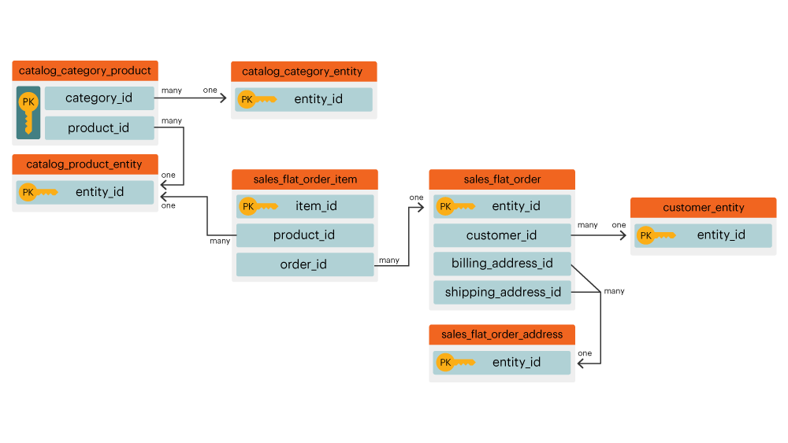
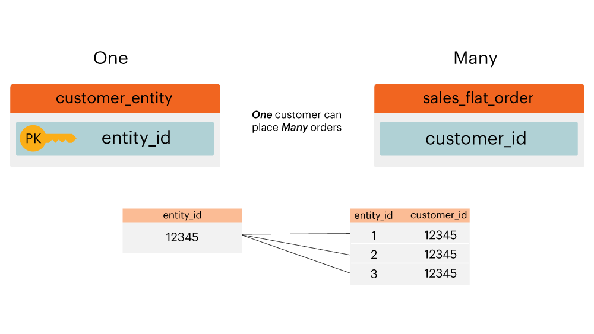
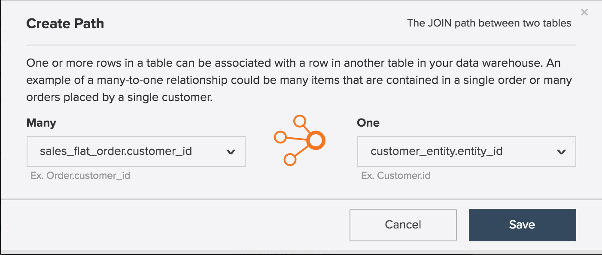
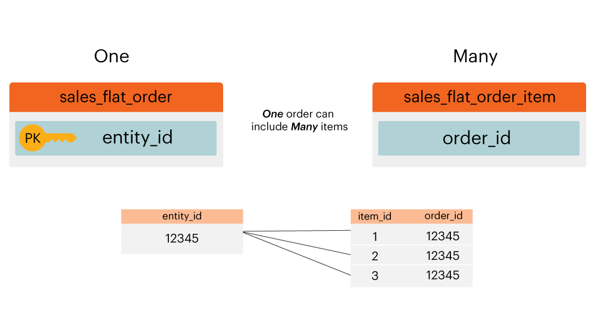
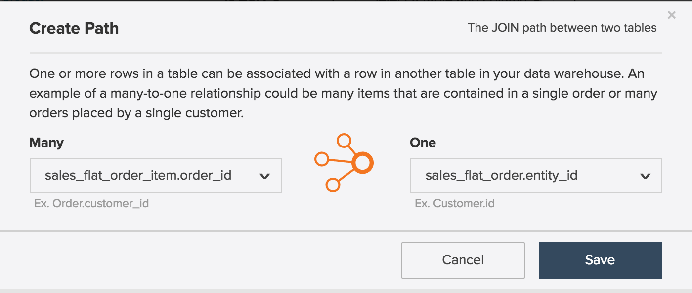
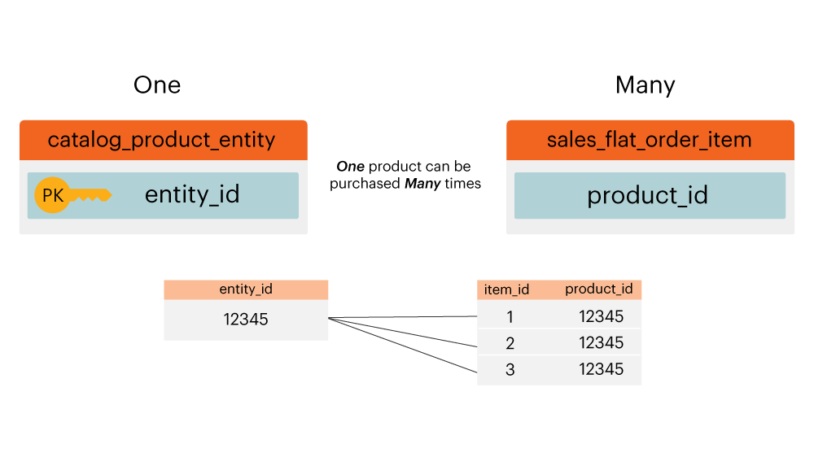
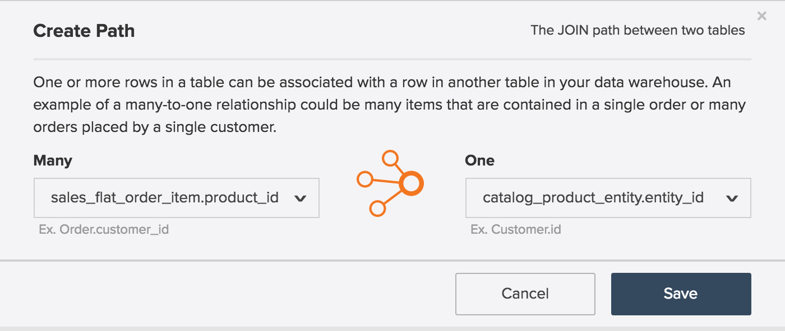

# 实体关系图

什么是 **[!UICONTROL entity relationship (ER) diagram]**? 安 `ER` 图表是数据库中表格的可视化图表，以及它们之间的关系。 本文包含一些ER图，可帮助您可视化几个常见的Commerce数据库表之间的关系。

>[!NOTE]
>
>在本文中，您将看到 **加入**, **关系** 和 **路径**. 这些词语都用于描述两个表是如何连接的。

## 核心商务 `ER` 图表

此 `ER` 图表表示商务数据库中核心表之间的关系。 通过一次查看多个关系，您可以查看数据在多个表中的关联情况。

以下部分包含 `ER` 特定于两个表的图表。 要查看图表及其随附说明，请单击该部分的标题。

## `customer\_entity & sales\_flat\_order`

一个客户可以下许多订单。 这两个表之间的关系是 `customer\_entity.entity\_id = sales\_flat\_order.customer\_id`

>[!IMPORTANT]
>
>`customer\_entity.entity\_id` 不等于 `sales\_flat\_order.entity\_id`. 第一个可以被视为 `customer\_id` 第二个可以被认为 `order\_id.`

在 [!DNL MBI]，如果这两个表之间的路径不存在，则可以 [创建路径](../data-warehouse-mgr/create-paths-calc-columns.md) data warehouse选项卡中。 准备好创建路径后，其定义如下：

## `sales\_flat\_order & sales\_flat\_order\_item`

一个订单可以包含多个项目。 这两个表之间的关系是 `sales\_flat\_order.entity\_id = sales\_flat\_order\_item.order\_id`.

在 [!DNL MBI]，如果这两个表之间的路径不存在，则可以 [创建路径](../data-warehouse-mgr/create-paths-calc-columns.md) data warehouse选项卡中。 准备好创建路径后，其定义如下：

## `catalog\_product\_entity & sales\_flat\_order\_item`

一个产品可以购买多种产品。 这两个表之间的关系是 `catalog\_product\_entity.entity\_id = sales\_flat\_order\_item.product`.

在 [!DNL MBI]，如果这两个表之间的路径不存在，则可以 [创建路径](../data-warehouse-mgr/create-paths-calc-columns.md) data warehouse选项卡中。 准备好创建路径后，其定义如下：

