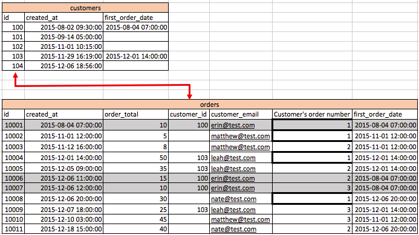
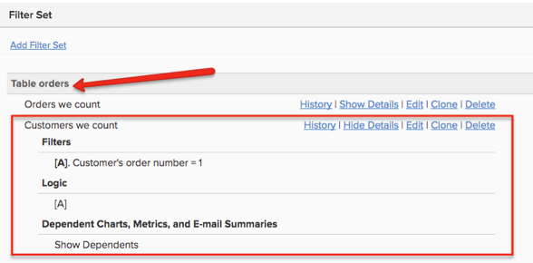

# 访客订单

在查看订单时，如果您发现许多`customer\_id`值为空，或者没有值可以连接回`customers`表，这表示您的商店允许访客订单。 这意味着您的`customers`表很可能不包括您的所有客户。

本主题讨论访客订单对您数据的影响，以及在[!DNL Commerce Intelligence] Data Warehouse中正确考虑访客订单的选项是什么。

## 访客订单对数据的影响

在典型的Commerce数据库中，有一个`orders`表联结到`customers`表。 `orders`表中的每一行都有一个`customer\_id`列，该列对`customers`表中的一行是唯一的。

* **如果所有客户都已注册**，并且不允许来宾订单，则意味着`orders`表中的每个记录在`customer\_id`列中都有值。 因此，每个订单都会连接回`customers`表。

  

* **如果允许来宾订单**，则意味着某些订单在`customer\_id`列中没有任何值。 在`customer\_id`表中，只为已注册客户提供了`orders`列的值。 未注册的客户将收到此列的`NULL`（或空白）值。 因此，并非所有订单记录在`customers`表中都有匹配的记录。

  >[!NOTE]
  >
  >要识别发出订单的独特个人，需要在附加到订单的`customer\_id`旁有另一个独特用户属性。 通常使用客户的电子邮件地址。

## 如何在Data Warehouse设置中考虑访客订单

通常，实施您的帐户的销售工程师在构建Data Warehouse的基础时会考虑来宾订单。

考虑访客订单的最佳方法是将所有客户级别的量度基于`orders`表。 此设置使用所有客户拥有的唯一客户ID，包括来宾（通常使用客户电子邮件）。 这将忽略`customers`表中的注册数据。 利用此选项，客户级别报表中只会包含至少购买过一次的客户。 尚未购买一次的注册用户不包括在内。 利用此选项，您的`New customer`量度将基于`orders`表中客户的首次订购日期。

您可能会注意到，在此类型的设置中设置的`Customers we count`过滤器具有`Customer's order number = 1`的过滤器。

在没有访客订单的情况下，每个客户在客户表中都作为唯一行存在（请参阅图1）。 诸如`New customers`之类的量度可以简单地根据`created\_at`日期计算此表的ID，以了解根据注册日期的新客户。

在访客订单设置中，所有客户量度都基于`orders`表来考虑访客订单，您必须确保您是`not counting customers twice`。 如果计算订单表的ID，则计算每个订单。 如果您改为计算`orders`表上的ID并使用筛选器`Customer's order number = 1`，则您将计算每个独特客户`only one time`。 这适用于所有客户级别的量度，如`Customer's lifetime revenue`或`Customer's lifetime number of orders`。

您可以在上面看到`customer\_ids`表中有null `orders`。 如果您使用`customer\_email`来识别独特客户，则可以看到`erin@test.com`已下三(3)份订单。 因此，您可以基于以下条件在`New customers`表上构建`orders`量度：

* `Operation table = orders`
* `Operation column = id`
* `Operation = count`
* `Timestamp = Customer's first order date`
* `Filter = Customer's we count (where Customer's order number = 1)`
