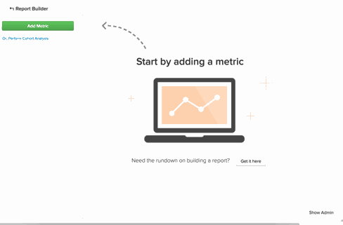

# [!DNL Google Analytics]使用客户获取源

## 什么是渠道？ {#channels}

创建自定义区段以查看不同流量的表现和观察趋势，是[!DNL Google Analytics]最强大的用途之一。 默认情况下，[!DNL Google Analytics]中存在一类区段，即`Channels`。 渠道是用户访问您网站的一组常用方式。  [!DNL Google Analytics]会自动对您获取用户的多种方式进行排序（无论是社交媒体、每次点击付费、电子邮件还是推荐链接），并将它们捆绑到存储桶或渠道中。

## 为什么在Commerce Intelligence中看不到我的`channels`？ {#nochannels}

`Channels`是数据的简单、聚合存储桶。 要将您的客户获取排序为渠道分段，[!DNL Google]使用特定参数设置不同的规则和定义：客户获取[Source](https://support.google.com/analytics/answer/1033173?hl=en)（流量的来源）和客户获取[Medium](https://support.google.com/analytics/answer/6099206?hl=en)（来源的一般类别）的组合。

虽然拥有这些存储段可以帮助您了解流量的来源，但这些数据不会按渠道进行标记，而是由Source和Medium组合进行标记。 由于[!DNL Google]将渠道信息作为两个单独的数据点发送，因此渠道分组不会自动显示在[!DNL Commerce Intelligence]中。

## 默认渠道分组是什么？ 它们是如何创建的？

默认情况下，[!DNL Google]设置了八个不同的渠道。 确定如何创建渠道的规则如下所示。

| **频道** | **这是什么？** | **它是如何创建的？** |
|---|---|---|
| 直接 | 直接进入您网站的任何人。 | Source = `Direct` 和Medium = `(not set); OR Medium = (none)` |
| 自然搜索 | 在无偿搜索引擎中已自然排名的流量。 | Medium = `organic` |
| 反向链接 | 来自非自然搜索外部链接或非社交网络网站的流量。 | Medium = `referral` |
| 付费搜索 | 具有UTM跟踪代码的流量，其中媒体为“cpc”、“ppc”或“paidsearch”，并且是不匹配“Content”的广告分发网络。 | Medium = `^(cpc|ppc|paidsearch)$` 和Ad Distribution Network ≠ `Content` |
| Social | 来自约[400个社交网络](https://www.annielytics.com/blog/analytics/sites-google-analytics-includes-in-social-reports/)中的任何一个，且未标记为广告的引用流量。 | 社交Source转介= `Yes` 或Medium = `^(social|social-network|social-media|sm|social network|social media)$` |
| 电子邮件 | 使用“电子邮件”媒介标记的会话流量。 | Medium的UTM跟踪代码= `email` |
| 显示 | 具有UTM跟踪代码（媒体为显示或cpm）的流量。 此外，还包括广告分发网络与“内容”匹配的AdWords交互 | Medium = `^(display|cpm|banner)$` 或广告分发网络= `Content` 和广告格式≠ `Text` |
| 其他 | 来自使用“cpc”、“ppc”、“cpm”、“cpv”、“cpa”、“cpp”、“affiliate”媒介标记的其他广告渠道（不包括付费搜索）的会话。 | Medium = `^(cpv|cpa|cpp|content-text)$` |

{style="table-layout:auto"}

## 如何在Data Warehouse中重新创建这些渠道分组？ {#recreate}

现在，您知道渠道只是源和媒体的组合，在Data Warehouse中重新创建这些分组是一个简单的三步过程。

1. **启用您的[!DNL Google ECommerce]集成**

   [启用时](../importing-data/integrations/google-ecommerce.md)，请确保在Data Warehouse中[同步]&#x200B;(../{{ site.baseurl }}/data-analyst/data-warehouse-mgr/tour-dwm.html#syncing) **媒体**&#x200B;和&#x200B;**源**&#x200B;字段。 完成此操作后，媒体和来源客户获取数据将导入您的Data Warehouse。

1. **上传Google渠道分组的映射**

   Adobe Commerce创建一个表，并将默认分组映射为可以[下载](../../assets/ga-channel-mapping.csv)的文件。

   如果您是[!DNL Google Analytics] Pro并创建了自己的渠道，则要在将文件上载到[!DNL Commerce Intelligence]之前将特定规则添加到映射表。

   将其作为[文件上传](../importing-data/connecting-data/using-file-uploader.md)引入您的Data Warehouse。

   

1. **在[!DNL Google ECommerce]和映射文件上载**&#x200B;之间建立关系

   为了在[!DNL Google ECommerce]和映射表之间建立关系，[向您的数据分析团队提交支持请求](../../guide-overview.md#Submitting-a-Support-Ticket)并引用此主题。 分析师在电子商务表中创建一个名为&#x200B;**Channel**&#x200B;的新计算列。 **在完整的更新周期**&#x200B;之后，此列将在`Filter`或`Group by`中准备就绪。

您现在在Data Warehouse中拥有[!DNL Google Analytics Channel]分组，这意味着您可以从新的角度分析数据：

在本例中，您一开始只是按&#x200B;**渠道**&#x200B;对&#x200B;**订单数**&#x200B;量度进行分段。 测试新列并查看可在[!DNL Google Analytics Channel]数据中识别哪些趋势！

## 相关文档

* [使用Report Builder](../../tutorials/using-visual-report-builder.md)
* [需要[!DNL Google ECommerce]数据](../importing-data/integrations/google-ecommerce-data.md)
* [使用订单和客户数据生成[!DNL Google ECommerce]维度](../data-warehouse-mgr/bldg-google-ecomm-dim.md)
* [您最宝贵的客户获取来源和渠道是什么？](../analysis/most-value-source-channel.md)
