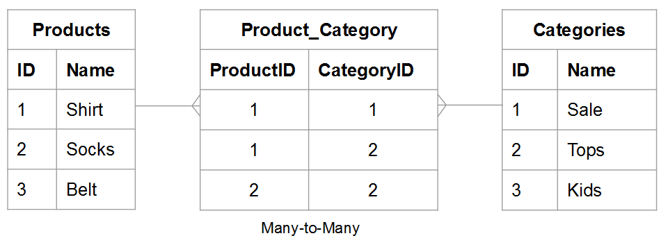
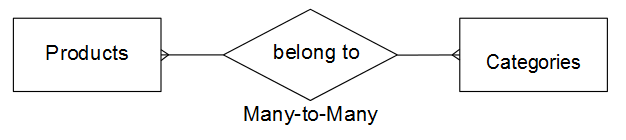
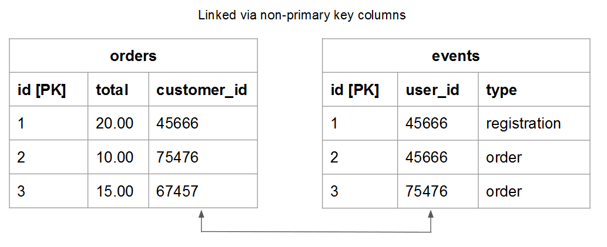
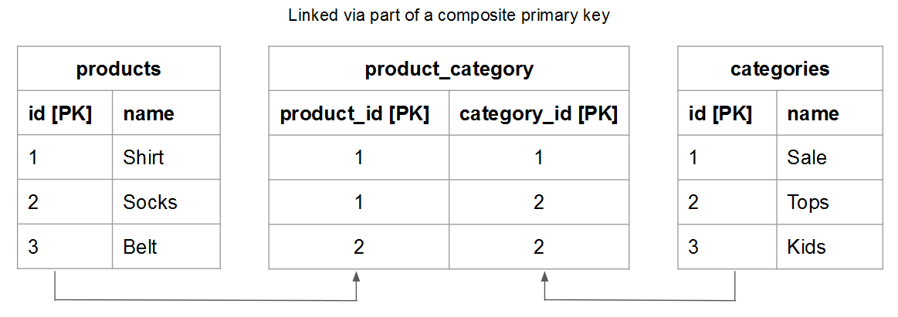

# 了解和评估表关系

在评估两个给定表之间的关系时，您需要了解一个表中可能属于另一个实体的实例数，反之亦然。 例如，使用 `users` 表格和 `orders` 表格。 这种情况下，你想知道 **订单** 给定 **用户** 已下单，可能下单 **用户** 一个 **订购** 可能属于。

了解关系对于维护数据完整性至关重要，因为它会影响 [计算列](../data-warehouse-mgr/creating-calculated-columns.md) 和 [维度](../data-warehouse-mgr/manage-data-dimensions-metrics.md). 要了解更多信息，请参阅 [关系类型](#types) 和 [如何评估Data warehouse中的表。](#eval)

## 关系类型 {#types}

两个表之间可以存在三种类型的关系：

1. [&#39;一对一&#39;](#onetoone)
1. [&#39;一对多&#39;](#onetomany)
1. [&#39;多对多&#39;](#manytomany)

### `One-to-One` {#onetoone}

在 `one-to-one` 关系，表中的记录 `B` 只属于表中的一条记录 `A`. 和表中的记录 `A` 只属于表中的一条记录 `B`.

例如，在人与驾驶证号码的关系中，一个人只能有一个驾驶证号码，而一个驾驶证号码只属于个人。

### `One-to-Many` {#onetomany}

在 `one-to-many` 关系，表中的记录 `A` 可能属于表中的多个记录 `B`. 想一想两者之间的关系 `orders` 和 `items`  — 一个订单可以包含多个项目，但一个项目属于单个订单。 在本例中， `orders` 表格是一侧而 `items` 桌子是多面。

### `Many-to-Many` {#manytomany}

在 `many-to-many` 关系，表中的记录 `B` 可能属于表中的多个记录 `A`. 反之亦然，在表格中记录 `A` 可能属于表中的多个记录 `B`.

想一想两者之间的关系 **产品** 和 **类别**：一个产品可以属于多个类别，而一个类别可以包含多个产品。

## 评估表 {#eval}

根据表之间存在的关系类型，您可以了解如何计算Data warehouse中的表。 由于这些关系决定了多表计算列的定义方式，因此了解如何识别表关系以及哪一面非常重要。 `one` 或 `many`  — 表属于。

可以使用两种方法评估Data warehouse中给定表对的关系。 第一种方法采用 [概念框架](#concept) 会考虑表格实体之间交互的方式。 第二种方法使用 [表的模式](#schema).

### 使用概念框架 {#concept}

该方法使用概念框架来描述两个表中的实体如何相互交互。 重要的是要了解，鉴于这种关系，这一框架评估了什么是可能的。

例如，在考虑用户和订单时，请考虑关系中可能的所有因素。 注册用户在其有效期内，不得下任何订单、只下一份订单或多份订单。 如果您已启动业务，但尚未下订单，则给定用户可能在其生命周期内下许多订单。 构建表是为了适应这种情况。

要使用此方法，请执行以下操作：

1. 标识每个表中描述的实体。 **提示：它通常是名词**. 例如， `user` 和 `orders` 表明确描述了用户和订单。

1. 标识一个或多个描述这些实体如何交互的动词。 例如，将用户与订单进行比较时，用户会“下单”。 另一方面，订单“属于”用户。

此类型的框架可以应用于Data warehouse中表的任何配对。 这允许您轻松识别关系的类型、哪个表是一侧以及哪个表是多侧。

一旦确定了描述两个表如何交互的术语，就可通过考虑第一个实体的一个给定实例与第二个实体的关系来构建两个方向上的交互框架。 以下是每种关系的一些示例：

### `One-to-One`

一个人只能有一个驾驶执照号码。 一个给定的驾驶执照号码只属于个人。

这是 `one-to-one` 关系，其中每个表都是一边。

### `One-to-Many`

一个给定的订单可能包含许多项目。 一个给定项目仅属于一个订单。

这是 `one-to-many` 其中，订单表为一侧，而物料表为多侧。

### `Many-to-Many`

一个给定产品可能属于多个类别。 一个给定类别可以包含许多产品。

这是 `many-to-many` 其中每张表是多面关系。

### 使用表的模式 {#schema}

第二种方法是使用表模式。 架构定义哪些列是 [`Primary`](https://en.wikipedia.org/wiki/Unique_key) 和 [`Foreign`](https://en.wikipedia.org/wiki/Foreign_key) 键。 您可以使用这些键将表链接在一起，并帮助确定关系类型。

标识将两个表链接在一起的列后，可使用列类型来评估表关系。 以下是一些示例：

### `One-to-one`

如果表是使用 `primary key` 之后，将在每个表中描述相同的唯一实体，并且关系为 `one-to-one`.

例如， `users` 表可以捕获大多数用户属性（如名称），而补充属性 `user_source` 表捕获用户注册源。 在每个表中，一行表示一个用户。

### `One-to-many`

>[!NOTE]
>
>你接受客服命令吗？ 参见 [访客订单](../data-warehouse-mgr/guest-orders.md) 以了解访客订单如何影响您的表关系。

使用链接表时 `Foreign key` 指向 `primary key`，此设置描述了 `one-to-many` 关系。 一侧是包含 `primary key` 多面是包含 `foreign key`.

### `Many-to-many`

如果以下任一项为true，则关系为 `many-to-many`：

* `Non-primary key` 列用于链接两个表
   
* 复合的一部分 `primary key` 用于链接两个表

## 后续步骤

正确评估表关系对于准确建模数据至关重要。 现在，您已了解表如何相互关联，请参见 [使用Data warehouse管理器可以执行的操作](../data-warehouse-mgr/tour-dwm.md).
