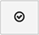
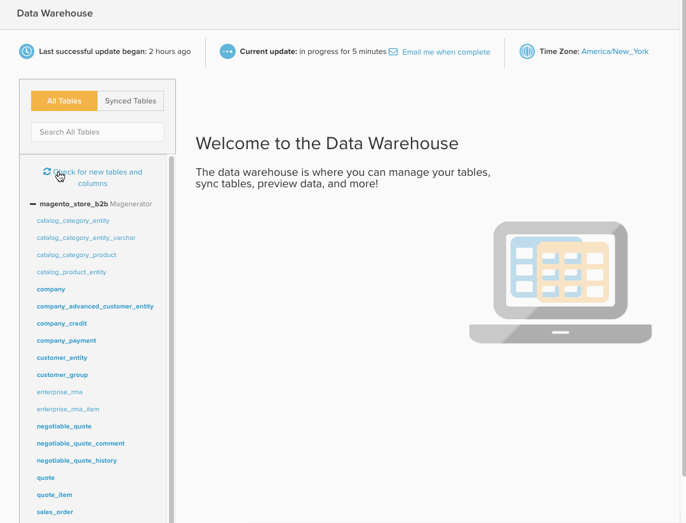
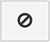
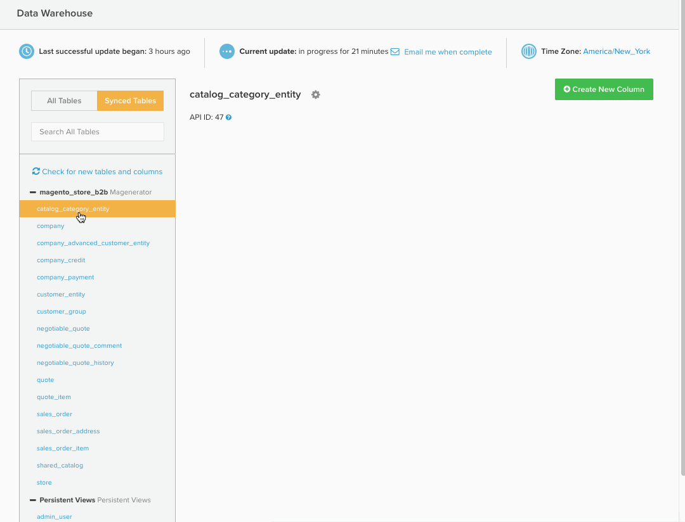

# data warehouse管理器

>[!NOTE]
>
>需要 [管理员权限](../../administrator/user-management/user-management.md)

data warehouse管理器，可通过单击 **[!UICONTROL Manage Data > Data Warehouse]**，是您网站的入口 [!DNL Adobe Commerce Intelligence] data warehouse。 使用Data warehouse管理器，您可以管理表和列同步设置，深入了解表的架构，并创建计算列以在报告中使用。

本主题涵盖：

* [了解如何应对](#learning)
* [正在同步表和列](#syncing)
* [创建计算列](#calculated)
* [删除表和删除列](#delete)
* [在后台同步新表](#syncnew)
* [那么，我何时可以使用新列呢？](#when)

## 了解如何应对 {#learning}

的左侧 `Data Warehouse Manager` 页面包含表列表，可让您在表之间轻松切换。 从列表中选择表后，表管理区域将填充该表的方案，您可以在其中修改所选表。

在表列表中，表按其连接源分组。 这些源添加在 [!UICONTROL Manage Data > Integrations] 可以是数据库，也可以是 [API](https://developer.adobe.com/commerce/services/reporting/)或第三方连接器。 在表列表顶部有一个搜索框，通过该框可以轻松查找所需的表。

在搜索框下方，您会看到两个选项： `All Tables` 和 `Synced Tables`. 此 `All Tables` 选项列出您对Data warehouse可用的所有表，包括已同步和未同步的表。

此 `Synced Tables` 选项显示已添加到Data warehouse中且从选定列复制了数据的所有表。

在中看不到您要查找的表 `All Tables` 列表？ 这种情况有几个可能的原因：

* 尚未添加数据源
* 数据源是一个数据库，而 [!DNL Commerce Intelligence] 您创建的用户没有访问权限。 在这种情况下，您或您的数据库管理员必须授予访问权限。
* 数据源或表最近已添加，但尚未同步

## 正在同步表和列 {#syncing}

### 同步新表和本机列

data warehouse管理器不仅让您能够轻松查看和管理数据源，而且您还可以自由选择要同步的单个表和列。

1. 单击 `All Tables` 选项并找到要同步的表。
1. 单击表的名称以预览架构。 如果表格是新的，则所有列显示为 `Unsynced`.
1. 选中要同步的列。

   >[!NOTE]
   >
   >表本地的列在数据库中的 `Location` 列。

1. 确保您检查 `Primary Key` 列 — 这些列的名称旁边有一个键符号。 A `Primary Key` 需要将数据正确同步到Data warehouse中。

   如果您正在同步直接来自数据库的表，则可能 `Primary Keys` 不得标示。 在这种情况下，请与数据库管理员联系，请求将一个或多个主键添加到表中。
1. 完成后，单击  按钮。

A *成功！* 消息显示且状态更改为 `Pending` （对于选定的列）。 在下一次完整更新完成后，新同步的表和列将可用于报告中。 您还可以设置新的 [复制方法](./cfg-replication-methods.md) 初次同步之后。

下面是整个过程的简单回顾：

### 在后台同步新表 {#syncnew}

首次同步大型表时，Data warehouse需要先追溯捕获表中的所有数据点，然后再持续捕获新数据。 如果您的表很大，您可能不希望让初始同步与您的 **更新周期**. 在此情况下，您希望初始同步在后台进行，位于 *并行* 任何当前正在运行的更新。

要确保这种情况发生，您应选择 `Save and Sync Data Immediately` 选项第一次同步该表。

### 检查新表和列 {#forceupdate}

在新源、表或列添加后，您的Data warehouse不会自动检测它们。 同步进程在一周中运行以查找新的添加项并使其可用，但如果您想在进程运行之前访问新添加的表和列，则可以强制进行结构同步。

在表列表中的搜索栏下方是 `Check for new tables and columns` 链接。 单击此链接将强制启动结构同步过程；新添加内容通常在10分钟后可用。 刷新该页以查看新的源、表或列。

## 创建计算列 {#calculated}

只需能够查看和管理来自您所有来源的数据，即可更轻松地深入了解您的业务。 但在Data warehouse管理器中，您可以通过在表内创建计算列而更进一步。 `Calculated` 列从现有数据派生新信息。

说您想添加 `user's lifetime revenue` 敬您的 `users` 表格以查找高价值用户。 或者，如果您要按性别划分收入，则可以添加 `customer's gender` 敬您的 `orders` 表格。

有关详细信息，请查看此 [教程](../../data-analyst/data-warehouse-mgr/creating-calculated-columns.md).

## 删除表和删除列 {#delete}

正如可以选择要同步到Data warehouse的表和列一样，也可以删除它们。

>[!NOTE]
>
>删除表或删除列会在确认删除后删除任何从属报表、量度、过滤器集和列。 确定您想这样做 —  **此操作无法撤消。**

如果您单击，请不要担心 **[!UICONTROL Delete]** 纯属意外。 依赖项检查会在删除任何内容之前运行，因此您有机会在确认之前查看所有内容。

要删除列，请单击该列所属的表。 选中要删除的列，然后单击  按钮。

要删除同步表，请选择表中的所有列，然后再次单击  按钮。 这会从Data warehouse中删除使用此表的所有本机列和计算列。

### 确认更改

无论您是删除表还是删除列，都将在删除过程完成之前运行相关性检查。 依赖关系是指使用要删除的表或列的计算列、量度、过滤器集和报表。 任何发现的依赖项都会显示 — 此时，您可以取消进程或单击 **[!UICONTROL Confirm Changes]** 删除表/删除列。

虽然已删除的依赖项无法恢复，但如果您将来需要重新同步任何本机列，表和列将仍然可用。

下面是删除列的概览：

## 那么，我何时可以使用新列呢？ {#when}

新的同步列和新的/更新的计算列将在下一次完全更新完成后准备就绪，可供使用。 如果更新尚未进行，您可以通过单击 **[!UICONTROL Force update]** 显示在顶部 `Data Warehouse` 或 `Integrations` 页面。 您还可以计划更新完成后发送电子邮件通知，方法是单击 **[!UICONTROL Email me when complete]**.

当您准备好在报告中使用新列时， [您需要先将它们添加到量度](../data-warehouse-mgr/manage-data-dimensions-metrics.md). 虽然在更新完成之前数据不可用，但您仍可以在报表中使用新列。 更新完成后，将显示报表中的数据。

## 总结

这篇文章介绍了很多材料。 到现在为止，您应该已经充分了解什么是数据库、数据如何组织、表如何相互关联以及您可以使用Data warehouse管理器做什么。

通过以下方式测试您的知识 [创建计算列](../data-warehouse-mgr/creating-calculated-columns.md) 或 [制作一些有趣的报告](../../tutorials/using-visual-report-builder.md).
