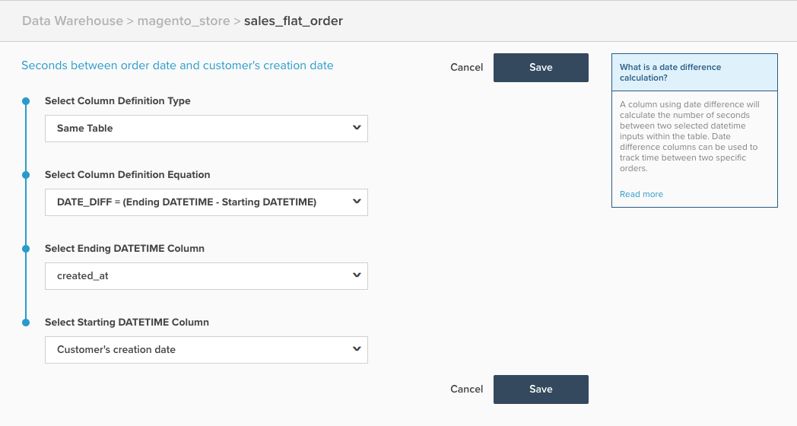

# 日期差异计算列

本主题概述了 `Date Difference` 中可用的计算列 **[!DNL Manage Data > Data Warehouse]** 页面。 下面是它的作用解释，然后是一个示例，以及创建它的机制。

**说明**

此 `Date Difference` 列类型根据事件时间戳计算属于单条记录的两个事件之间的时间。 此列中计算的原始值以秒为单位，但它会自动转换为分钟、小时、天等，以便在报表中显示。 但是，当用作过滤器/分组时，您希望使用以秒为单位的值。

A `date difference` 计算列可用于创建计算两个事件之间的平均时间或中间时间的量度，如客户注册和首次订购之间的平均时间。

**示例**

| **`id`** | **`timestamp_1`** | **`timestamp_2`** | **`Seconds between timestamp_2 and timestamp_1`** |
|--- |--- |--- |--- |
| `A` | 2015-01-01 00:00:00 | 2015-01-01 12:30:00 | 45000 |
| `B` | 2015-01-01 08:00:00 | 2015-01-01 10:00:00 | 7200 |

{style="table-layout:auto"}

在上例中， `Date Difference` 列是 `Seconds between timestamp_2 and timestamp_1` 列。 它执行计算 `timestamp_2 minus timestamp_1`.

**力学**

以下步骤描述了如何创建 `Date Difference` 列。

1. 导航至 **[!DNL Manage Data > Data Warehouse]** 页面。
1. 导航到要在其上创建此列的表。
1. 单击 **[!UICONTROL Create a Column]** 并按照以下方式配置您的列：
   * 选择 `Column Definition Type` > `Same Table`
   * 选择 `Column Definition Equation` > `DATE_DIFF = (Ending DATETIME - Starting DATETIME)`
   * 选择 `Ending DATETIME` 列>选择结束日期时间字段，该字段通常是稍后发生的事件
   * 选择 `Starting DATETIME` column** >选择开始日期时间字段，该字段通常是较早发生的事件

1. 为列提供一个名称，然后单击 **[!UICONTROL Save]**.
1. 列可供使用 *立即*.

例如，以下示例配置为计算 `Seconds between order date and customer's creation date`：

