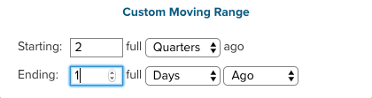

# 功能板范围过滤

通过功能板范围的过滤，您可以在特定功能板上批量编辑所有报表。 您可以快速查看不同时间段或不同商店的相同分析。 您可以轻松比较每家商店上一年、月或周的绩效。 此外，您还可以更新整个功能板，以适应新启动的营销活动。

## 日期过滤器

要更改功能板上报表的日期范围或间隔，请单击右上角的日历图标()。

您可以选择使用 `Fixed Date Range` 或各种预先计算的 `Moving Date Ranges`:

的 `Last Full...` 移动范围选项表示最近完全完成的范围，而 `This...` 将是当前正在进行的范围。 例如，如果当前为6月，则 `Last Full Month` is _5月1日 — 5月31日_，而 `This Month` is _6月1日 — 现在_.

或者创建您自己的 `Custom Moving Range`\:

也选择更改间隔。 选择默认按钮()表示仅更改日期范围：

要将所有报表恢复到其初始日期范围和间隔，请单击 **[!UICONTROL Restore Defaults]** 或单击 **[!UICONTROL Cancel]**.

当您为功能板指定日期过滤器时，该过滤器仅应用于该功能板。 导航到其他功能板时，不会应用此功能板。

>[!NOTE]
>
>此时， `Cohort Reports` 和 `SQL Reports` 在功能板级别应用更改时，不会包含在内。

## 存储过滤器

要分析特定商店的执行情况，请单击右上角的商店图标()。 默认情况下， `Store Filter` 设置为 `All Stores`，显示所有 [商店查看次数](https://experienceleague.adobe.com/docs/commerce-admin/stores-sales/site-store/store-views.html) 可在您的商务网站中找到。

>[!NOTE]
>
>整个过程中会启用或禁用存储过滤器 [!DNL MBI] 帐户。 如果功能板包含不受过滤器影响的报表（例如未基于任何商务数据构建的报表），则在应用商店过滤器时，这些报表不会更新。 您可以 [联系支持](../../guide-overview.md) 如果您认为报表应根据存储区选择进行更新，或者您认为帐户存储区过滤器被错误地禁用。

从 `Store Filter`，则当您在功能板之间导航时，过滤器会保留您的选择。 通过保留您的选择，您可以在选择之前随时随地查看所选存储的数据 `All Stores`.

## 共享功能板的过滤器

对于共享功能板，如果一个用户配置了日期过滤器，则有权访问该功能板的其他用户将会看到所应用的同一过滤器。 但是，在这种情况下，存储过滤器不适用。 如果功能板所有者配置存储过滤器并共享功能板，则配置的存储过滤器将不会保留给其他用户。 用户必须 [编辑访问](../../data-user/dashboards/share-dashboard-with-users.md) 功能板，以调整功能板过滤器。
