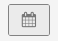
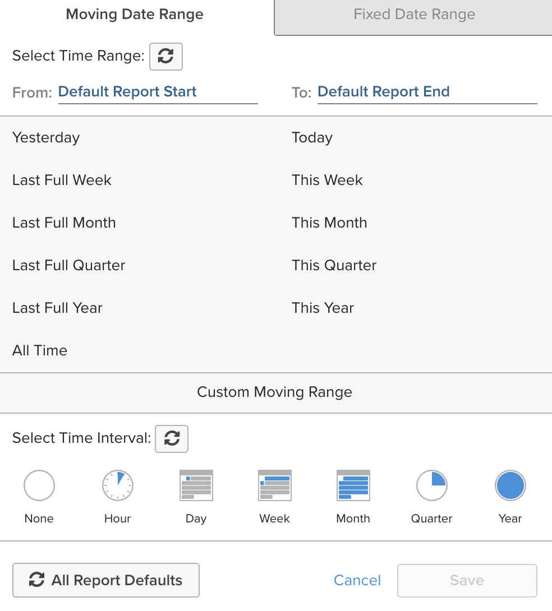

# 功能板范围筛选

通过功能板范围的过滤，您可以对特定功能板上的所有报告进行批量编辑。 您可以快速查看不同时间段或不同商店的相同分析。 您可以轻松地比较每个商店前一年、一个月或一周的表现。 您可以更新整个仪表板以适应新启动的营销活动。

## 日期过滤器

要更改仪表板上报告的日期范围或时间间隔，请单击右上角的日历图标（）。

您可以选择使用`Fixed Date Range`或各种预先计算的`Moving Date Ranges`查看数据：

`Last Full...`移动范围选项表示最近完全完成的范围，而`This...`是当前正在进行的范围。 例如，如果是6月，则`Last Full Month`为&#x200B;_5月1日至5月31日_，而`This Month`为&#x200B;_6月1日至6月1日 — 现在_。

或创建您自己的`Custom Moving Range`\：

选择以更改间隔。 选择默认按钮（）意味着只有日期范围会更改：

要将所有报告恢复到其初始日期和时间间隔，请单击&#x200B;**[!UICONTROL Restore Defaults]**&#x200B;或单击&#x200B;**[!UICONTROL Cancel]**。

在为功能板指定日期过滤器时，该过滤器仅应用于该功能板。 当您导航到其他功能板时，该选项不适用。

>[!NOTE]
>
>目前，在仪表板级别应用更改时不包括`Cohort Reports`和`SQL Reports`。

## 存储筛选器

要分析特定商店的执行方式，请单击右上角的商店图标（）。 默认情况下，`Store Filter`设置为`All Stores`，这将显示您的Commerce站点中可用的所有[存储视图](https://experienceleague.adobe.com/docs/commerce-admin/stores-sales/site-store/store-views.html)中的数据。

>[!NOTE]
>
>已为整个[!DNL Commerce Intelligence]帐户启用或禁用商店筛选器。 如果仪表板包含不受筛选器影响的报表（例如未基于任何[!DNL Adobe Commerce]数据构建的报告），则在应用商店筛选器时，这些报表不会更新。 如果您认为报表应该根据存储选择进行更新，或者您认为您的帐户存储筛选器被错误地禁用，您可以[联系支持人员](https://experienceleague.adobe.com/docs/commerce-knowledge-base/kb/troubleshooting/miscellaneous/mbi-service-policies.html)。

当您从`Store Filter`中选择商店时，当您在功能板之间导航时，筛选器将保留您的选择。 保留您的选择允许您查看所选存储的所有位置的数据，直到您选择`All Stores`为止。

## 共享功能板的过滤器

对于共享功能板，如果一位用户配置日期过滤器，则具有该功能板访问权限的其他用户会看到应用了该相同过滤器。 但是，存储筛选器不适用于此情况。 如果仪表板所有者配置商店筛选器并共享仪表板，则配置的商店筛选器不会保留给其他用户。 用户必须具有对仪表板的[编辑权限](../../data-user/dashboards/share-dashboard-with-users.md)才能调整仪表板筛选器。
