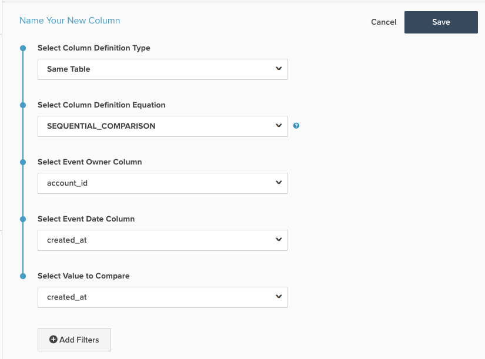

# 顺序比较计算列

本主题概述 `Sequential Comparison` 计算列在 **[!DNL Manage Data > Data Warehouse]** 页面。 下面是其功能的说明，后面是一个示例，以及创建该功能的机制。

**说明**

的 `Sequential Comparison` 列类型：查找连续事件之间的差异。 最常见的类型 `Sequential Comparison` 列是 `Seconds since previous order` 列。 此列需要三个输入：

1. `Event Owner`:此输入可确定对其行进行分组的实体。 例如，在 `Seconds since previous order` 列中，事件所有者是客户，因为我们希望查找自同一客户上一订单以来经过的秒数。
1. `Event Date`:此输入强制执行事件序列。 对于 `Seconds since previous order`，则包含订单时间戳的列应为 `Event Date`. 此输入始终为时间戳。
1. `Value to Compare`:此输入是要比较的实际值。 它会从当前行的值中减去前一行的值。 因此，将调用一个列，该列查找客户连续订单之间的时间差 `Seconds since previous order`. 此输入不必是时间戳。 非时间戳示例是查找客户连续订单之间顺序值的差。

**示例**

| **`event_id`** | **`owner_id`** | **`timestamp`** | **`Seconds since owner's previous event`** |
|--- |--- |--- |--- |
| **`1`** | A | 2015-01-01 00:00:00 | NULL |
| **`2`** | B | 2015-01-01 00:30:00 | NULL |
| **`3`** | A | 2015-01-01 02:00:00 | 7200 |
| **`4`** | A | 2015-01-02 13:00:00 | 126000 |
| **`5`** | B | 2015-01-03 13:00:00 | 217800 |

在上述示例中， `Seconds since owner's previous event` 是 `Sequential Comparison` 计算列。 对于 `owner_id = A`，则首先会根据 `timestamp` 列，然后减去上一个事件的 `timestamp` 从当前事件的时间戳。 在表的第三行中 — 第二行 `owner_id A`  — 的值 `Seconds since owner's previous event` 是“2015-01-01 02:00”到“2015-01-01 00”之间的秒数:00:00&#39;。 此差异等于2小时= 7200秒。

对于此计算列类型，对应于所有者第一个事件的行具有 `NULL` 值。

**力学**

创建 **事件编号** 列：

1. 导航到 **[!DNL Manage Data** > **Data Warehouse]** 页面。
1. 导航到要创建此列的表。
1. 单击 **[!UICONTROL Create New Column]** 中。
1. 选择 `Same Table` 作为 `Definition Type` （如果要比较的列不在同一个表上，则可能需要重新定位它们）。
1. 选择 `SEQUENTIAL_COMPARISON` 作为 `Column Definition Equation`.
1. 如上所述，选择输入：
   - `Event Owner`
   - `Event Date`
   - `Value to Compare`
1. 还可以添加过滤器以排除考虑的行。 排除的行将具有此列的NULL值。
1. 在页面顶部提供列的名称，然后单击 **[!UICONTROL Save]**.
1. 列将可供使用 *立即*.

