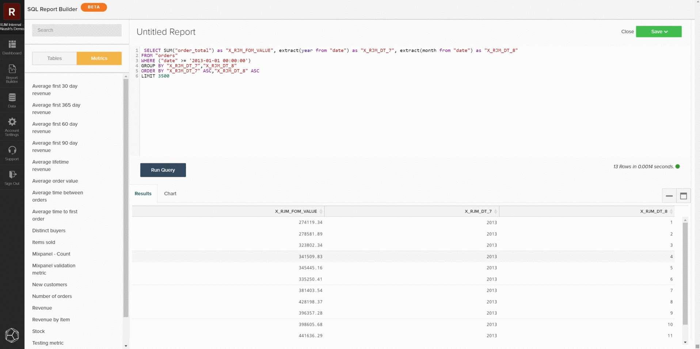

# [!DNL SQL Report Builder]

[!DNL SQL Report Builder]主要用于生成新报告和迭代分析，但也可以用于有效审核数据和量度。 以下信息说明如何使用[!DNL SQL Report Builder]审核数据和量度，以便将结果与本地数据库中的数据进行比较。

## 查询量度

要开始操作，请导航到[!DNL SQL Report Builder]以打开&#x200B;**[!UICONTROL Report Builder > SQL Report Builder > Create Report]**。 您可以使用[!DNL SQL]编辑器中的侧边栏，通过将鼠标悬停在量度上并单击&#x200B;**[!UICONTROL Insert]**，将量度直接插入到查询中。 这会将该量度的查询定义添加到编辑器中。 该定义包括以下组件：

- 正在执行&#x200B;**度量操作**，如下面的示例中的`SUM()`所示。
- 在&#x200B;**上生成度量的**&#x200B;表，由`FROM`子句指示。
- 已添加到量度的任何&#x200B;**筛选器（和筛选器集）**，如下例中的`WHERE`子句所示。
- 要对其排序数据的&#x200B;**时间戳** （年、月）的组件，由以下示例中的`ORDER BY`子句指示。

要更清楚地查看查询，您可以重新格式化查询字段中的显示方式。 准备就绪后，选择`Run Query`。 结果将作为表格填充到查询下方的报表面板中。

## 限制查询

如果尝试查明特定差异或数据集，则应将查询限制为特定示例以对照本地数据库进行检查。 为此，您可以编辑查询以符合所需的限制。 在以下示例中，您将查询限制为仅包含从2013年1月1日或之后开始的收入。 更新查询后，再次选择&#x200B;**[!UICONTROL Run Query]**&#x200B;以更新结果。

## 保存和导出

当报告符合您的要求时，请为报告指定不同的名称，单击&#x200B;**[!UICONTROL Save]**，然后选择要保存的报告类型和仪表板。 在审核指标时，Adobe建议将报表另存为`Table`并保存到测试仪表板。

保存报告后，选择`Go to Dashboard`以导航到该仪表板。 从该位置，您可以通过查找报告并选择&#x200B;**[!UICONTROL Options gear > Full `.csv`导出]**&#x200B;或&#x200B;**[!UICONTROL Full Excel Export]**&#x200B;来导出数据。

## 自定义查询

您还可以编写自定义查询并导出结果，以与本地数据库进行比较。 按照查询优化[的](../../best-practices/optimizing-your-sql-queries.md)准则，在SQL编辑器中编写查询。 您可以使用侧边栏顶部的按钮在[!DNL SQL Report Builder]中可用的表和量度列表之间进行切换，并将它们添加到查询中。 当自定义查询符合您的需要时，您可以保存报告并从功能板导出该数据。

>[!NOTE]
>
>如果审计数据后发现不一致，请查看[联系支持人员：数据差异](https://experienceleague.adobe.com/docs/commerce-knowledge-base/kb/troubleshooting/miscellaneous/mbi-data-discrepancies.html?lang=zh-Hans)支持主题，以了解有关后续操作的更多信息。
