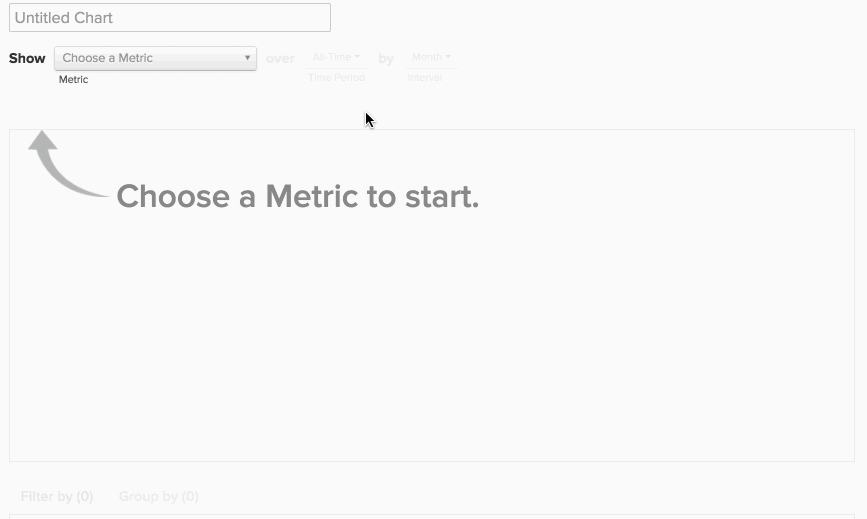

# 同类群组Report Builder

您是否曾希望研究一段时间内用户的不同子集的行为？ 例如，是否曾想过在促销期间注册的用户的平均生命周期收入是否高于未注册的用户？ 如果答案是 `Yes`，则 `Cohort Report Builder` 是您的完美工具。 [!DNL MBI] 经过专门优化，可执行此分析并使其与您的业务相关。

## 什么是同类群组分析？ {#what}

`Cohort` 分析可广义地定义为对在其生命周期中具有相似特征的用户组的分析。 它允许您识别不同用户群组之间的行为趋势。

更深入的入门读物 `cohort` 分析， [看这里](https://www.cohortanalysis.com/)  — 我们在上面写了网站！

在 [!DNL MBI] 功能板中，用户 `cohorts` 基于 `cohort` 日期和量度。

## 那么，为什么同类群组分析很重要？ {#important}

如上所述， `cohort` 通过分析，可识别不同用户组之间的行为趋势。 通过对特定群体行为的深入了解，您可以定制决策和支出，以最大限度地提高销售。 例如，以生命周期收入为例 `cohort` 分析 — 虽然这种分析有多种原因，但立竿见影的是更好的客户获取决策。

## 如何创建我自己的 `cohort` 分析？

### 新架构

以下是使用 `Cohort Report Builder` 在 [新架构](../../administrator/account-management/new-architecture.md).

1. 单击 **[!UICONTROL Report Builder]** 在左侧选项卡或 **[!UICONTROL Add Report** > **Create Report]** 在任何功能板中。

1. 在 `Report Builder` 选择屏幕，单击 **[!UICONTROL Create Report]** 旁边 `Visual Report Builder` 选项。

**添加量度**

既然我们在 `Report Builder`，则会添加要对其执行分析的量度(例如： `Revenue` 或 `Orders`)。

>[!NOTE]
>
>本机 [!DNL Google Analytics] 量度与 `Cohort Report Builder`.

**将量度视图切换为`Cohort`**

此时将打开一个新窗口，您可以在其中配置 `Cohort` 报告。

### 构建 `Cohort` 报表：

1. 如何对 `cohorts`
1. 的 `cohort` 时段
1. 数量 `cohorts` 查看
1. 每个数据的最小量 `cohort` 必须包含
1. 之后的时间范围 `cohort` 发生次数

#### 1.分组 `cohorts`

`Cohorts` 按时间戳(如 **注册日期** 或 **首次订单日期**.

>[!NOTE]
>
>您不能使用为 `cohort` 日期。 对于需要进行此分析的分析，您可以使用 `Standard report builder` 中。

#### 2. `Cohort` 时段

选择要分组的时间段 `cohorts` 。 换句话说，您在上面选择的时间戳中，哪部分最为重要；the `week`, `month`, `quarter`或 `year`?  您的报表将以您在此处选择的任何间隔显示数据

#### 3.和4。 设置 `cohorts` 查看每个数据的数量 `cohort` 必须

这些参数可帮助您仅查看 `cohorts` 你感兴趣的，以及 `Preview` 框，可准确显示报表中显示的同类群组。

默认情况下，当前 `cohort` 除非您更改每个 `cohort` to `0`. 在本例中， `cohort` 对于当前时间段，将仅包含部分数据。

#### 5.之后的时间范围 `Cohort` 发生次数

此功能允许您设置您查看所选数据的时间范围 `cohorts`. 例如，如果您想每月查看24次 `cohorts` 基于 `customer's first order date`，但您只对每个报表包的前3个月数据感兴趣 `cohort`，您可以设置 `number of cohorts to view` to `24` 和 `time range after cohort occurrence` to `3`.

此值的间隔会随您在 `cohort time period` 且值设置为 `12` 默认情况下；除非单击日历图标进行编辑，否则不会更改该值。

#### 其他说明

* [!UICONTROL Filters]:在以下两种情况下切换： `Standard` 和 `Cohort` 视图。

* 请参阅 [`Perspectives`](#perspectives).

#### 示例

下面是一个将所有内容汇总在一起的示例。 在本例中，我想在 `cohort`这是首次购买，目的是查看同类群组在未来6个月内是否会再次购买。

### 旧版架构

#### 旧版架构 {#personalinfo}

以下是特定于旧版本的 `Cohort Report Builder`. 如果您有兴趣使用新版本，请参阅 [新架构](../../administrator/account-management/new-architecture.md) 有关迁移到的更多信息 [!DNL MBI] 新的架构帐户。

#### 如何创建我自己的 `cohort` 分析？ {#create}

`Cohort` 分析的实际操作！ 在这里，我们可以看到随着时间的推移，收入在累积和每用户的基础上不断增长。

在本节中，我们将指导您创建自己的 `cohort` 分析。 有关示例(以及演示该过程的动画GIF)，请查看 [示例部分](#examples) 本文的。

1. 单击 **[!UICONTROL Report Builder]** 在左侧选项卡或 **[!UICONTROL Add Report** > **Create Report]** 在任何功能板中。

1. 在 `Report Builder Selection` 屏幕，单击 **[!UICONTROL Create Report]** 旁边 `Cohort Analysis` 选项。

#### 添加量度

既然我们在 `Cohort Report Builder`，让我们添加量度(例如： `Revenue` 或 `Number of orders`)进行分析。

>[!NOTE]
>
>本机 [!DNL Google Analytics] 量度与 `Cohort Report Builder`.

#### 选择同类群组日期 {#date}

下一步是指定 `cohort date`. 这是用户的分组日期。 例如，这可能是 `User's first order date` 或 `User's registration date`.

>[!NOTE]
>
>不能使用生成量度的相同日期(例如： `created at`)作为 `cohort date`.

#### 设置间隔和时间段

接下来，我们设置 `Interval` 和 `Time Period`.

`Interval`
的 `Interval` 选项用于设置 `length` 您的 `cohorts`. 例如，如果将此参数设置为 `Month`，则报表将以月为单位进行测量。

您可以使用 **持续时间** 菜单。

`Time Period`
使用 `Time Period` 用于选择特定用户的菜单 `cohorts` 分析。 您可以显示 `cohort`，从列表中选择，指定时间范围或定义滚动时间范围 `cohorts` 以包含。 例如，如果我们使用 `Specific Cohorts` 选项，我们可以选择要包含在分析中的特定月份：

如果我们把 `cohorts` ，然后在 `Specific Cohorts` 列表中，将包含在这些月中注册的任何用户。

#### 定义X轴

在 `duration`，则可以定义图表的X轴设置。 即，每个数据点表示多少个时间段，以及要包含在分析中的数据点数。

#### 选择 `counting members` 表

如果您选择按 `cohort date` 从另一个表连接时，您可能会看到 `counting members in the … table` 选项。

让我们查看一个示例，以了解此设置。 假设您构建了一个 `Revenue` 量度 `Customer's registration date`. 您还希望使用 `Average value per cohort member` 以查看一段时间内每位买家的收入。 为了找到每位买家的平均价值，我们需要确定要除以的买家数量。 是 `customers` 表格，或是您的 `orders table` 同一时期？

此设置将回答该问题。 对中的成员进行计数 `customers` 表格包括平均所有客户（无论他们是否购买过商品）。 对中的成员进行计数 `orders` 表仅包括购买的客户。

#### 选择透视 {#perspective}

定义量度以及要如何分析量度后，可以选择 `perspective` 你想用。

报表可视化图表的上方是 `perspective` 设置。

请参阅 [透视](#perspectives).

## 同类群组分析示例 {#examples}

现在，我们已经完成了如何创建 `cohort` 分析，让我们看一些示例。

### 我想知道我的用户 `cohorts` 会随着时间的推移而增长。

在本例中，我们分析了 `Revenue` 量度，按 `customer's first order date`，并选择了最近的8个 `cohorts` (定义于 `Time Period` 菜单)以包含在分析中。 为了看看同类群体如何随着时间增长，我们使用 `Cumulative Average Value per Cohort Member` `perspective`.

### 我想知道，平均而言，用户在其生命周期中不同时间点的订单数。

!

在本例中，我们分析了 `Number of orders` 量度，按 `customer's first order date`，并包含8个最新同类群组(在 `Time Period` 菜单)。 为了查看每个同类群组的平均订单数，我们更改了 `perspective` to `Average Value per Cohort Member`.

### 我希望了解用户未来的购买活动与其第一个月的业务活动有何不同。

## `Perspectives` {#perspectives}

`Standard`
这显示了给定同类群组群组在其生命周期的任何给定时间点的增量贡献。 (示例：“第6周”点显示用户在其第6周做出的所有数据点。)

`Average Value per Cohort Member`
这将 `Standard cohort` (1)按每个 `cohort` 群组。 这对于逐个比较同类群组性能非常有用，因为并非所有同类群组群组都可能包含相同数量的用户。 例如，某个特定客户的每用户平均每周6个收入 `cohort`.

`Cumulative`
此 `perspective` 显示了传统 `cohort` 对 `cumulative` 基础。 换句话说，它显示给定同类群组迄今为止在其生命周期的任何给定时间点的总贡献。 例如，特定同类群组中6周用户后的累计收入。

`Cumulative Average Value per Cohort Member`
这将 `Cumulative` (3)按每个 `cohort` 群组。 它显示每次的平均生命周期贡献（通常是平均生命周期收入） `cohort` 成员 `cohort's` 生命。 例如，在6月加入的用户数为6个月后，平均生命周期收入。

`Percent of First Value (show first value)`
这会分析聚合 `cohort` 在 `cohort's` 生命周期占其在第一个期间贡献的百分比。 例如，第6个月的收入除以6月加入的用户第1个月的收入。

`Percent of First Value (hide first value)`
这与 `perspective` 上，但首次隐藏100%的时段值除外。

## 包装 {#finish}

的 `Cohort Report Builder` 当前已针对按公用 `cohort date`. 您可能有兴趣按类似活动或属性对用户进行分组 — 如果是这样，我们会很乐意提供帮助！ 我们建议注销 [关于定性同类群组的本教程](../dev-reports/create-qual-cohort-analysis.md) 以开始使用。
