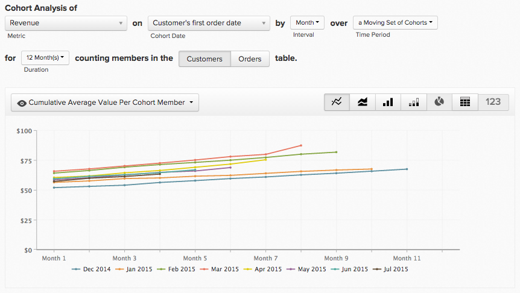
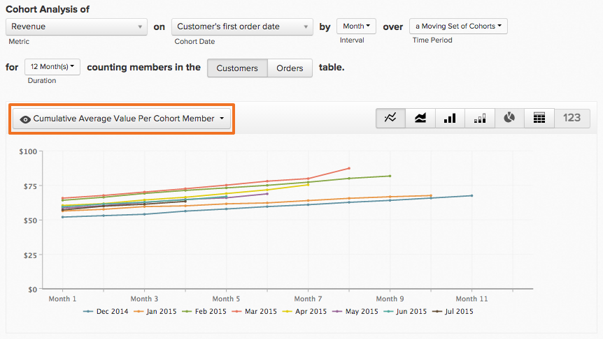
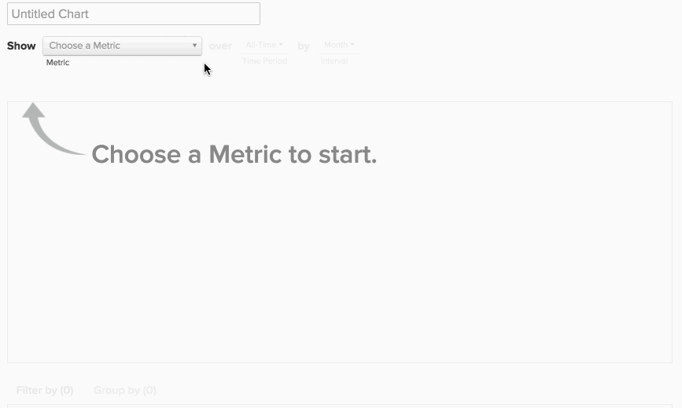

# 同类群组Report Builder

您是否曾想过研究用户的不同子集在一段时间内的行为？ 例如，您是否曾想知道，在促销期间注册的用户是否比没有注册的用户拥有更高的平均终生收入？ 如果答案是 `Yes`，则 `Cohort Report Builder` 是您的最佳工具。 [!DNL MBI] 已进行优化以执行此分析，并使其与您的业务相关。

## 什么是同类群组分析？ {#what}

`Cohort` 分析可以宽泛地定义为分析在其生命周期内具有相似特征的用户组。 它允许您识别不同用户组之间的行为趋势。

有关更深入的入门介绍 `cohort` 分析， [查看此处](https://www.cohortanalysis.com/).

在您的 [!DNL MBI] 仪表板，可轻松创建用户 `cohorts` 基于 `cohort` 帐户中的日期和量度。

## 为什么同类群组分析很重要？ {#important}

如上所述， `cohort` 分析允许您识别不同用户组之间的行为趋势。 通过深入了解特定群体的行为，您可以定制您的决策和支出以最大限度地提高您的销售额。 以生命周期收入为例 `cohort` 分析 — 虽然这种分析由于多种原因而有益处，但直接原因就是更好的客户获取决策。

## 如何创建我自己的 `cohort` 分析？

### 新架构

这些是使用 `Cohort Report Builder` 在 [新架构](../../administrator/account-management/new-architecture.md).

1. 单击 **[!UICONTROL Report Builder]** 在左侧选项卡上或 **[!UICONTROL Add Report** > **Create Report]** 在任意仪表板中。

1. 在 `Report Builder` 选择屏幕，单击 **[!UICONTROL Create Report]** 旁边的 `Visual Report Builder` 选项。

**添加指标**

现在您已在 `Report Builder`，添加要对其执行分析的量度(示例： `Revenue` 或 `Orders`)。

>[!NOTE]
>
>本机 [!DNL Google Analytics] 指标与 `Cohort Report Builder`.

**将“量度视图”切换为`Cohort`**

这将打开一个新窗口来配置的详细信息 `Cohort` 报告。

### 构建 `Cohort` 报告：

1. 如何对进行分组 `cohorts`
1. 此 `cohort` 时段
1. 的数量 `cohorts` 查看
1. 每个的最小数据量 `cohort` 必须包含
1. 时间范围晚于 `cohort` 发生次数

#### 1.分组 `cohorts`

`Cohorts` 按时间戳分组，例如 **注册日期** 或 **首次订购日期**.

>[!NOTE]
>
>不能使用为构建量度的相同时间戳 `cohort` 日期。 对于需要此功能的分析，您可以使用 `Standard report builder` 而是。

#### 2. `Cohort` 时段

选择要分组的时段 `cohorts` 操作者。 换句话说，您在上面选择的时间戳的哪一部分最重要； `week`， `month`， `quarter`，或 `year`？ 您的报告以您在此处选择的任意间隔显示数据

#### 3.和4. 设置数量 `cohorts` 查看每个报表包中的数据和数据量 `cohort` 必须具有

这些参数可帮助您仅查看 `cohorts` 您感兴趣的内容，以及 `Preview` 窗口底部的框可确切显示报表中显示的同类群组。

默认情况下，当前 `cohort` 除非您更改每个报表包所需的最少数据量，否则不包含 `cohort` 到 `0`. 在本例中， `cohort` 对于当前时段，仅包括部分数据。

#### 5.之后的时间范围 `Cohort` 发生次数

此功能允许您为选定对象设置查看数据的时间范围 `cohorts`. 例如，如果您希望每月查看24次 `cohorts` 基于 `customer's first order date`，但是您只对前3个月的数据中的每个感兴趣 `cohort`，您可以设置 `number of cohorts to view` 到 `24` 和 `time range after cohort occurrence` 到 `3`.

此值的间隔会随您在 `cohort time period` 且值设置为 `12` 默认情况下，该值不会更改，除非单击日历图标对其进行编辑。

#### 其他注释

* [!UICONTROL Filters]：当您在之间切换时，应用于您的量度将保持不变 `Standard` 和 `Cohort` 视图。

* 参见 [`Perspectives`](#perspectives).

#### 示例

下面是一个将所有内容放在一起的示例。 在本例中，我想在 `cohort`这是该品牌首次购买该品牌产品，目的是查看该同类群组是否将在未来6个月内再次购买。

### 旧版架构

#### 旧版架构 {#personalinfo}

以下说明特定于旧版的 `Cohort Report Builder`. 如果您有兴趣使用新版本，请参阅 [新架构](../../administrator/account-management/new-architecture.md) 以了解有关迁移到 [!DNL MBI] 新的架构帐户。

#### 如何创建我自己的 `cohort` 分析？ {#create}

`Cohort` 分析正在进行！ 在这里，您可以看到收入在一段时间内以累计和每个用户为基准增长。

此部分将指导您创建自己的 `cohort` 分析。 有关示例(以及演示该过程的动画GIF)，请查看 [“示例”部分](#examples) 本文章节。

1. 单击 **[!UICONTROL Report Builder]** 在左侧选项卡上或 **[!UICONTROL Add Report** > **Create Report]** 在任意仪表板中。

1. 在 `Report Builder Selection` 屏幕，单击 **[!UICONTROL Create Report]** 旁边的 `Cohort Analysis` 选项。

#### 添加指标

现在您已在 `Cohort Report Builder`，添加量度(示例： `Revenue` 或 `Number of orders`)。

>[!NOTE]
>
>本机 [!DNL Google Analytics] 指标与 `Cohort Report Builder`.

#### 选择同类群组日期 {#date}

下一步是指定 `cohort date`. 这是对用户进行分组的日期。 例如，这可以是 `User's first order date` 或 `User's registration date`.

>[!NOTE]
>
>不能使用构建量度的同一日期(例如： `created at`)作为 `cohort date`.

#### 设置间隔和时间段

接下来，设置 `Interval` 和 `Time Period`.

`Interval`
此 `Interval` 选项允许您设置 `length` 的 `cohorts`. 例如，如果将此值设置为 `Month`，则您的报告将以月为单位进行测量。

可使用以下方法更改这些间隔在x轴上的显示方式： **持续时间** 菜单。

`Time Period`
使用 `Time Period` 选择特定用户的菜单 `cohorts` 以进行分析。 您可以显示 `cohort`，从列表中选择，指定时间范围，或定义滚动时间范围 `cohorts` 以包含。 例如，如果您使用 `Specific Cohorts` 选项时，您可以选择要包含在分析中的特定月份：

如果您要将您分组 `cohorts` ，然后选择四月、五月和六月 `Specific Cohorts` 列表，则包含在这几个月内注册的任何用户。

#### 定义X轴

下 `duration`中，您可以定义图表的X轴设置。 即，每个数据点表示的时间段数以及分析中包含的数据点数。

#### 选择 `counting members` 表

如果您选择按用户分组 `cohort date` ，您可能会看到 `counting members in the … table` 选项。

请查看示例以了解此设置。 假设您构建了一个报表同类群组 `Revenue` 量度依据 `Customer's registration date`. 您还想使用透视 `Average value per cohort member` 查看一段时间内每个买方的收入。 要确定每个购买者的平均价值，您需要确定要除以的购买者数量。 贵机构是否 `customers` 表格，还是指贵机构中 `orders table` 同一时期？

此设置可回答该问题。 对中的成员进行计数 `customers` 表包括平均中的所有客户（无论他们是否购物）。 对中的成员进行计数 `orders` 表仅包括已购物的客户。

#### 选择透视 {#perspective}

定义量度以及要如何分析该量度后，可以选择 `perspective` 您想要使用。

在报表可视化图表正上方是一个下拉列表， `perspective` 设置。

参见 [透视](#perspectives).

## 同类群组分析示例 {#examples}

您现在已经了解了如何创建 `cohort` 分析，看一些例子。

### 我想了解我的用户如何 `cohorts` 会随着时间而增长。

在此示例中，您分析了 `Revenue` 量度，按 `customer's first order date`，并选择最近8个 `cohorts` （在中定义） `Time Period` 菜单)以包括在分析中。 要了解同类群组如何随时间增长，您使用 `Cumulative Average Value per Cohort Member` `perspective`.

### 我想知道，平均而言，一个用户在其一生中的不同时间点下多少订单。

!。 要查看每个同类群组的平均订单数，您将 `perspective` 到 `Average Value per Cohort Member`.

### 我想了解用户的未来购买活动与他们在业务中第一个月的购买活动有何不同。

## `Perspectives` {#perspectives}

`Standard`
这显示了给定同类群组在其生命周期中任何给定点的增量贡献。 （示例：“第6周”点显示用户在其第六周提出的所有数据点。）

`Average Value per Cohort Member`
这将 `Standard cohort` 在(1)中按每个报表包中的用户数分析 `cohort` 组。 这可用于根据苹果对苹果来比较同类群组表现，因为并非所有同类群组都可能包含相同数量的用户。 例如，某客户每用户的平均第6周收入 `cohort`.

`Cumulative`
此 `perspective` 显示传统 `cohort` 分析 `cumulative` 基础。 换言之，它显示给定同类群组在生命周期中任何给定时间点迄今的总贡献。 例如，某个同类群组中的用户在六周后的累计收入。

`Cumulative Average Value per Cohort Member`
这将 `Cumulative` 在(3)中按每个用户数量分析 `cohort` 组。 它显示平均生命周期贡献（通常为平均生命周期收入） `cohort` 中每个期间的成员 `cohort's` 生活。 例如，6月份加入的用户在六个月后的平均生命周期收入。

`Percent of First Value (show first value)`
这将分析聚合 `cohort` 中的特定时间贡献 `cohort's` 生命周期占其第一周期贡献的百分比。 例如，第6个月收入除以6月加入的用户第1个月收入。

`Percent of First Value (hide first value)`
这与 `perspective` 除了第一个时段值100%隐藏之外。

## 总结 {#finish}

此 `Cohort Report Builder` 已针对按常见用户分组进行优化 `cohort date`. 您可能希望按类似的活动或属性对用户进行分组。 Adobe建议签出 [本关于定性同类群组的教程](../dev-reports/create-qual-cohort-analysis.md) 以开始使用。
