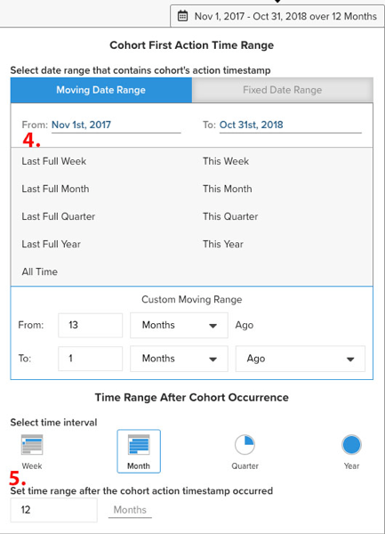

# `Cohort Report Builder for Non-Date-Based Cohorts`

我们的 [`Cohort Report Builder`](../dev-reports/cohort-rpt-bldr.md) 帮助商家研究不同用户子集在一段时间内的行为方式非常出色。 过去， `Cohort Report Builder` 主要针对按公用 `cohort date` （例如，在给定月份首次购买的所有客户集合）。 的 `Non-Date Based Cohort` 功能现在允许您按类似活动或属性对用户进行分组。 了解此功能的一些用例。

## 用例

这不是一个完整的列表，但以下是可通过此功能完成的一些潜在分析：

* 检查从中收购的客户收入 [!DNL Google] 与 [!DNL Facebook]
* 分析首次购买美国和加拿大的客户
* 查看从各种广告促销活动中获取的客户的行为

## 如何创建分析

1. 单击 **[!UICONTROL Report Builder]** 在左侧选项卡或 **[!UICONTROL Add Report** > **Create Report]** 在任何功能板中。

1. 在 `Report Builder Selection` 屏幕，单击 **[!UICONTROL Create Report]** 旁边 `Visual Report Builder` 选项。

### 添加量度

既然我们在 `Report Builder`，则会添加要对其执行分析的量度(例如： `Revenue` 或 `Orders`)。

>[!NOTE]
>
>本机 [!DNL Google Analytics] 量度与 `Cohort Report Builder`. 我们此示例的目标是查看一段时间内通过不同GA来源获得的第一订单客户的收入。

### 切换 `Metric View` to `Cohort`

这会打开一个新窗口，我们可以在其中配置同类群组报表的详细信息。

构建同类群组报表需要五个规范：

1. 如何对同类群组进行分组
1. 选择同类群组
1. 操作时间戳
1. 同类群组首次操作时间范围
1. 同类群组发生后的时间范围

{:width=&quot;200&quot; height=&quot;224&quot;}

{:width=&quot;400&quot; height=&quot;554&quot;}

#### 1.分组 `cohorts`

`Cohorts` 在本例中，按行为特征分组在一起 `Customer's first order GA source`. 请注意，此处可用的选项是已指定为 `groupable` 的值。

#### 2.选择同类群组

您可以选择显示给定特征的所有结果。 由于这会导致 `cohorts`，您可以选择 `cohorts` (对应于 `Customer's first order GA source`)。

<!--{: width="300" height="338"}-->

#### 3. `Action timestamp`

这将允许您选择基于日期的列，而不是创建量度的列。 下面，我们将介绍如何选择适用于给定的时间范围 `action timestamp`.

#### 4. `Cohort first action time range`

在这里，您将选择包含 `cohorts action timestamp` （2017年11月至2018年10月首次订购的客户）。 这可以是移动日期范围或固定日期范围。

#### 5. `Time range after cohort occurrence`

您想要查看 `cohorts` 按月、按周或按年逐时间显示？ 您将在此处进行这些选择。 在该部分下，您将选择 `time range` 之后 `cohort action timestamp` 已发生。 例如，这将显示在操作时间范围内首次下订单的客户的十二个月数据。

<!--{: width="400" height="557"}-->

### 其他说明

* [!UICONTROL Filters]:在以下两种情况下切换： `Standard` 和 `Cohort` 视图
* 请参阅 [`Perspectives`](../../data-analyst/dev-reports/cohort-rpt-bldr.md).
