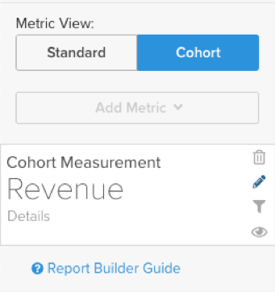
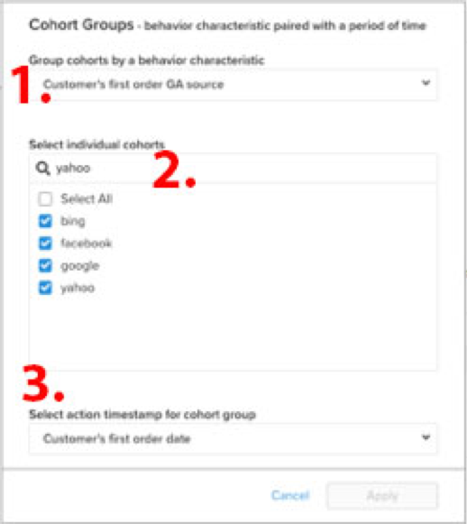
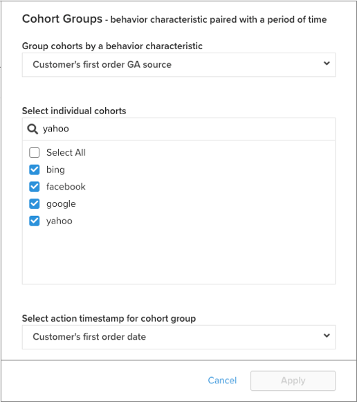
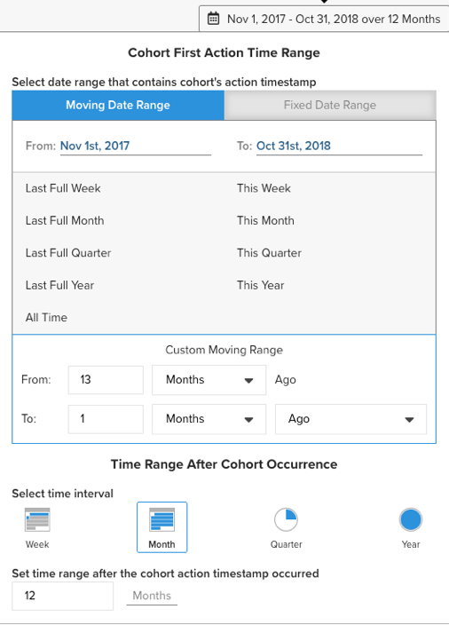

# [!DNL Cohort Report Builder] 适用于非基于日期的同类群组

此 [`Cohort Report Builder`](../dev-reports/cohort-rpt-bldr.md) 非常善于帮助商家研究不同用户子集在一段时间内的行为。 在过去， `Cohort Report Builder` 已针对按常见用户分组进行了优化 `cohort date` （例如，在给定月份中首次购买的所有客户集）。 此 `Non-Date Based Cohort` 功能现在允许您按类似的活动或属性对用户进行分组。 查看此功能的几个用例。

## 用例

这不是一个全面的列表，但以下是使用此功能可以完成的一些潜在分析。

* 审查收购以下公司之客户之收益： [!DNL Google] 对比 [!DNL Facebook]
* 分析首次购买地点在美国与加拿大的客户
* 查看从各种广告促销活动获得的客户行为

## 如何创建分析

1. 单击 **[!UICONTROL Report Builder]** 在左侧选项卡上或 **[!UICONTROL Add Report** > **Create Report]** 在任意仪表板中。

1. 在 `Report Builder Selection` 屏幕，单击 **[!UICONTROL Create Report]** 旁边的 `Visual Report Builder` 选项。

### 添加量度

现在您已进入 `Report Builder`，您可以添加要对其执行分析的量度(示例： `Revenue` 或 `Orders`)。

>[!NOTE]
>
>原生 [!DNL Google Analytics] 指标与 `Cohort Report Builder`. 此示例的目标是查看通过其他渠道获得的第一订单客户在一段时间内的收入 [!DNL Google Analytics] 源。

### 切换 `Metric View` 到 `Cohort`

该操作将打开一个新窗口，您可以在其中配置同类群组报表的详细信息。

构建同类群组报表需要五种规范：

1. 如何将同类群组分组
1. 选择同类群组
1. 操作时间戳
1. 同类群组首次操作时间范围
1. 同类群组发生后的时间范围

<!--{: width="200" height="224"}-->

#### 1.分组 `cohorts`

`Cohorts` 在此示例中，按行为特征分组 `Customer's first order GA source`. 此处提供的选项是已指定为的列 `groupable` 对于量度。

#### 2.选择同类群组

可以显示给定特征的所有结果。 因为这会导致许多 `cohorts`，您可以选择特定的 `cohorts` （对应于各种可用值） `Customer's first order GA source`)。

<!--{: width="300" height="338"}-->

#### 3. `Action timestamp`

这允许您选择基于日期的列，而不是创建量度的列。 在下面，您会看到选择适用于给定的时间范围 `action timestamp`.

#### 4. `Cohort first action time range`

您可以在此处选择包含 `cohorts action timestamp` （首次订购时间为2017年11月至2018年10月的客户也是如此）。 这可以是移动日期范围或固定日期范围。

#### 5. `Time range after cohort occurrence`

您是否想查看 `cohorts` 按月、周或年显示时间？ 您可在以下位置进行这些选择。 在该部分下，您将选择 `time range` 之后 `cohort action timestamp` 已发生。 例如，对于在操作时间范围内下达了第一笔订单的客户，这会向您显示12个月的数据。

<!--{: width="400" height="557"}-->

>[!NOTE]
>
>[!UICONTROL Filters] 当您在页面之间切换时，应用于您的量度的操作将保持不变 `Standard` 和 `Cohort` 视图。

### 相关

请参阅 [`Perspectives`](../../data-analyst/dev-reports/cohort-rpt-bldr.md).
