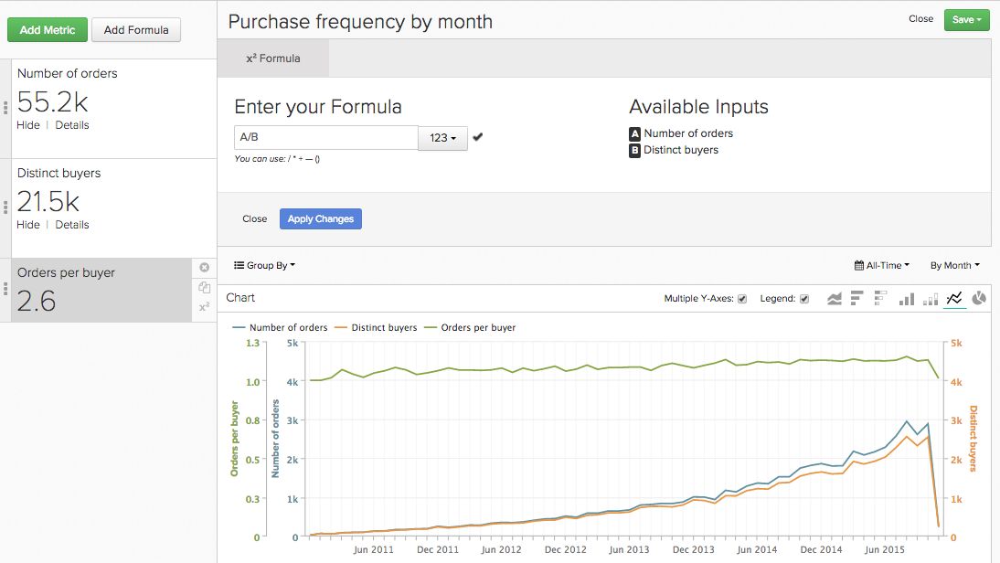
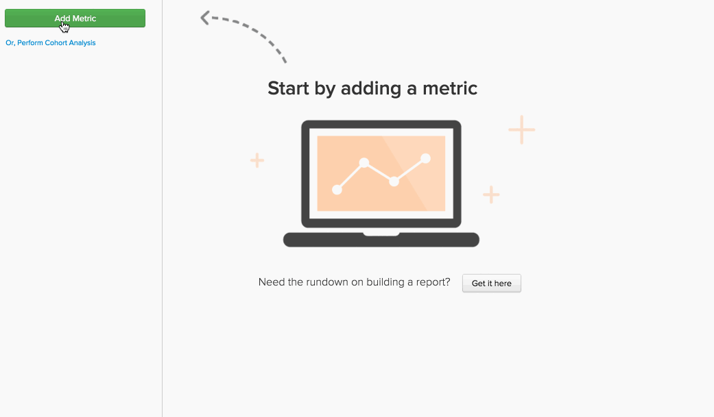
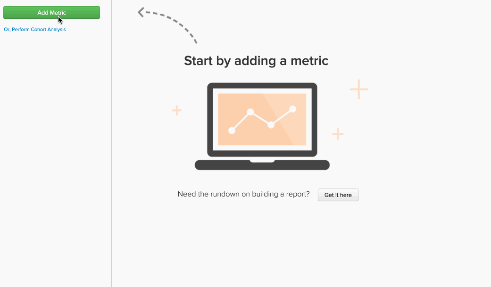

# `Report Builder`中的公式

在[`Report Builder`](../../tutorials/using-visual-report-builder.md)中，您可以使用帐户中的[定义的量度](../../data-user/reports/ess-manage-data-metrics.md)创建强大的可视化图表。 在公式中组合这些量度允许您从数据获取其他见解。 本主题介绍如何在`Report Builder`中使用公式 — 让我们跳入！

## 什么是`formula`？ {#what}

在`Report Builder`中，`formula`只是基于某些数学逻辑的一个或多个量度的组合。 典型示例如下所示：

在Report Builder中显示计算的

在此示例中，您使用`Number of orders metric (A)`和`Distinct buyers metric (B)`，目标是回答以下问题：我的买家每个月的平均订单数是多少？ 公式的参数为：

* `Definition`：在此，对输入量度应用数学。 在本例中，将订单数除以不同的购买者数可得出平均订单数。 因此，定义为(A/B)。

* `Format`：您的公式是返回数字、时间段还是货币金额？ 公式定义旁边是一个下拉列表，可用于指定返回的格式。 在此例中，它是一个数字。

* `Miscellaneous`：公式的时间戳、分组、透视和筛选器均由其输入量度继承。 这里无事可做！

## 如何在我的报告中使用`formulas`？ {#how}

既然您已介绍了基础知识，请查看一些示例。

### 示例：我想了解我的收入中有多少百分比归于首次订单。

在此示例中，您使用了`Revenue`和`Revenue (first time orders)`量度。 通过将`Revenue (first time orders)(B)`量度除以`Revenue metric (A)`并将退货格式设置为`Percent`，您可以找到可归因于首次订购的收入百分比。

### 示例：我想知道在提供和不提供`promo code`时，每订单的平均收入是多少。

在此示例中，您使用了`Revenue`和`Number of orders`量度。 此问题的答案涉及两个步骤 — 将`Revenue (A)`除以`Number of orders (B)`并将返回格式设置为`Currency`。 接下来，您仅允许公式结果(`Avg. Revenue per order`)显示这些结果，并按`Promo code`对这些结果分组。

### 示例：我想了解新客户的UTM源的分布。

找到此问题的答案需要执行几个步骤：

1. 首先您添加了`New Customers`指标，然后按照`utm_source - all`分组。 这是指标`A`或`New Customers (grouped)`。

1. 接下来，您复制了`New Customers (grouped)`量度，并将其设置为使用独立的维度。 量度`B` - `New customers (ungrouped)` — 显示新客户的总数。

1. 隐藏这两个量度后，将公式定义设置为`A/B`。 这将`New customers (grouped)`除以`New Customers (ungrouped)`。

1. 接下来，将结果格式设置为`Percent`。

在此示例中，您使用`Stacked Columns`透视按月显示结果。 这样，我们就可以逐月比较新客户的分布情况。

## 正在结束 {#wrapup}

您是否注意到上述示例中公式的`timestamp`、`groupings`、`perspectives`和`filters`继承自其输入量度？ 请记住，公式可用于使用`perspectives`和[独立的时间选项](../../tutorials/time-options-visual-rpt-bldr.md){: target="_blank"}，就像量度一样。

如果您对在`Report Builder`中使用公式有任何其他问题，请[联系支持人员](https://experienceleague.adobe.com/docs/commerce-knowledge-base/kb/troubleshooting/miscellaneous/mbi-service-policies.html)。
