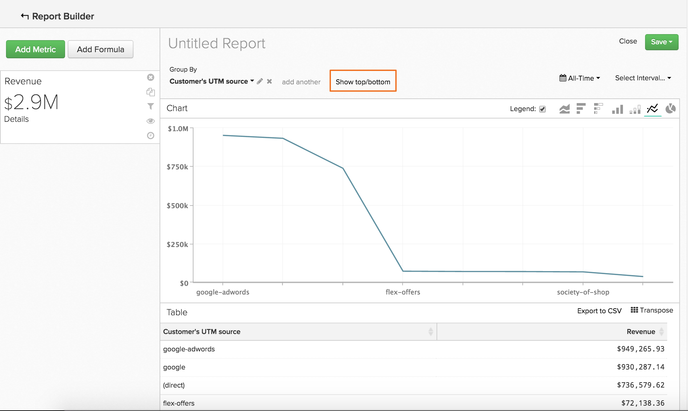
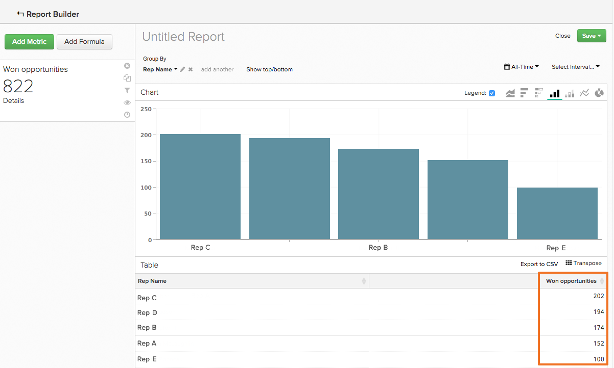
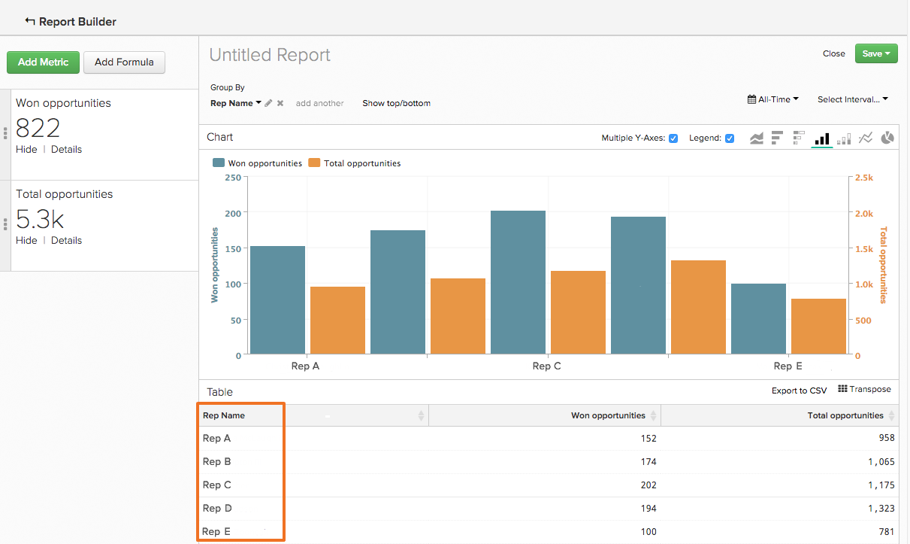

# 使用排序数据 `Show Top/Bottom` 特征

您可以在中执行更多操作 `Visual Report Builder` 而不是创建一段时间的分析。 例如，您可以构建一个报表来显示客户获取和营销渠道的价值，但也可以构建一个仅显示前五名绩效者的报表。 同样，您可以通过创建显示哪些州产生的收入最多的报告，重新集中营销工作。

对数据进行这种排序和排序可以在同时使用 `Group By` 和 `Time Interval of None`. 当这两个元素都在报表中时， `Show Top/Bottom` 功能显示在图表预览上方。 此功能允许您根据设置的参数查看顶端（最高到最低）和底部（最低到最高）数据点。

## 如何使用它？ {#how}

单击 **[!UICONTROL Show Top/Bottom link]** 设置显示和排序参数。 文本框中的数字可以是整数(例如 `5`)或 `ALL`. 接下来，您可以选择按指标或分组对报表进行排序。

例如，如果要显示带来最多收入的五个反向链接来源，您可以按照以下方式操作：

1. 添加 `Revenue` 报表的量度。

1. 添加 `Group By` 按反向链接来源对量度进行分段。

1. 设置 `Time Interval` 到 `None`.

1. 在 `Show Top/Bottom` 设置，将显示设置为 `5` 因此，只有收入金额前五位的反向链接来源才会包含在报表中。

>[!NOTE]
>
>因为报告没有 `Time Interval`，这些值（在本例中是前五个反向链接来源）会随着时间的推移而改变。 如果一个反向链接来源在收入方面超过另一个反向链接来源，则其显示顺序会发生更改。

## 使用多个量度怎么样？ {#multiplemetrics}

当报表中有多个量度时，使用此功能会变得复杂，因为每个量度只能按其本身或按分组之一排序。

假设您同时使用了以下两种工具生成了报告 `Revenue` 和 `Number of orders` 量度，按反向链接来源分组。 `Revenue` 只能按 `Revenue` 或反向链接来源和 `Number of orders` 只能按 `Number of orders` 或反向链接来源。

这意味着，尽管您可以显示 `Revenue` 仅从顶部 `5` 收入生成反向链接来源，您不能同时按顶部显示订单数 `5` 创收型推荐来源。 简而言之：当存在多个量度时，最佳方法是按分组对每个量度进行排序。

以下是对 `Revenue` 量度本身，而不是分组。 如您所见，如果不按分组对量度进行排序，则会创建一个异常（并且最终毫无帮助）的报告：

如果您已按分组对两个量度进行排序，则图表将如下所示：

## 默认情况下，如何对值进行排序？ {#defaultsorting}

当具有的报表中仅包含一个量度时 `Group by` 和 `Time Interval` 之 `None`，中的默认顺序 `Visual Report Builder` 是基于量度显示排名最前的值。 在本例中， `Show Top/Bottom` 如果符合您的需求，则可能没有必要使用此功能。

此示例查看了您的销售代表已结束的销售机会数。 在此例中，此表根据量度自动从高到低排序 `Won Opportunities`.

但是，在添加第二个量度时，默认设置是根据分组对排名最前的量度进行排序。 添加量度和分组后，默认排序将依次基于第一个分组、第二个分组，依此类推。

## 正在结束 {#wrapup}

虽然这里介绍了一些基本功能，但此功能有许多有趣的用途。

想一想以前的销售代表和销售机会示例。 删除 `Time Interval`，应用 `Group By`，并根据分组对数据排序使我们能够获得每个代表获胜机会数的详细图片。 此外，使用 `Show Top/Bottom` 功能让我们能够发现谁是表现最好的人。
