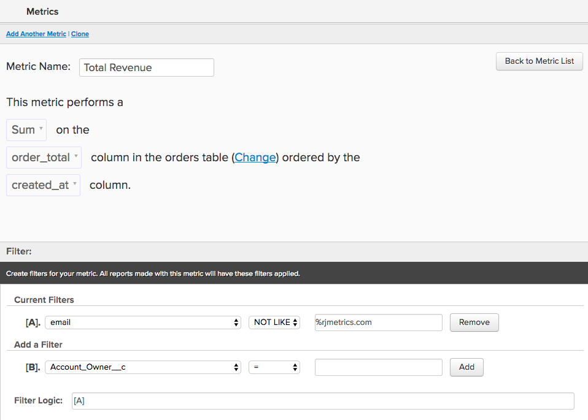
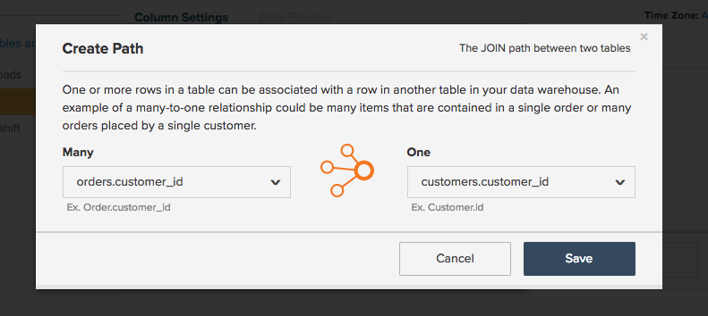
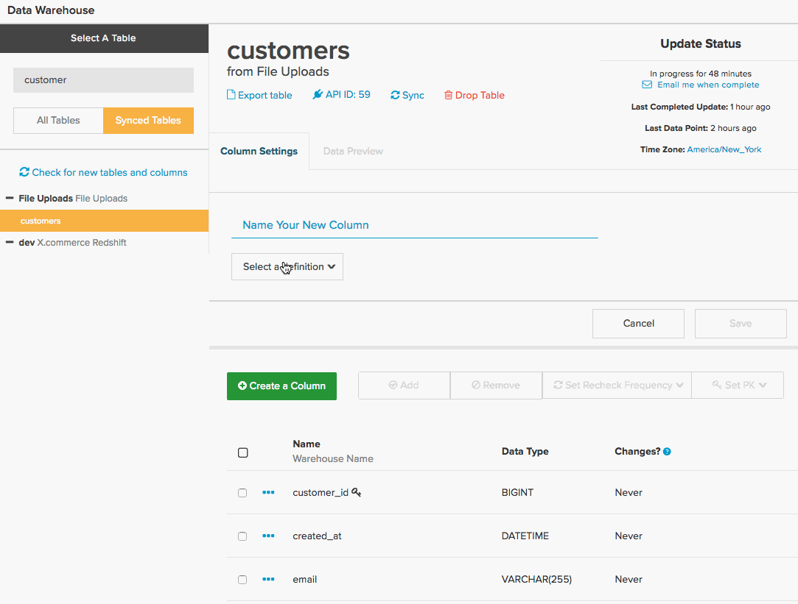
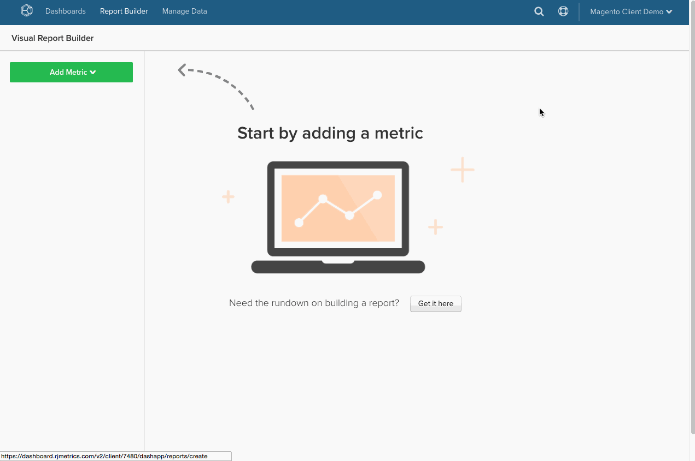
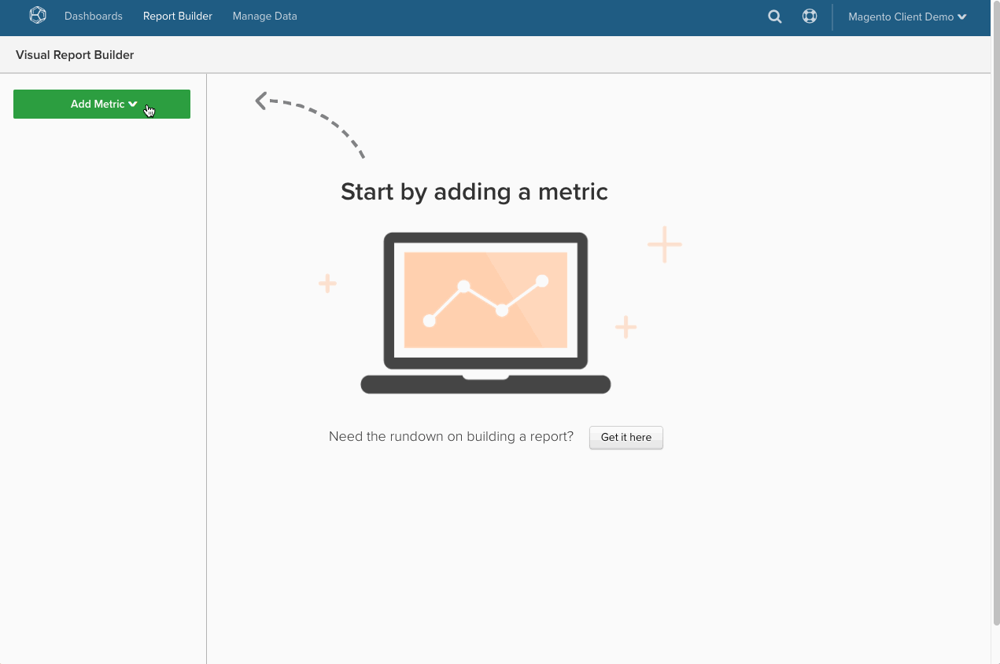

# 在Commerce Intelligence中翻译SQL查询

曾想过如何将SQL查询转换为您在[中使用的](../data-warehouse-mgr/creating-calculated-columns.md)计算列[、](../../data-user/reports/ess-manage-data-metrics.md)量度[和](../../tutorials/using-visual-report-builder.md)报告[!DNL Commerce Intelligence]？ 如果您是重型SQL用户，了解如何在[!DNL Commerce Intelligence]中翻译SQL使您能够在[Data Warehouse管理器](../data-warehouse-mgr/tour-dwm.md)中更智能地工作并充分利用[!DNL Commerce Intelligence]平台。

在本主题结束时，您找到了SQL查询子句和&#x200B;**元素的**&#x200B;翻译矩阵[!DNL Commerce Intelligence]。

首先查看常规查询：

| | |
|--- |--- |
| `SELECT` |  |
| `a,` | 报告`group by` |
| `SUM(b)` | `Aggregate function` （列） |
| `FROM c` | `Source`表 |
| `WHERE` |  |
| `d IS NOT NULL` | `Filter` |
| `AND time < X`   `AND time >= Y` | 报告`time frame` |
| `GROUP BY a` | 报告`group by` |

此示例涵盖了大多数翻译案例，但有一些例外。 深入研究，从`aggregate`函数的转换方式开始。

## 集合函数

查询中的聚合函数（例如，`count`、`sum`、`average`、`max`、`min`）采用&#x200B;**中的**&#x200B;量度聚合&#x200B;**或**&#x200B;列聚合[!DNL Commerce Intelligence]的形式。 差异因素在于是否需要连接以执行聚合。

查看以上每个内容的示例。

## 量度聚合 {#aggregate}

聚合`within a single table`时需要指标。 例如，上述查询中的`SUM(b)`聚合函数很可能由对列`B`求和的度量表示。 

查看`Total Revenue`中如何定义[!DNL Commerce Intelligence]量度的具体示例。 查看下面您尝试翻译的查询：

| | |
|--- |--- |
| `SELECT` |  |
| `SUM(order_total) as "Total Revenue"` | `Metric operation` （列） |
| `FROM orders` | `Metric source`表 |
| `WHERE` |  |
| `email NOT LIKE '%@magento.com'` | 量度`filter` |
| `AND created_at < X`  `AND created_at >= Y` | 量度`timestamp` （和报表`time range`） |

通过单击&#x200B;**[!UICONTROL Manage Data** > **&#x200B;量度&#x200B;**> **创建新量度]**&#x200B;导航到量度生成器，您必须首先选择相应的`source`表，在本例中为`orders`表。 然后，将设置量度，如下所示：

## 列聚合

聚合从另一个表连接的列时需要计算列。 例如，您可能在`customer`表中生成了一个名为`Customer LTV`的列，该列加总了`orders`表中与该客户关联的所有订单的总值。

此聚合的查询可能如下所示：

|  |  |
|--- |--- |
| `Select` | |
| `c.customer_id` | 聚合所有者 |
| `SUM(o.order_total) as "Customer LTV"` | 聚合操作（列） |
| `FROM customers c` | 聚合所有者表 |
| `JOIN orders o` | 聚合源表 |
| `ON c.customer_id = o.customer_id` | 路径 |
| `WHERE o.status = 'success'` | 聚合筛选器 |

在[!DNL Commerce Intelligence]中设置此项需要使用Data Warehouse管理器，您可以在其中构建`orders`和`customers`表之间的路径，然后在客户表中创建名为`Customer LTV`的列。

了解如何在`customers`和`orders`之间建立新路径。 最终目标是在`customers`表中创建新的聚合列，因此请首先导航到Data Warehouse中的`customers`表，然后单击&#x200B;**[!UICONTROL Create a Column** > **&#x200B;选择定义&#x200B;**> **SUM]**。

接下来，您需要选择源表。 如果`orders`表存在路径，则只需从下拉菜单中选择该路径即可。 但是，如果您正在构建新路径，请单击&#x200B;**[!UICONTROL Create new path]**，此时您会看到以下屏幕：

在此，您需要仔细考虑您尝试连接的两个表之间的关系。 在这种情况下，可能有`Many`个订单与`One`客户关联，因此`orders`表列在`Many`侧，而`customers`表列在`One`侧。

>[!NOTE]
>
>在[!DNL Commerce Intelligence]中，`path`等同于SQL中的`Join`。

保存路径后，即可创建`Customer LTV`列！ 请参阅下文：

现在，您已在`Customer LTV`表中构建了新的`customers`列，接下来可以使用此列创建一个[指标聚合](#aggregate)（例如，查找每个客户的平均LTV）。 您还可以使用基于`group by`表构建的现有量度，按报表中的计算列`filter`或`customers`。

>[!NOTE]
>
>对于后者，无论何时生成新的计算列，您都必须[将该维度添加到现有量度](../data-warehouse-mgr/manage-data-dimensions-metrics.md)，然后才能作为`filter`或`group by`使用。

请参阅[使用您的Data Warehouse管理器创建计算列](../data-warehouse-mgr/creating-calculated-columns.md)。

## `Group By`子句

查询中的`Group By`函数通常在[!DNL Commerce Intelligence]中表示为用于划分或过滤可视化报表的列。 例如，让我们重新访问您之前探讨的`Total Revenue`查询，但这次按`coupon\_code`对收入进行分段，以更好地了解哪些优惠券产生的收入最多。

从下面的查询开始：

| | |
|--- |--- |
| `SELECT coupon_code,` | 报告`group by` |
| `SUM(order_total) as "Total Revenue"` | `Metric operation`（列） |
| `FROM orders` | `Metric source`表 |
| `WHERE` |  |
| `email NOT LIKE '%@magento.com'` | 量度`filter` |
| `AND created_at < '2016-12-01'`   `AND created_at >= '2016-09-01'` | 量度`timestamp` （和报表`time range`） |
| `GROUP BY coupon_code` | 报告`group by` |

>[!NOTE]
>
>与之前开始的查询唯一的区别是添加了“coupon\_code”作为分组依据。_

使用您之前创建的相同`Total Revenue`指标，您现在可以创建按优惠券代码分段的收入报表了！ 查看下面的gif，其中显示了如何设置此可视化报表，查看9月至11月的数据：

## 公式

有时，查询可能涉及多个聚合，以便计算单独列之间的关系。 例如，您可以通过以下两种方法之一计算查询中的平均订单值：

* `AVG('order\_total')`或
* `SUM('order\_total')/COUNT('order\_id')`

前一种方法涉及创建对`order\_total`列执行平均值的新量度。 但是，如果已将量度设置为计算`Total Revenue`和`Number of orders`，则可以直接在Report Builder中创建后一种方法。

后退一步，查看`Average order value`的整体查询：

| | |
|--- |--- |
| `SELECT` |  |
| `SUM(order_total) as "Total Revenue"` | 量度`operation` （列） |
| `COUNT(order_id) as "Number of orders"` | 量度`operation` （列） |
| `SUM(order_total)/COUNT(order_id) as "Average order value"` | 量度`operation` （列）/量度操作（列） |
| `FROM orders` | 指标`source`表 |
| `WHERE` |  |
| `email NOT LIKE '%@magento.com'` | 量度`filter` |
| `AND created_at < '2016-12-01'`  `AND created_at >= '2016-09-01'` | 量度时间戳（和报表时间范围） |

现在，假定您已设置量度以计算`Total Revenue`和`Number of orders`。 由于存在这些量度，您只需打开`Report Builder`并使用`Formula`功能创建按需计算即可：

## 正在结束

如果您是繁重的SQL用户，通过考虑如何在[!DNL Commerce Intelligence]中翻译查询，可以生成计算列、量度和报表。

如需快速参考，请查看下面的矩阵。 这显示了SQL子句的对等项[!DNL Commerce Intelligence]元素以及它如何映射到多个元素，具体取决于它在查询中的使用方式。

## Commerce Intelligence元素

| **`SQL Clause`** | **`Metric`** | **`Filter`** | **`Report group by`** | **`Report time frame`** | **`Path`** | **`Calculated column inputs`** | **`Source table`** |
|---|---|---|---|---|---|---|---|
| `SELECT` | X | - | X | - | - | X | - |
| `FROM` | - | - | - | - | - | - | X |
| `WHERE` | - | X | - | - | - | - | - |
| `WHERE` （带有时间元素） | - | - | - | X | - | - | - |
| `JOIN...ON` | - | X | - | - | X | X | - |
| `GROUP BY` | - | - | X | - | - | - | - |
