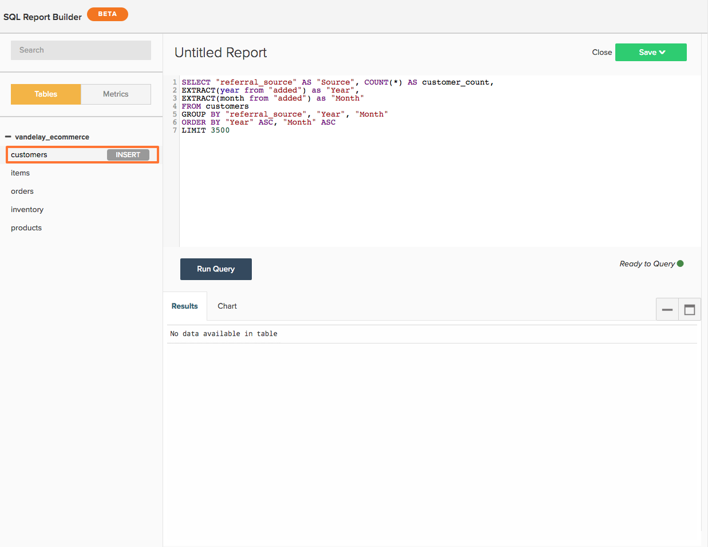
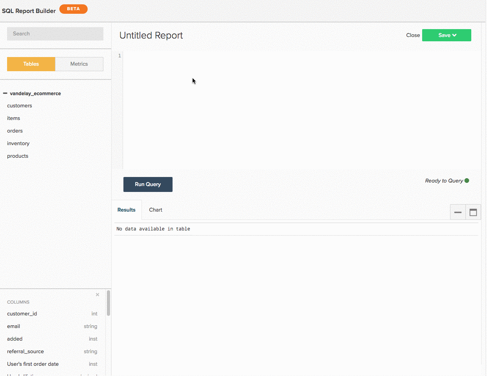
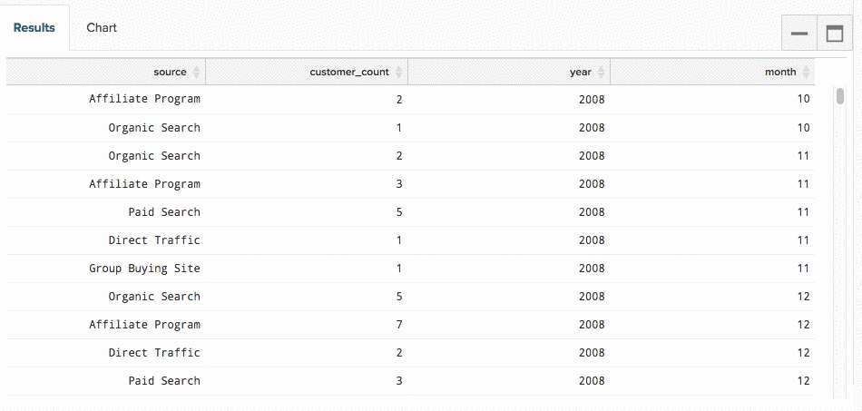
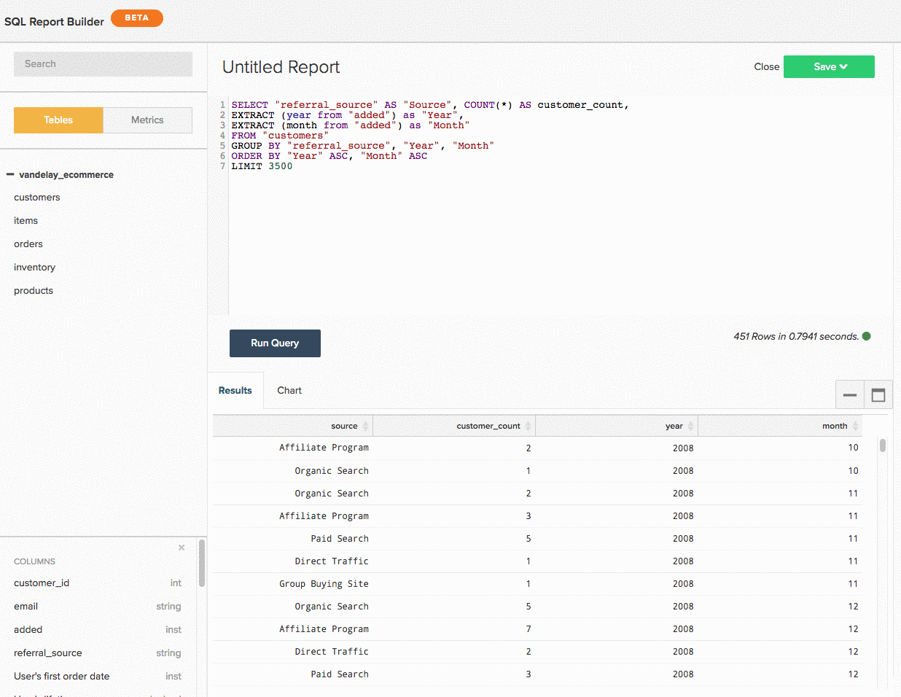

# 使用 `SQL Report Builder`

>[!NOTE]
>
>需要 [管理员权限](../../administrator/user-management/user-management.md) 创建和编辑SQL图表。 `Standard` 用户可以在功能板上重新排列这些图表，并且 `Read-only` 用户拥有与传统图表相同的体验。 此外， `Read-only` 用户无权访问查询的文本。

请参阅 [训练视频](https://experienceleague.adobe.com/docs/commerce-knowledge-base/kb/how-to/mbi-training-video-sql-report-builder.html?lang=en) 了解更多信息。

`SQL`或结构化查询语言，是用于与数据库通信的编程语言。 In [!DNL MBI]，SQL用于查询或检索Data warehouse中的数据。 查看仪表板上的报告 — 在幕后，每个报告都由SQL查询提供支持。

您可以使用 [`SQL Report Builder`](../dev-reports/sql-rpt-bldr.md) 要直接查询Data warehouse，请查看结果，并将其转换为图表。 您可以使用以下方式开始创建报告 `SQL Report Builder` 导航到 **[!UICONTROL Report Builder** > **SQL Report Builder]**.

请参阅 [训练视频](https://experienceleague.adobe.com/docs/commerce-knowledge-base/kb/how-to/mbi-training-video-sql-report-builder.html?lang=en) 了解更多信息。

此 `SQL Report Builder` 允许您直接查询Data warehouse、查看结果并快速将其转换为图表。 使用SQL构建报告的最佳部分是，您不需要等待更新周期来迭代您创建的列。 如果结果不正确，您可以快速编辑并重新运行查询，直到符合您的预期为止。

本文将引导您使用 `SQL Report Builder`. 在您了解如何解决这一问题后，请查看可视化图表的SQL教程或尝试优化您编写的某些查询。

本文涵盖的内容：

1. [编写查询](#writing)

1. [运行查询并查看结果](#runquery)

1. [创建可视化图表](#createviz)

1. [保存报告](#save)

## SQLReport Builder集成

在目前的世界状况下， [[!DNL Google Analytics]](../importing-data/integrations/google-analytics.md) 是唯一无法与一起使用的集成 [`SQL Report Builder`](../dev-reports/sql-rpt-bldr.md). 此功能正在开发中。

要开始创建SQL报告，请单击 **[!UICONTROL Report Builder]** 或 **[!UICONTROL Add Report]** 位于任何仪表板的顶部。 在 `Report Picker` 屏幕，单击 **[!UICONTROL SQL Report Builder]** 以打开SQL编辑器。

## 开始使用

要编辑报告，请单击齿轮()图标，然后单击 **[!UICONTROL Edit]**.

## 编写查询 {#writing}

>[!NOTE]
>
>`SQL Report Builder` 查询区分大小写。 在编写查询时，请确保您使用了正确的大小写，否则可能会出现意外结果或错误。

遵循 [查询优化准则](../../best-practices/optimizing-your-sql-queries.md)，在SQL编辑器中编写查询。

>[!IMPORTANT]
>
>**SQL报表中的指标**  — 将指标插入SQL报表时， `current definition` 的量度。

如果度量在将来更新，则SQL报告 *不会* 反映了所做的更改。 您必须手动编辑报告以使更改生效。

使用侧栏顶部的按钮，您可以在表格列表和量度之间切换，这些表格和量度可用于 `SQL Report Builder`. 如果在列表中看不到要查找的内容，请尝试使用侧栏顶部的搜索栏进行搜索。

您还可以使用SQL编辑器中的侧边栏，通过将鼠标悬停在量度、表和列上并单击，将其直接插入到查询中 **[!UICONTROL Insert]**：

>[!NOTE]
>
>任意 [SELECT函数](https://www.postgresql.org/docs/9.5/sql-select.html#SQL-SELECT-LIST)或SQLReport Builder支持PostgreSQL支持的任何不改变数据的函数。 这包括但不限于AVG、COUNT、COUNT DISTINCT、MIN/MAX和SUM。

此外，支持任何JOIN类型，但Adobe建议仅使用INNER JOIN，因为它是开销最小的JOIN类型。

## 运行查询并查看结果 {#runquery}

编写完查询后，单击 **[!UICONTROL Run Query]**. 结果显示在SQL编辑器下面的表中：

如果结果中有出错的地方，可以编辑查询并重新运行查询直到满意为止。

您有时可能会看到 [编辑器中包含EXPLAIN的消息](../../best-practices/optimizing-your-sql-queries.md). 如果您看到其中一个，则表示您的查询尚未运行，需要微调。

编辑完查询后，您可以转到创建可视化图表或将您的工作保存到功能板。

## 创建可视化图表 {#createviz}

要使用您的查询结果创建可视化图表，请单击 **[!UICONTROL Chart]** 在中选项卡 `Results` 窗格。 在此选项卡中，选择：

* 此 `Series`或要测量的列，例如 **已售出商品**.
* 此 `Category`或要用于分段数据的列，例如 **客户获取来源**.
* 此 `Labels`或X轴值。

下面是可视化流程的外观：

有关如何创建可视化的详细演练，请参阅 [从SQL查询创建可视化图表教程](../../tutorials/create-visuals-from-sql.md){： target=&quot;_blank&quot;}.

## 保存报告 {#save}

在保存所做工作之前，必须为报表提供一个名称。 请记住遵循 [命名最佳实践指南](../../best-practices/naming-elements.md){： target=&quot;_blank&quot;}，然后选择可明确传达报告内容的内容！

单击 **[!UICONTROL Save]** ，然后选择该报表 `Type` (`Chart` 或 `Table`)。 要完成这些操作，请选择要将报告保存到的仪表板，然后单击 **[!UICONTROL Save to Dashboard]**.

### 分析您的数据

#### `SQL Report Builder`

[`The SQL Report Builder`](../dev-reports/sql-rpt-bldr.md) 使您能够直接查询Data warehouse、查看结果并快速将其转换为报表。 使用SQL还允许您 [使用不可用的SQL函数](https://docs.aws.amazon.com/redshift/latest/dg/c_SQL_functions.html) 在 `Visual` 或 `Cohort` Report Builder，从而让您能够更好地控制数据。

使用SQL创建的计算列不依赖于更新周期，这意味着您可以根据需要对其进行迭代，并立即查看结果。

>[!NOTE]
>
>这仅适用于列的结构，而不适用于数据的新鲜度。 新数据仍依赖于已成功完成的更新周期。

| **这个很适合……** | **这个不太适合……** |
|---|---|
| 中级/高级分析师 | 初学者 — 您需要了解SQL。 |
| 对SQL的了解 | 简单分析 — 编写查询可能比简单地使用可视化Report Builder更有效。 |
| 构建一次性使用的计算列 | 与他人共享 — 考虑您的受众：他们了解SQL吗？ 否则，他们可能会对构建报表的方式感到困惑。 |
| 数据 `one-to-many` 关系 |  |
| 测试新列或分析 |  |

#### 数据库与SQL编辑器结果

大多数情况下，结果的差异可归因于更新周期。 如果 [!DNL MBI] 将数据从数据库复制到Data warehouse的过程中，即使使用相同的查询，您也可能会看到不同的结果。

连接问题也可能导致不一致。 导航到 `Connections` 页面（通过单击） **[!DNL Manage Data** > **Connections]**)签出 — 有问题的数据库集成是否存在错误？ 如果是这样，您可能需要 [重新验证集成](https://experienceleague.adobe.com/docs/commerce-knowledge-base/kb/how-to/mbi-reauthenticating-integrations.html?lang=en) 让一切恢复运转。

如果所有集成都连接成功，并且您未处于更新周期中，则可能有其他错误。

#### 删除SQL报告是否也会从我的Data warehouse中删除基础列？

不需要，无论如何构建Data warehouse，都不会丢失任何列。

使用创建的列 `Data Warehouse Manager` 如果删除使用它们的报表或查询，则不会受到影响。

使用创建的列 `SQL Report Builder` 不会保存到您的Data warehouse。

#### `Report Builder` 对比 `SQL Report Builder`

此 `SQL Report Builder` 在创建和构建图表时为您提供了更大的灵活性 — 例如，您可以选择应在图表上显示的值。 `X` 和 `Y` 坐标轴。 有关在中创建图表的详细信息 `SQL Report Builder`，查看 [通过SQL查询创建可视化图表](../../tutorials/create-visuals-from-sql.md) 教程。

#### `Cohort Report Builder` {#cohortrb}

不像 `Visual Report Builder`，则 [`Cohort Report Builder`](../dev-reports/cohort-rpt-bldr.md) 具有单一目的 — 分析和识别相似用户组随时间变化的行为趋势。 使用同类群组Report Builder不需要任何SQL知识，因此，如果您刚刚开始使用，可以毫不犹豫地直接开始使用。

| **这个很适合……** | **这个不太适合……** |
|---|---|
| 中级/高级分析师 | 初学者 — 您需要定义练习的同类群组。 |
| 确定一段时间内的行为趋势 | 定性分析 — 可以是 [完成](../dev-reports/create-qual-cohort-analysis.md)，但需要Adobe帮助。 |

## 在更新周期后重建查询

您不必重新生成查询。 使用创建的报告 [`SQL Report Builder`](../dev-reports/sql-rpt-bldr.md) 保存方式与在中创建的相同 `Report Builder`. SQL图表的更新过程是相同的 — 更新数据后，图表中的值将重新计算并重新显示。

>[!NOTE]
>
>删除SQL报表/查询时，不会从Data warehouse中删除基础列。 无论如何构建列，都不会丢失任何列。

* 如果删除使用列管理器的报表或查询，则使用Data warehouse管理器创建的列不会受到影响。

* 使用SQLReport Builder创建的列不会保存到Data warehouse中。

## 总结 {#wrapup}

如果您想尝试一些更具挑战性的东西，为什么不尝试编写针对可视化进行了优化的查询呢？ 查看 [从SQL查询创建可视化图表教程](../../tutorials/create-visuals-from-sql.md){： target=&quot;_blank&quot;}以开始使用。
