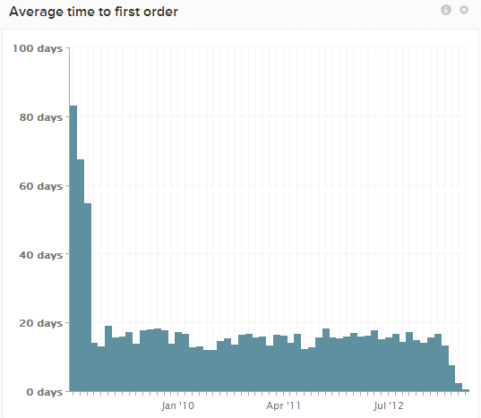

# 首次购买报告的平均时间

许多Adobe客户都有一个名为`Average time to first purchase`的量度和图表，该量度和图表显示了一组用户注册日期与首次购买日期之间的平均时间。 随着时间越来越接近现在，数据几乎总是会向下倾斜。

这是因为这些较新的客户还没有机会生成从加入日期起超过一个月的任何购买。 由于从未购买过产品的用户根本不会包括在内（直到他们真的购买产品），因此这会使较新客户群的平均购买量出现下调。

还有其他几种可能的方法来看待这个指标，它们引入的偏见较少。 浏览一个示例。

## 示例：对第一笔订单执行`cohort`分析

您的`Users`仪表板中可能有一个名为`Time to first order cohort`的图表。 此报表使用`Distinct buyers`量度，按`cohort`周或注册月对用户进行分组，并显示在注册后接下来的几周或几个月内首次购买的用户比例（介于`0`和`1`之间）。

图表可能会显示，对于在2014年12月注册的用户，`0.56`（或`56%`）在第2个月（例如，2015年1月）之前做了第一笔订单。

此同类群组分析可很好地指示一段时间内用户激活率。 如果此图表开始扁平化或停滞不前，并且您仍未接近完全转化为购买者，则可能是时候通过电子邮件促销活动激活其余用户了。
