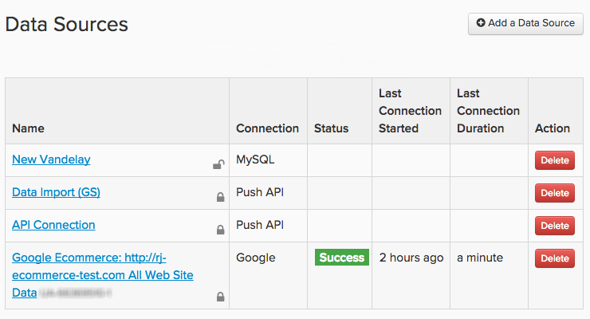

# 连接数据

在 [!DNL MBI]，则会调用数据源 `integrations`. 在 `integration` 成功连接后，您将能够浏览可在Data warehouse管理器中同步的表。

使用 `Connections` 页面，单击 **[!UICONTROL Manage Data** > **Connections]**. 在此，您会看到与帐户关联的所有集成的列表、集成类型、状态([!DNL Google Analytics] 和 [!DNL Data Import API] 连接将具有空白状态字段)，以及上次连接测试(`Last Connection` 开始列)。

## 集成类型

有四种方法可将数据导入 [!DNL MBI]:连接数据库、连接SaaS集成、上传 `.csv` 文件，或使用我们的API。

## 数据库集成

[!DNL MBI] 支持基于SQL的数据库和NoSQL数据库，例如 [MySQL](../../importing-data/integrations/mysql-via-ssh-tunnel.md), [Microsoft SQL](../integrations/microsoft-sql-server.md), [MongoDB](../integrations/mongodb-via-ssh-tunnel.md)和 [PostgreSQL](../integrations/postgresql.md).

您可以直接将数据库连接到 [!DNL MBI] 使用数据库凭据，我们建议您使用经过验证的加密方法，如SSH隧道。 这将确保数据在进入data warehouse时保持安全和安全。

根据连接方法和数据库类型，可能需要一些技术专家才能完成设置。

## `SaaS` 集成

`SaaS` 集成的服务如 [[!DNL Google Adwords]](../integrations/google-adwords.md), [[!DNL Salesforce]](../integrations/salesforce.md)和 [[!DNL Zendesk]](../integrations/zendesk.md). 请务必注意，由于第三方数据位于供应商的服务器上，因此您无法像使用数据库中的数据一样直接访问它。

在大多数情况下，在 [!DNL MBI] 只需输入帐户凭据即可。 某些服务可能需要API密钥才能完成授权 — 请查看 [集成部分](../integrations/integrations.md) 有关生成所需任何凭据的说明。

## 文件上传

不确定如何将数据从补充源获取到您的data warehouse? [使用 `File Upload` 功能](../connecting-data/using-file-uploader.md) 是获取不需要日常决策的数据的好方法。 按照我们的格式规则，您可以快速上传 `.csv` 文件加入您的data warehouse中，并与其他数据源一起使用。

## [!DNL MBI] `Import API`

如果您希望自动从自己的某个源中检索数据，则可以使用 [!DNL MBI] `Import API`. 基本上：如果它不在数据库或 `SaaS` 集成， `Import API` 函数是您的最佳选择。

使用API需要一些技术专业知识 — 如果某人能够熟练地编写和维护小型Ruby或PHP脚本，那么他将不仅符合条件。

要了解有关开始使用的更多信息，请 `Import API`，请查看 [开发人员网站](https://developer.adobe.com/commerce/services/reporting/) 和 [如何生成API密钥](https://developer.adobe.com/commerce/services/reporting/import-api/).

## 添加集成

要添加集成，请单击 **[!UICONTROL Manage Data** > **Connections]** 然后单击 **[!UICONTROL Add a New Data Source]**. 单击要添加的集成图标，然后按照帮助文章中的说明进行设置：

* [集成常见问题解答](https://support.magento.com/hc/en-us/sections/360003161871-Integration-FAQ)
* [可用 ](../integrations/integrations.md)
* [整合表](../../../best-practices/consolidating-your-tables.md)
* [限制对数据库的访问](../../../administrator/account-management/restrict-db-access.md)

**没有看到您想要的集成？** 必须激活某些集成才能在您的帐户中显示这些集成。 如果你在找什么，例如， [!DNL Facebook]  — 但没有列出， [提交支持票证](../../../guide-overview.md).

**如果您看到集成的错误状态**，不要惊慌 — 请查看 [疑难解答部分](https://support.magento.com/hc/en-us/sections/360003078151) 来获取帮助。
